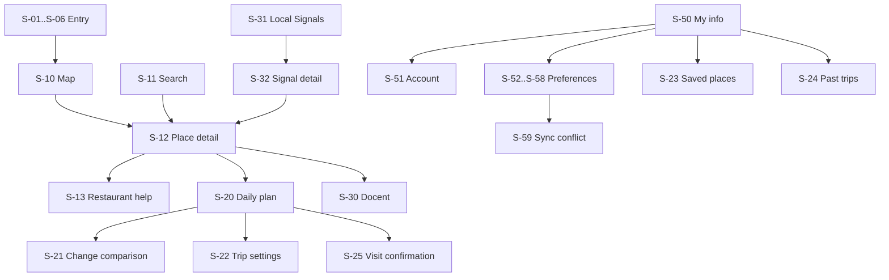

# Canonical screen completion contract

Status: implementation contract for `integration/canonical-screen-completion-20260903`

This contract turns the 36-screen functional brief into production Flutter
routes. Stitch exports are visual references only. Runtime values must come from
the LALA API, authenticated account state, or persisted device state; the normal
path must never substitute sample, fixture, or demo values.

## 1. Delivery inventory

| Group | Screens | Delivery state before this program | Completion slice |
| --- | --- | --- | --- |
| Entry | S-01..S-06 | Implemented | regression verification |
| Discovery | S-10, S-11, S-14, S-15 | Implemented | regression verification |
| Place | S-12, S-13 | S-13 implemented; S-12 sheet-only | A: standalone detail route |
| Planning | S-20..S-25 | S-20 implemented; S-21/S-23/S-25 partial; S-22/S-24 absent | B: trip library and overrides |
| Docent/signals | S-30..S-32 | S-30/S-31 implemented; S-32 partial | C: canonical signal detail |
| Community | S-40..S-44 | Implemented | regression verification |
| Profile | S-50..S-59 | preference editors implemented; S-50/S-51/S-59 incomplete | A/C: profile, account, conflict |

Each slice uses one branch and one Draft PR. A slice is merged into the
non-production integration branch only after exact-head tests and visual
verification. Main promotion remains a separate user-approved decision.

## 2. Information architecture



The persistent bottom navigation has exactly five roots in this order:
Search, Map, Plan, Local Signals, My Info. Detail and editing routes are pushed
above those roots so back navigation returns to the originating context.

## 3. Slice A wireframes

### S-12 Place detail

```text
+--------------------------------------+
| <  verified image/fallback       save|
| category  place name                 |
| region / distance                    |
| reason + source/freshness            |
| [add to plan] [docent] [visit help]  |
| weather / air quality                |
| evidence (collapsed by default)      |
| [show on map]                        |
+--------------------------------------+
```

- Route identity is the canonical `placeId`.
- A route entered with `GoRouterState.extra` renders immediately, then remains
  bound to the same ID. A deep link without `extra` performs one bounded real
  `/places?category=all` lookup and selects only an exact ID match.
- A missing/deleted place displays an honest unavailable state with Back and
  Map actions. It must not synthesize a place.
- Saving uses `SavedPlaceStore`; adding to plan publishes the canonical ID to
  the existing plan context; docent playback uses the app-root controller.
- Restaurant help appears only for the restaurant category.

### S-50 My Info hub

```text
+--------------------------------------+
| My info                              |
| account status / sync status       > |
| travel preference summary          > |
| saved places                       > |
| past trips                         > |
| language / privacy / accessibility > |
+--------------------------------------+
| Search Map Plan Signals My Info      |
+--------------------------------------+
```

- Account state is read directly from `LalaAuthController`.
- Preference summary is read from `TravelPreferencesStore`.
- Counts may be shown only when backed by persisted or server data.
- Rows whose data route is not yet delivered remain absent, not fake-enabled.

### S-51 Account management

```text
+--------------------------------------+
| < Account                            |
| profile or guest state               |
| LALA account sync state / retry      |
| data scope and privacy entry         |
| sign in OR sign out                  |
| delete account (destructive confirm) |
+--------------------------------------+
```

`LalaAuthStatus` and `LalaAccountSyncStatus` are the only status authority.
Raw provider errors, tokens, request IDs, and management API details never
appear in UI or logs.

## 4. Data and state bindings

| Screen | Authority | Required failure state |
| --- | --- | --- |
| S-12 | `LalaPlace`, `LalaBackend`, `SavedPlaceStore`, app docent controller | loading, network error, exact-ID unavailable |
| S-21 | planner intervention response | incomplete comparison, stale intervention |
| S-22 | account-backed default preferences + trip override repository | guest device-only, sync pending/error |
| S-23 | saved canonical IDs joined with real place projection | empty, unavailable IDs, network error |
| S-24 | authenticated plan-history API | guest sign-in prompt, empty, network error |
| S-25 | visit store/API with canonical slot/place IDs | already recorded, auth required, failure |
| S-32 | Local Signal aggregate/detail API | empty evidence, stale, network error |
| S-50 | auth + preference + library summaries | guest, account sync error |
| S-51 | `LalaAuthController` | disabled, busy, stale session, service/config error |
| S-59 | preference revision/conflict payload | no conflict, keep local, use server, retry error |

## 5. Responsive and accessibility rules

- Validate 360, 393, and 430 logical-pixel widths and a wide web viewport.
- All icon-only actions have tooltips and at least 44x44 targets.
- Bottom navigation labels stay single-line in KO, EN, JA, zh-Hans, zh-Hant.
- Screen headings use screen/section scale; compact cards never use hero type.
- Lists scroll without hiding their last action behind the bottom navigation.
- Dynamic names, addresses, sources, and error copy use bounded lines and
  ellipsis where truncation is semantically safe.
- Focus order follows visual order; destructive account actions are not the
  first focus target.

## 6. Visual acceptance matrix

| Check | iPhone 17 Pro | 360dp | Wide web |
| --- | --- | --- | --- |
| Five root destinations visible, no overlap | required | required | required |
| S-12 real place image or honest fallback | required | required | required |
| S-12 evidence starts collapsed | required | required | required |
| S-50 account and preference state match stores | required | required | required |
| S-51 guest/signed-in/error states do not expose raw errors | required | required | required |
| Long EN/JA/ZH labels have no overflow | required | required | required |

For every named capture, record the exact Git SHA. Different states must have
different file hashes. OCR is a secondary copy check; visual inspection remains
required for clipping, overlap, contrast, and hierarchy.

## 7. Completion gate

A screen is complete only when its production route, real-state binding,
loading/empty/error behavior, focused tests, full Flutter analyze/tests, CI,
and exact-head runtime capture all pass. A design document, fixture-only widget
test, or Stitch preview is not runtime completion.
