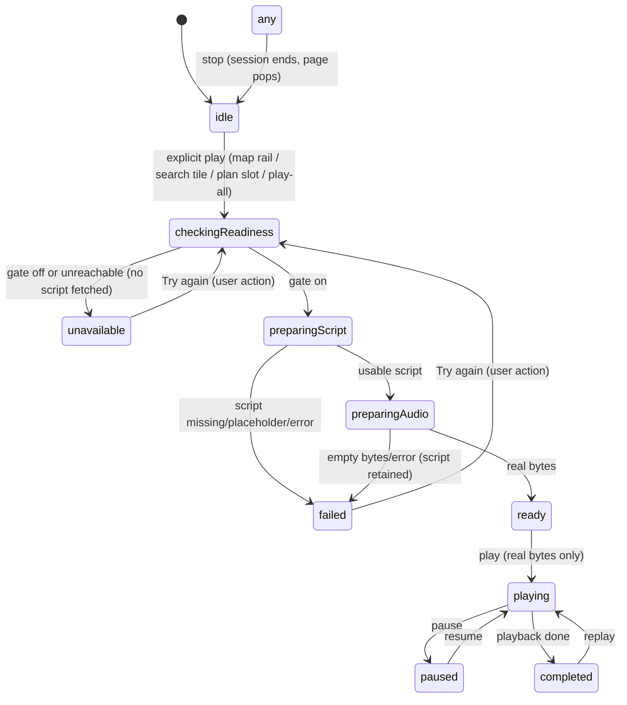

# Round 2 · S-30 docent player polish design contract

Status: implementation contract for branch `geondongkim/feature-round2-docent-polish`
Base: `origin/integration/canonical-screen-completion-20260903` @ `f6067a4a5f9fb3a54399c36f3bdb359be97bc02e`

This contract turns the S-30 gap in
`docs/product/lala-stitch-vs-runtime-screen-comparison-v2-20260903.md` §3.5, §6
(Flow 4), §10 and §13 into a bounded visual-polish slice. LALA is text-first:
the RAG script is the deliverable and voice is a gated, separately prepared
representation of the same script. Stitch's finished-looking audio player is a
simulation we must not copy; we copy only its "script + playback state
understandable at a glance" hierarchy (§10 reference item 3).

Hard boundaries (unchanged from the canonical contract and the controller's
existing behavior):

- Only real `DocentExperienceController` state drives the UI. No controller
  behavior, gating, or call order changes in this slice.
- No simulated playback, no invented script/source/timing, no seek/duration
  progress, no paid AI/Speech calls from tests, no mock normal paths.
- Readiness gate stays: when speech is not enabled, script and audio are both
  absent and the UI says so — it never implies a hidden script exists.
- Every visible string is bounded, localized copy in ko/en/ja/zh-Hans/zh-Hant;
  visitor locales never show Hangul (`lalaCopy`'s EN fallback or
  `lalaCopyMulti` translations).

## 1. ASCII wireframe (S-30 full player, `/docent-player`)

```text
+----------------------------------------------+
| <  Docent (AppBar, 5 locales)                |
+----------------------------------------------+
| [ verified 16:9 image | neutral empty slot ] |
| Place display name (20/w900, 2 lines max)    |
| Korean original name (only when nameKo real) |
| [source] [created date] [grounding…]  (Wrap) |
| [ Show your driver ]  (only when nameKo real)|
| ┌─ playback status card ────────────────────┐|
| │ (state   | queue prefix · caption   [▶/⏸] │|
| │  glyph)  | explanation line (optional) [⏹] │|
| │          | [ Try again ] (unavail/failed)  │|
| └───────────────────────────────────────────┘|
| Docent script            (only when real     |
| <full single-language script text>  usable)  |
+----------------------------------------------+
```

Mini player (above the shell's bottom navigation) keeps its compact single-row
form: artwork · place name · state caption (live region) · toggle · stop.

### State presentation matrix (the slice's core)

| Controller phase | Card tone / leading glyph | Caption (bold) | Explanation line | Controls |
| --- | --- | --- | --- | --- |
| `checkingReadiness` | amber · spinner | “Checking voice availability” | — | toggle disabled (`Semantics(enabled:false)`, label = step caption), stop enabled (cancels) |
| `preparingScript` | amber · spinner | “Preparing the script” | — | same as above |
| `preparingAudio` | amber · spinner | “Preparing the audio” | — | same as above; real script already visible below |
| `ready` | amber · waveform icon | “Ready to play” | — | play, stop |
| `playing` | amber · waveform icon | “Playing” | — | pause, stop |
| `paused` | amber · waveform icon | “Paused” | — | play (resume), stop |
| `completed` | amber · waveform icon | “Finished” | — | play (replay), stop |
| `unavailable` | slate · volume-off icon | “Voice docent is unavailable” | “Voice guidance is turned off or not ready on this service yet.” | visible “Try again” CTA (re-checks readiness), stop; no play affordance |
| `failed` | amber · error glyph | “Could not prepare” | controller `safeMessage` (already says what survives) | visible “Try again” CTA, stop; retained script stays readable |

Queue playback prefixes the caption with the real `queueIndex/queueLength`
progress token (existing behavior). Amber tokens reuse the tour audio family
(`0xFFFFFBEB`/`0xFFF5C842`/`0xFF744210`/`0xFFC87F11`); the unavailable slate
reuses the docent slate family (`0xFFF8FAFC`/`0xFFE2E8F0`/`0xFF64748B`)
already present in `docent_subtitle.dart`. No new color values.

## 2. Mermaid state flow (rendered states only — no controller changes)



Rendering contract per phase: exactly one caption source — `safeMessage` when
present (unavailable explanation and failed detail), else the phase label.
Never both a phase label and a contradicting message.

## 3. Component / data / state bindings

| Widget | Binds to | Truthfulness rule |
| --- | --- | --- |
| `DocentPlayerPage` | `DocentExperienceController.state` + `OnboardingState.language` | place==null renders the empty scaffold with back escape; never invents a place |
| `_DocentVerifiedImage` | `hasOfficialPlaceImage(place)` | neutral slot when no verified image |
| `_DocentPlayerHeader` | `LalaPlace.name/nameKo`, `LalaDocentScript.source/generatedAt/groundingSources` | chips only for real, parseable fields; raw identifiers never shown |
| `_DocentPlaybackCard` (reworked) | `DocentExperienceState.phase`, `safeMessage`, `queueIndex/queue` | one visual state per phase matrix above; disabled toggle carries `enabled:false` + explaining label; caption is a live region |
| `_DocentTranscriptCard` | `usableDocentScript(script.script, language)` | whole section absent without a usable script — no filler copy |
| `DocentMiniPlayer` | same controller state | step-aware caption via shared copy helper; compact 1-line caption allowed to ellipsize (full player carries the detail) |
| copy helpers in `docent_experience_copy.dart` | — | single source for all new strings; 5 locales; no raw error text |

## 4. Responsive and accessibility rules

- 320/360/393/430 dp widths plus wide web: playback card switches from
  horizontal (glyph · caption · controls) to a stacked column when
  `MediaQuery.textScaleOf(context) >= 1.3`, so at 200% text scale the full
  safe message and both 44 dp controls remain visible without truncation.
- Transcript and captions wrap freely (no fixed heights); only names, chips and
  the mini player's one-line caption ellipsize.
- All controls are ≥44 dp with `Semantics(button: true, label:)`; the disabled
  preparing toggle exposes `enabled: false` and a label that names the current
  step, so assistive tech announces why it cannot be activated.
- The player-page caption is a `liveRegion` (mini player already is), so
  phase transitions are announced without focus moves.
- Focus order follows visual order: controls before transcript; retry is never
  the first focus target on failure (caption comes first).

## 5. Visual acceptance matrix

| Check | iPhone-class 393dp | 320dp + 200% text | Wide web |
| --- | --- | --- | --- |
| Loading shows the real current step (check → script → audio) | required | required | required |
| Preparing toggle disabled + labeled, stop stays enabled | required | required | required |
| unavailable: slate tone, explanation, Try again; no play glyph; no transcript placeholder | required | required | required |
| failed: safe message fully visible, retry CTA, retained script readable | required | required | required |
| ready/playing/paused/completed captions correct, no seek/duration UI | required | required | required |
| Chips only for real source/generatedAt/grounding | required | required | required |
| ko/en/ja/zh-Hans/zh-Hant captions with zero Hangul outside ko | required | required | required |
| No RenderFlex overflow at 200% text scale | required | required | required |

Runtime capture of these states on a device remains an open gate (see §7);
widget tests cover the same matrix headlessly.

## 6. Out of scope (explicitly)

- Controller gating/caching/queue semantics, paid call flow, readiness contract.
- S-12 place-detail / map dock / tour-sheet per-surface docent widgets
  (`DocentSubtitle`, `DockDocentPreview`, `TourAudioBar`, `TourScriptCard`).
- Speech enablement itself, TTS quality QA, seek/duration features.
- Shared routing, non-docent features, SQL/API changes, PR creation.

## 7. Remaining runtime gates after this slice

- Paid speech generation and full-place pronunciation QA (operations approval).
- Exact-head on-device capture of each player state for the comparison doc.
- VoiceOver/TalkBack manual pass on the new status card.
