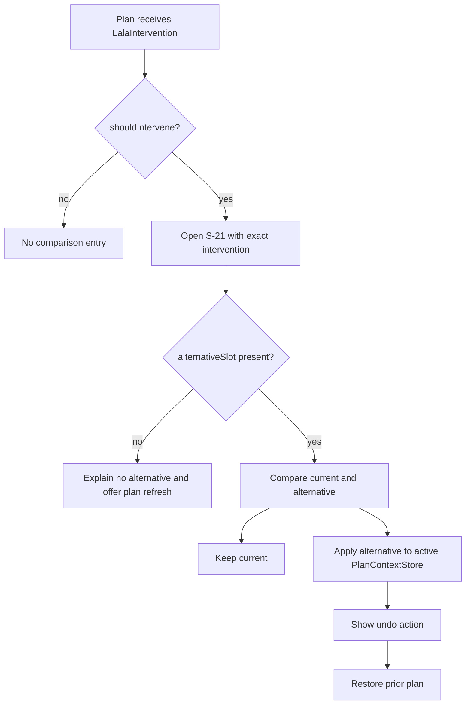
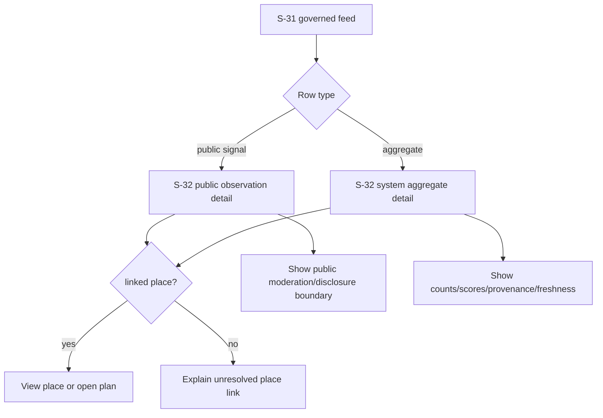
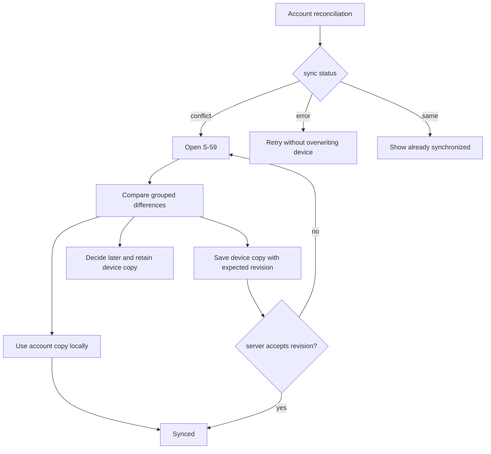

# LALA Screen Finalization and Sync Contract

Status: implementation contract for canonical screens S-21, S-32, and S-59.

## Shared rules

- Every screen renders only API, device-store, or account-store state already owned by LALA.
- Missing authority is shown as unavailable or empty. Sample rows, fabricated timestamps, and simulated success states are forbidden on the normal path.
- Korean, English, Japanese, Simplified Chinese, and Traditional Chinese use one selected language at a time.
- All primary actions have at least a 44 x 44 logical-pixel target, a semantic label, keyboard focus, and a non-color state cue.
- Navigation is a full-screen push above the current shell branch so back returns to the originating context.
- External review text, author identity, raw URLs, precise coordinates, secrets, and moderation internals never enter these views.

## S-21 Situation change comparison

### Purpose

Explain an observed change and compare the current itinerary slot with an API-provided alternative before the user changes the local active plan.

### Wireframe

```text
+----------------------------------+
| <  Situation change             |
| [weather / closure badge]        |
| What changed                     |
| reason                           |
| source + observed/unknown time   |
+----------------------------------+
| CURRENT          | ALTERNATIVE   |
| place/title      | place/title   |
| time / opening   | time / opening|
| travel authority | travel auth.  |
+----------------------------------+
| Why this option                  |
| observable factors only          |
+----------------------------------+
| Keep current | Apply alternative |
+----------------------------------+
```

### Flow



### Bindings and decisions

- Trigger, reason, recommended action, source, original slot, alternative slot, observable trigger factors, and distance comparison come from `LalaIntervention`.
- The comparison route receives the same object loaded by `PlanPage`; it does not issue a second request.
- Apply replaces the matching current-plan period only when an alternative exists, then publishes the new immutable `LalaDailyPlan` through `PlanContextStore` so persistence and other tabs observe it.
- Undo restores the exact prior plan object. No server mutation is claimed.
- Absent source time or travel authority is labelled unknown, not synthesized.

## S-32 Local Signal detail

### Purpose

Make the distinction between a governed system aggregate and a public user contribution explicit, then expose only actions supported by the current public contract.

### Wireframe

```text
+----------------------------------+
| <  Local Signal                  |
| [System aggregate | Community]   |
| title / linked place             |
| provenance + freshness           |
+----------------------------------+
| What this means                  |
| public aggregate values OR       |
| moderated public observation     |
+----------------------------------+
| Privacy and filtering            |
| no raw review/author/external URL|
+----------------------------------+
| View place | Open plan           |
+----------------------------------+
| Contribution availability        |
| sign-in / unavailable disclosure |
+----------------------------------+
```

### Flow



### Bindings and decisions

- Public detail receives `LocalSignalPublicItem`; aggregate detail receives `LocalSignalPlaceAggregate` plus envelope freshness.
- Feed cards open S-32. Place and plan actions continue through the existing `LocalSignalActionController` so map selection remains the single cross-tab hand-off.
- Public contributions currently have no app write API. S-32 must state that contribution management is unavailable rather than presenting inert create/edit/reaction/report controls.
- Aggregate scores render only when present and are labelled as aggregate indicators, never as individual reviews.
- A stale aggregation window is disclosed from server dates; freshness is not inferred from device time when authority is absent.

## S-59 Preference synchronization conflict

### Purpose

Compare device preferences and account preferences without automatic overwrite, including hard safety constraints, then let the user resolve or postpone the conflict.

### Wireframe

```text
+----------------------------------+
| <  Resolve preference conflict   |
| Nothing changes until you choose |
+----------------------------------+
| THIS DEVICE     | LALA ACCOUNT   |
| updated time    | updated time   |
| pace/interests  | pace/interests |
| HARD SAFETY differences          |
+----------------------------------+
| [Review differing groups]        |
| food/access/mobility/content ... |
+----------------------------------+
| Use account | Use this device    |
| Decide later                     |
+----------------------------------+
```

### Flow



### Bindings and decisions

- Device data is `TravelPreferencesStore.value`; account data is the last reconciled `TravelPreferencesRemoteDocument` held by the same store.
- The store exposes read-only account preferences, account update time, and the device document update time. It never exposes tokens or identity claims.
- Differences are grouped into travel style, food, mobility/accessibility, budget/operations, and docent/language. Hard safety differences receive a warning icon and explicit text.
- `Use account` calls the store's revision-safe account choice. `Use this device` uses compare-and-swap with the latest observed server revision. `Decide later` performs no write and returns to local operation.
- Server-empty, device-empty, identical, syncing, success, re-conflict, and error states are all explicit.

## Responsive and accessibility rules

- At 320 logical pixels, comparison columns stack vertically; at 600 or wider they can remain side by side.
- Long place names and translated labels wrap; no viewport-width font scaling and no negative letter spacing.
- Bottom actions account for safe-area insets and remain reachable with text scale 2.0.
- Difference rows announce group, device value, account value, and whether the group contains a safety constraint.
- Loading uses progress semantics; errors preserve the device copy and expose a retry action.

## Visual acceptance matrix

| Screen | Required real state | Honest fallback | Required evidence |
| --- | --- | --- | --- |
| S-21 | API intervention with original and alternative slots | no-alternative or unavailable authority | full page, apply, changed plan, undo |
| S-32 public | API public item and its public metadata | unresolved place or unavailable contribution API | detail, disclosure, linked action |
| S-32 aggregate | governed aggregate row and envelope freshness | approved aggregate unavailable | detail, provenance, optional metrics |
| S-59 | reconciled device/account mismatch | local-only, server-empty, same, syncing, error | differences, one resolution, decide later |

Runtime evidence must name the exact build commit. Widget tests may exercise rare conflict/intervention states, but they do not replace an honest real-runtime empty or available state capture.
