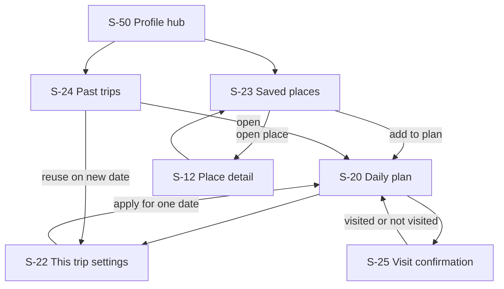

# S-22 to S-25 trip library and visit contract

Status: implementation contract for the canonical screen completion branch.

This packet covers the four user-visible screens that turn a generated daily
plan into durable, user-controlled trip state. It does not authorize applying
SQL to a live database. It also does not treat demo plans, sample places, or a
successful widget test as runtime evidence.

## 1. Ownership and precedence

- `TravelPreferences` is the account/device default.
- `TripPreferenceOverride` contains only fields that may legitimately change
  for one user-visible itinerary calendar date. It never weakens declared
  allergens, dietary modes, or accessibility constraints. Converting that date
  to UTC is forbidden because it can move the itinerary to the previous day.
- Effective planning input is `hard defaults + soft override`. Missing override
  fields inherit the default rather than receiving a generated value.
- Guests keep a versioned device copy. After Logto authentication and `/me`
  account sync complete, the same date-scoped document may be synchronized to
  the LALA API with optimistic revision checks.
- Saved places and visit confirmations remain usable offline. A failed account
  sync is visible and retryable, but never erases the device copy.

## 2. Navigation and state flow



## 3. Screen contracts

### S-22 This trip settings

```text
+------------------------------------------------+
| <  This trip settings          date / region   |
| Uses your defaults [View differences]          |
+------------------------------------------------+
| Companions       [solo] [friends] [family]     |
| Pace             relaxed | balanced | packed   |
| Weather response indoor | balanced | outdoor   |
| Walking range    short | medium | long          |
| Transport        walk / transit / taxi / car   |
| Crowd / wait     preference + max wait          |
| Budget / hours   band + closing-soon policy     |
+------------------------------------------------+
| Safety constraints inherited from defaults     |
| [Reset to defaults]       [Apply to this trip] |
+------------------------------------------------+
```

Required states: device-only, account-synced, saving, revision conflict,
retryable failure, and no differences. The difference view names only changed
fields. A reset deletes the override after confirmation; it does not edit the
default preferences.

### S-23 Saved places

```text
+------------------------------------------------+
| <  Saved places                 sync status    |
| [All] [region] [category]                      |
+------------------------------------------------+
| current place projection | source | saved time |
| [Open details] [Map] [Add to today's plan] [x] |
+------------------------------------------------+
| unavailable place id | no current projection   |
| [Remove from saved]                          |
+------------------------------------------------+
```

The API stores opaque canonical place IDs only. Current place details are a
separate public projection. If the projection is unavailable, the row says so
instead of inventing a name, image, category, or opening status.

### S-24 Past trips

```text
+------------------------------------------------+
| <  Past trips                     newest first |
+------------------------------------------------+
| date | region | 4/4 slots | 2 visited          |
| last updated                                   |
| [Open] [Reuse for another date] [Delete]       |
+------------------------------------------------+
| load more / honest empty / retry               |
+------------------------------------------------+
```

Past trips are account-scoped because the current device keeps only the active
plan. Deletion is explicit and removes the plan, its date override, and visit
rows in one transaction. Reuse always asks for a destination date and saves a
new plan; it never rewrites history.

### S-25 Visit confirmation

```text
+------------------------------------------------+
| <  Visit confirmation                          |
| place / date / plan period                     |
+------------------------------------------------+
| [I visited] [I did not visit] [Not decided]    |
| Optional reason: closed/weather/crowded/time/  |
|                  transport/changed mind/other  |
| [ ] Use this outcome for similar suggestions  |
| Privacy: no precise route or free-text review  |
+------------------------------------------------+
| [Cancel record]                  [Save]         |
+------------------------------------------------+
```

The reason is a bounded code, not free text. `use_for_recommendations` is false
by default and can be changed later. A planned/undecided state carries neither
reason nor confirmation time.

## 4. Data bindings

| UI state | Source of truth | Persistence |
| --- | --- | --- |
| default preferences | `TravelPreferencesStore` | device + account after sync |
| one-trip override | `TripPreferenceOverrideStore[planDate]` | device + authenticated API |
| effective settings | base defaults overlaid by non-null override fields | derived, never stored twice |
| saved IDs | `SavedPlaceStore` | device; authenticated API reconciliation |
| current saved-place details | public canonical place projection | refetched; never copied into private row |
| active plan | `PlanContextStore` | device; authenticated date plan API |
| past-plan summaries | authenticated planning API | server only |
| visit outcome | `SlotVisitStore` plus confirmation metadata | device + authenticated API |

## 5. API and conflict rules

- All `/api/v1/me/*` routes require a Logto OAuth access token.
- List endpoints return an honest empty list, not 404 and not sample content.
- One trip override exists per `(issuer, subject, plan_date)` and uses a revision
  compare-and-swap. A stale write returns a safe 409 conflict.
- Past-plan pagination is bounded and ordered by date descending.
- Plan deletion is idempotent and reports whether a plan actually changed.
- Visit status is `planned`, `visited`, or `not_visited`. Reasons are accepted
  only for `not_visited`; `planned` clears reason and feedback consent.
- Responses never expose issuer, subject, raw auth claims, coordinates from
  device history, or internal recommendation features.

## 6. Responsive and accessibility acceptance

- Every control has a minimum 44 logical pixel target.
- Selection is conveyed by text/icon state in addition to color.
- 200% text scale may wrap rows but cannot clip actions or hide the save button.
- Compact phones use a single column. Wide web layouts may use two columns but
  preserve reading and focus order.
- Destructive actions require a confirmation dialog and are never adjacent to
  the primary action without spacing.
- Screen readers announce sync state, selected values, difference count, and
  whether feedback will affect recommendations.

## 7. Visual acceptance matrix

| Screen | Data acceptance | Visual acceptance | Recovery acceptance |
| --- | --- | --- | --- |
| S-22 | actual default + date override | differences and inherited safety are distinct | conflict offers reload or keep device draft |
| S-23 | actual saved IDs + public projection | unavailable rows are explicit | retry does not discard local saves |
| S-24 | actual account plan summaries | date, region, slots, visits are scannable | empty/error/pagination are distinct |
| S-25 | actual selected plan slot | outcome and optional reason are unambiguous | failed save retains the draft |

Final evidence requires exact-head tests and distinct iPhone 17 Pro captures for
all four screens. Database migration application and authenticated production
runtime verification remain separate operating gates.
