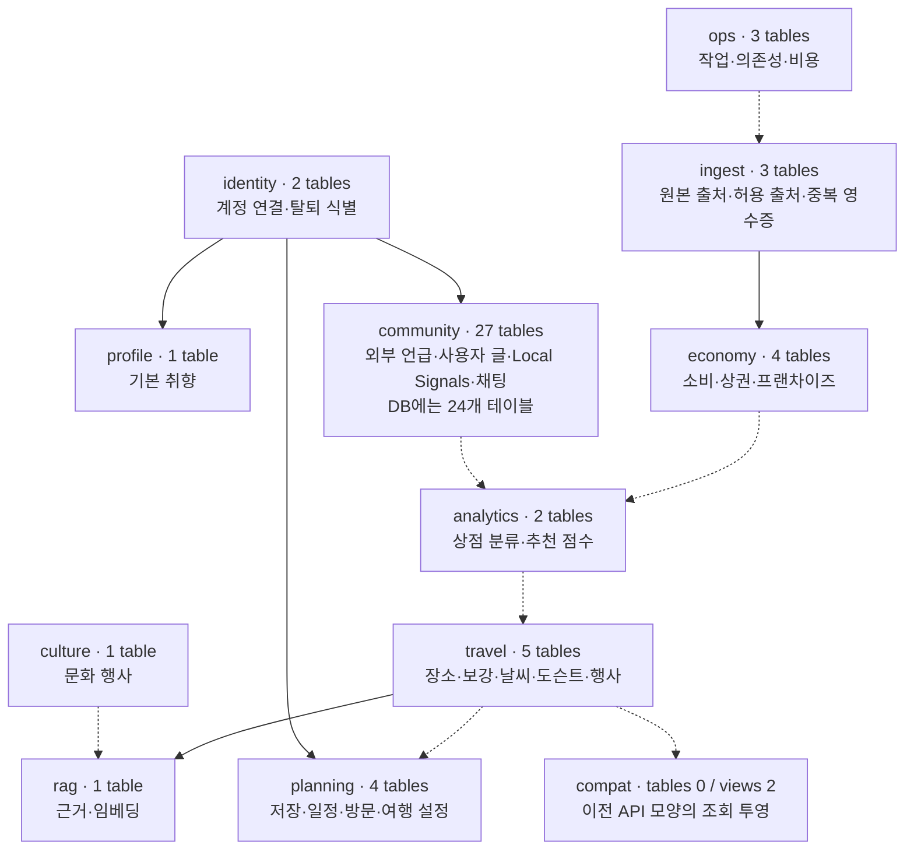
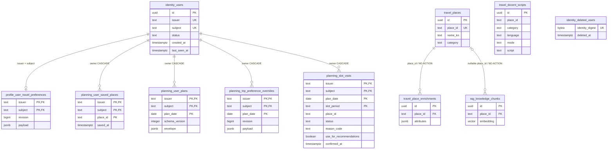
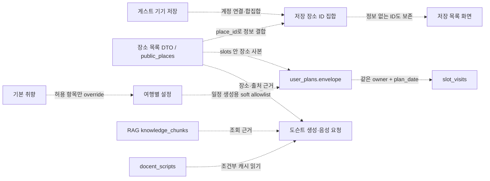

# 전체 개요와 핵심 ERD

이 도식의 코드 기준은 `765570a2`다. 실제 DB 대조 결과와 차이는 [01 문서](01-baseline-and-db-comparison.md)에 있다.

확대해서 볼 그림: [전체 개요 SVG](assets/schema-overview.svg) · [핵심 물리 ERD SVG](assets/core-physical-erd.svg) · [논리 흐름 SVG](assets/core-logical-flow.svg). 아래 Mermaid가 편집 원본이다.

## 전체 스키마 개요

아래는 도메인별 데이터 흐름의 요약이다. 연결선 하나가 단일 FK 또는 API를 뜻하지 않는다. 전체 53개 테이블과 개별 제약은 [전체 목록](08-full-schema-reference.md)에 있다.

community 27개 중 3개는 실제 DB에 없다. 보류된 커뮤니티·Local Signals·채팅, 날씨 재계획 관련 구조도 현재 구조에서 삭제하지 않았다. `analytics`는 주로 장소·추천 분석 자료이며 사용자 행동 로그 전용 스키마가 아니다.

## 핵심 흐름의 실제 FK

아래 연결선은 코드에 선언되고 이번 DB에서 확인된 FK다. 식별자는 schema.table을 schema_table로 적었다. 핵심 컬럼만 도식화했으며 전체 타입·NULL·DEFAULT는 사전을 따른다.

**복합 키 범례:** identity_users의 issuer·subject의 UK 표기는 두 컬럼을 합친 UNIQUE 하나다. 각각이 UNIQUE라는 뜻이 아니다. 여러 PK 표기도 합친 PK 하나를 뜻한다. `travel_docent_scripts`는 (place_id, category, language, mode) 복합 UNIQUE가 있으나 place_id FK는 없다. deleted_users도 identity.users FK가 없다.

## API·JSON·기기 상태의 논리적 연결

다음 점선은 FK가 없는 코드·JSON 연결이다. 새 FK를 제안하거나 적용한 도식이 아니다.

| 관계 | DB가 강제하는 것 | 코드·제품에서 따로 확인할 것 |
|---|---|---|
| 계정 → 저장/일정/기본 취향/override/방문 | (issuer, subject) FK·계정 삭제 CASCADE | 실제 로그인·계정 전환·탈퇴 결과는 별도 실행 검증 |
| 장소 → 저장 ID | 장소 FK 없음 | 조회 범위 밖/삭제/통합된 장소 ID의 표시·복원 정책 |
| 일정 → 방문·override | 같은 날짜를 향한 FK 없음 | 일정 삭제 시 repository가 방문·override를 같은 transaction에서 정리 |
| 장소 → 도슨트 원고 | place_id FK 없음 | 콘텐츠 근거·캐시 만료·언어·실제 재생 상태 |
| 기본 취향 → 여행별 설정 | 각각 계정 FK만 있음 | 허용된 override 병합, expected_revision/409 |
| RAG source_table/source_id → 출처 | source_table은 문자열 | 출처 객체 존재·데이터 신선도·수집 정책 검증 |

회의 설명 순서: **누가(계정) → 무엇을 선호하는가(취향) → 무엇을 찾고 저장했는가(장소·저장) → 어떤 날짜에 계획/확인했는가(일정·방문) → 어떤 근거로 안내했는가(도슨트·RAG)**. 현재 상태 테이블과 사용자 행동 이력을 혼동하지 않는다.
