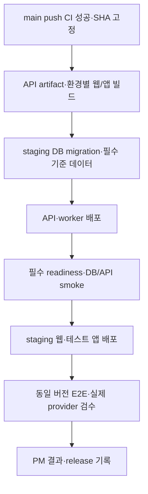

# 03. CI와 배포 전환

상태: **후속 구현 명세**. 이 문서의 job 이름과 배포 단계는 현재 활성 workflow가 아니다.
기존 구현은 [현황](01-current-state.md)을 본다.

## PR에서 필요한 검사

| 제안 gate | 검사 내용 | 실패 예시 / 담당 |
|---|---|---|
| `quality` | Ruff check·format check, 비밀 탐지, YAML·shell 검사 | 문법·포맷·비밀 포함 / 작성자 |
| `api-tests` | 기존 pytest·JWT·worker plan 테스트. 외부 HTTP·SDK mock | 인증·권한·오류 envelope·fallback 회귀 / 백엔드 |
| `db-integration` | 일회용 PostgreSQL + PostGIS·vector·pgcrypto, 스키마·seed·실제 query | 컬럼 누락, FK 오류, 기존 데이터 손실 / DB + 백엔드 |
| `api-contract` | PR base 및 지원 중인 배포 계약과 OpenAPI 비교, DTO 필드·타입·nullability·클라이언트 파싱 | 프론트가 기대하는 필드 삭제·타입 변경 / 백엔드 + 프론트 |
| `flutter-checks` | 검증된 SDK 버전 설치, format check·analyze·test, reference client 검사 | 화면 상태·직렬화·컴파일 오류 / 프론트 |
| `web-build` | 비밀 없는 테스트 설정으로 Flutter web release build | JS/asset 빌드 실패 / 프론트 |
| `required-ci` | 위 결과를 모으는 고정 이름의 최종 gate | 필수 job 실패·취소·뜻하지 않은 skip도 실패 |

GitHub branch protection/ruleset에서 `required-ci`와 리뷰를 필수로 설정해야 merge가 실제로 차단된다.
문서나 YAML에 이름을 적는 것만으로 보호 규칙이 적용되지는 않는다.
초기에는 공통 gate를 모든 PR에서 실행한다. 이후 경로별 최적화를 하더라도 DB/API 계약 영향은 함께 검사한다.
mypy는 현재 baseline 오류를 먼저 측정한 뒤 범위를 정해 추가한다.

테스트 앱 빌드는 Android debug APK·iOS simulator 빌드처럼 서명 없는 컴파일 검사를 우선 추가한다.
모바일 코드·plugin·native 설정 변경 PR과 출시 후보에서는 해당 플랫폼 검사를 필수로 한다.
서명된 기기 배포 빌드는 staging 배포 단계에서 별도로 생성한다.

## 테스트 환경 계약

```dotenv
LALA_RUNTIME_PROFILE=ci
LALA_LOCAL_USE_AWS_SECRETS=false
LALA_ENABLE_LIVE_AI=false
LALA_ENABLE_LIVE_SPEECH=false
LALA_ENABLE_LIVE_ROUTING=false
LALA_STATIC_SNAPSHOT_FALLBACK=false
AWS_EC2_METADATA_DISABLED=true
```

위 값은 현재 존재하는 테스트 설정 예시다. fallback·유료 경로 테스트는 주입한 mock과 함께 해당 값을 테스트 안에서 바꿀 수 있다.
PR job에는 운영·staging 비밀이나 IAM 역할을 주입하지 않는다. 실제 DB job에는 그 job에서 만든 임시 DB 접속값만 전달한다.
로컬 재현 시 상속된 클라우드 설정도 제외해야 한다. 기존 [격리 검사 예시](../team-development-preparation-20260909/08-development-environment.md)를 따른다.

web build 성공은 실제 지도·Logto 성공이 아니다. 테스트용 공개 주소를 명시해 컴파일을 검사하고,
실제 provider 검수는 staging build로 수행한다. 잠금 파일을 사용하는 의존성 설치와 SDK 버전 고정도 이 PR에서 정리한다.

## 작은 PR로 적용하는 순서

| 순서 | 변경 묶음 | 완료 조건 |
|---|---|---|
| 0. 이번 브랜치 | 현황·정책·후속 구현 명세 | 문서·링크·diff 검증, 팀 검토 가능한 브랜치 |
| 1. Local + PR CI | 설정 예시, 외부 mock 경계, 실제 DB job, API 계약, Flutter build | 다른 개발자/CI의 새 checkout에서도 재현, 의도적 오류를 gate가 탐지 |
| 2. Staging + 기존 배포 전환 | staging 대상·서비스 권한·DB·공개 빌드 설정, main CI 성공 후 staging 배포, 운영 자동 trigger 교체 | 지정 SHA 배포·migration·readiness·PM 인수 완료 |
| 3. Production 승격 | 검수된 release 지정·승인·운영 migration·배포·smoke·복구 | 검수 안 된 버전 배포 차단, 이전 API와 DB 호환 확인 |

PR 1까지 main에 merge하는 동안에는 **기존 운영 자동 배포가 여전히 적용**된다.
팀이 준비 작업의 운영 반영을 원하지 않으면 그보다 먼저 별도 작은 PR로 운영 배포를 수동·승인 방식으로 전환한다.
이는 실제 운영 동작 변경이므로 배포 담당자가 전환 시점과 복구 방법을 확인한다.

## 기존 배포를 전환할 때

1. 현재 `.github/workflows/deploy.yml`의 CI 성공 → 운영 배포 경로를 명시적 운영 release 방식으로 교체한다. main 배포와 staging 배포가 동시에 운영을 건드리지 않게 한다.
2. 기존 `dev`의 Azure 배포·운영 웹 smoke trigger 처리 방침을 정한다. staging 제공자 확정 후 재사용·대체 여부를 결정하고 중복 활성 trigger를 정리한다.
3. GitHub 외 Vercel Git 연동의 production branch·preview 설정도 확인한다. GitHub workflow만 바꾸고 웹 자동 운영 배포를 남겨두지 않는다.
4. staging 배포는 신뢰된 저장소의 **main push CI 성공**과 그 실행의 정확한 `head_sha`에 연결한다. PR workflow 성공이나 임의 branch artifact로 배포 권한을 얻지 못하게 한다.
5. 배포 직전에 움직이는 `origin/main`을 다시 선택하지 않는다. CI를 통과한 SHA와 artifact 식별자를 끝까지 전달한다.
6. 환경별 배포 동시 실행을 직렬화한다. 진행 중인 DB migration을 새 push 때문에 취소하지 않는다. 최신 후보와 검수 완료 후보를 구분한다.

## Staging 배포의 실행 순서



migration 실패 시 그 후보의 서비스 배포를 중단한다. staging QA seed는 초기 구성·필요한 갱신 때만 별도로 실행하고,
매 배포마다 PM 데이터를 초기화하지 않는다. 실패 결과는 성공한 이전 후보와 분리해 기록한다.
`/healthz`의 HTTP 200뿐 아니라 `/readyz`의 DB-backed 상태·필수 schema·인증 설정·snapshot 비활성을 판정한다.
유료 기능까지 자동 smoke할지는 대상 기능과 호출량을 정해서 설정한다.

## Production 승격과 복구

- release 기록에는 API SHA·artifact digest, 웹/앱 SHA·build number, DB revision 또는 SQL manifest hash, 설정 버전, staging 검수 결과를 연결한다.
- API는 검수한 artifact를 재사용한다. Flutter는 API 주소·callback·앱 식별자가 빌드에 들어가므로 **같은 소스 SHA에서 환경별로 빌드**하고 각각 식별자를 남긴다.
- iOS/Android의 staging 앱과 운영 앱은 식별자·서명이 다를 수 있어 동일 바이너리를 그대로 승격한다고 가정하지 않는다.
- 운영 시작 조건은 지정 release의 필수 검사 통과와 배포 담당 승인이다. 승인 권한과 실행자 자기 승인 허용 여부를 실제 GitHub 설정에 반영한다.
- 지원되는 환경 보호 기능을 계정에서 확인한다. 부족하면 권한을 제한한 수동 release 절차를 정하고, 확인되지 않은 자동 승인 gate를 완료 처리하지 않는다.
- 호환되는 DB 확장 변경 → API → 웹/스토어 배포 순으로 진행한다. 기존 앱 버전이 남으므로 최소 지원 앱 계약을 유지한다.
- 서비스 장애는 이전 검증 API artifact로 복구한다. DB 변경을 일괄 downgrade하거나 운영 DB를 자동 초기화하지 않는다. 데이터 수정은 forward-fix·복원 계획에 따라 별도로 실행한다.

운영 smoke는 장소 조회·로그인 같은 최소 정상 동작을 확인한다. 테스트 데이터 대량 생성·삭제·외부 수집 전체 재실행은 운영 smoke에 넣지 않는다.
