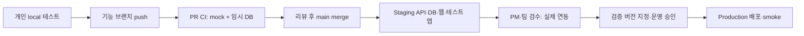

# Local · CI · Staging · Production 전환 설계

기준일: 2026-09-15. 기준 코드: `origin/main`의 `765570a21ff5ab5207c627d3659e8051be6dbd98`.
작업 브랜치: `docs/environment-ci-foundation`.

상태: **최신 main 조사와 설계 문서 작성 완료 / CI·환경·배포 전환은 후속 구현**.
이 브랜치는 아래 구조를 팀이 검토하고 작은 PR로 구현하기 위한 문서 산출물이다.
현재 배포 workflow, 애플리케이션, DB, 클라우드 설정을 변경하지 않는다.

## 먼저 알아둘 현재 동작

현재는 `main`의 CI 성공 후 운영 EC2로 자동 배포된다. 아래 목표 흐름으로 아직 전환되지 않았다.
이 문서 브랜치도 기존 방식으로 main에 merge하면 운영 배포가 시작될 수 있다.
기존 `dev` 브랜치에도 Azure 배포와 운영 웹 주소 smoke가 연결되어 있다.

## 목표 흐름

`staging`은 환경 이름이다. 장기 유지하는 staging 브랜치를 추가하지 않고,
`main`과 짧게 쓰는 기능 브랜치로 시작한다. staging에 새 버전이 배포되면 검수 대상 SHA를 갱신한다.
운영 배포는 검수를 통과한 특정 버전을 대상으로 한다.

## 읽는 순서

| 문서 | 확인할 내용 |
|---|---|
| [01 현재 구조와 차이](01-current-state.md) | 이미 구현된 부분, 빠진 검사, 기존 배포와 목표의 차이 |
| [02 환경·API·키 정책](02-environments-and-external-apis.md) | local/CI/staging/production에서 실제와 mock의 경계, 키 접근법 |
| [03 CI와 배포 전환](03-ci-and-deployment.md) | 필수 CI, PR 순서, 기존 자동 운영 배포 전환, 버전·복구 |
| [04 DB migration과 seed](04-database-and-seed.md) | 기존 SQL 활용, Alembic 도입 조건, 데이터 보존 검사 |
| [05 팀 작업과 검수](05-team-workflow-and-acceptance.md) | 세 개발자 역할, 웹·앱 1~5 단계, PM 인수표, 필요한 입력 |

## 이번 결정과 남은 결정

| 항목 | 상태 |
|---|---|
| 최신 main에서 별도 브랜치와 문서 생성 | 사용자 요청에 따라 완료 |
| Local → PR CI → staging → 검수 → production | 이번 설계의 목표 |
| staging 클라우드 | **사용자 결정: 미정 유지, 클라우드 공통 구조까지만 작성** |
| Logto | 사용자가 전달한 tenant 1개 제약을 설계 전제로 사용. 요금제·추가 앱/리소스 허용 범위는 별도 확인 |
| DB 도구 | 기존 canonical SQL 유지, Alembic은 후속 migration 도입 후보 |
| 실제 환경 주소·권한·배포 계정·앱 서명 | [입력표](05-team-workflow-and-acceptance.md)에 미확정으로 기록 |

이번 문서는 환경과 CI/CD 전환 범위의 최신 설계다. [9월 팀 준비 묶음](../team-development-preparation-20260909/README.md)의
제품 범위·화면·MVVM 결정은 그 문서를 계속 참조한다. 과거 운영 문서는 기준일과 코드 계약을 대조해 사용한다.
이번 조사는 저장소 파일 기준이며 클라우드의 현재 가동 상태, 비밀 값, DB 내용은 조회하지 않았다.

## 산출물 검증

- 기준 main과 브랜치 분기점 일치 확인: `765570a21ff5ab5207c627d3659e8051be6dbd98`.
- 변경 Markdown 9개, 내부 파일 링크 82개 확인: 누락 없음. 코드 fence 짝 확인.
- `git diff --cached --check` 통과. 저장소 pre-commit의 문서 대상 검사·비밀 탐지 통과.
- README 삽입으로 이동한 기존 비밀 탐지 항목의 줄 번호를 `.secrets.baseline`에 자동 갱신. 새 허용 항목 추가 없음.
- 변경 범위는 문서와 위 검사 metadata뿐이다. 서비스 코드·workflow 변경 없음.
- 실제 DB·외부 API·앱 빌드·배포 검증은 이번 문서 검증에 포함하지 않음.
