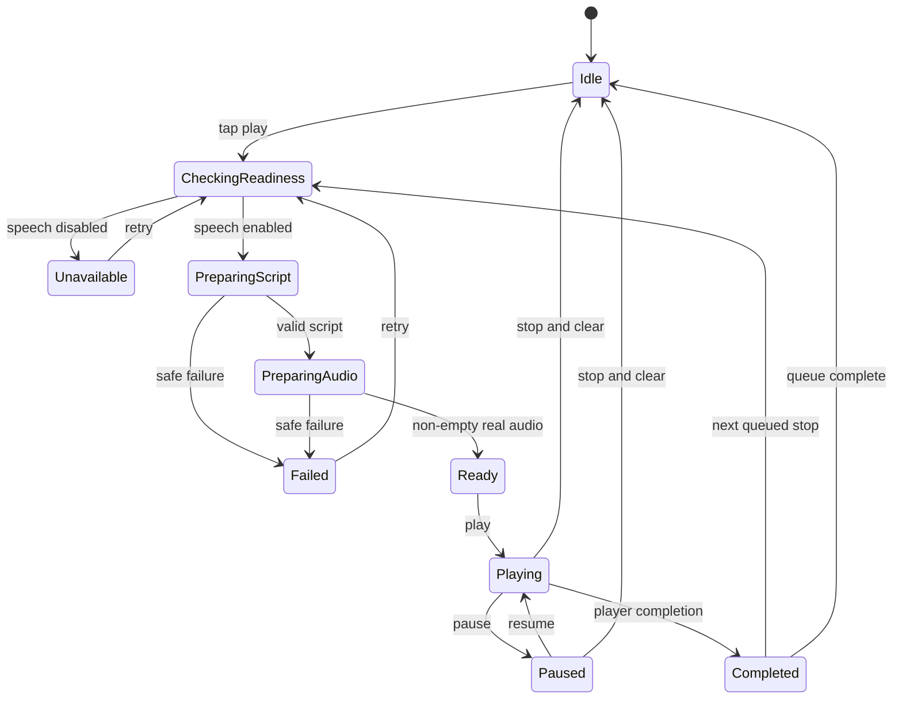

# Issue #120 docent-first implementation contract

Status: approved implementation input  
Base: `origin/main` at `35ed6bad7ecaa3acaf98c177ace63f0cd8a36ea3`  
Branch: `feature/docent-first-experience`  
Issue: <https://github.com/3dt-1st-org/LALA-next/issues/120>

## 1. Objective

Promote LALA's generated docent from a detail-sheet utility to a persistent,
truthful product surface without adding a fifth bottom tab or reducing the map
viewport. A user must be able to start a guide from a map card, search result,
or itinerary stop, continue listening while changing tabs, and open one
full-screen player that explains source and freshness.

The generated concept image is a direction reference only:

`/Users/geondongkim/LALA-next/output/imagegen/lala-issue-120-current-redesign-20260901/issue-120-current-redesign-v1.png`

Claude image OCR is not an implementation source. This Markdown contract is the
source of truth for layout, behavior, states, data binding, and acceptance.

## 2. Current-state reconciliation

Issue #120 was authored against the 2026-08-11 app. Do not reimplement items
that are already present on current `main`:

- Naver Dynamic Map and the current conditional native/web/stub map boundary.
- Four bottom destinations: Discover/Search, Map, Plan, Local Signals.
- Five-language navigation labels with honest English fallback.
- `slot.title` handling and the `lu`/`di` correction.
- `travel_time_from_previous_minutes` parsing and display helpers.
- `audioplayers`, `DocentAudioPlayer`, and `DocentPlaybackController`.
- Existing generated-script, speech, readiness, place-reason, freshness, and
  Local Signals contracts.
- Current compact map dock and category-color/pin-first behavior.

The still-missing user value is:

1. one shared playback owner above the tab routes;
2. visible listen controls at discovery surfaces;
3. a persistent mini-player above the existing four-tab bar;
4. a full-screen, source-aware player;
5. opt-in itinerary queue playback that generates one stop at a time;
6. a large Korean-name utility for a driver or physical sign comparison.

## 3. Non-goals and safety

- Do not add a Docent bottom tab.
- Do not replace or restyle the Naver map implementation.
- Do not change API endpoints, database schema, deployment, cloud settings,
  Logto, or PR #164.
- Do not make live OpenAI/Speech calls, crawl, deploy, or write production data
  during implementation or tests.
- Do not prefetch scripts or audio. Generation starts only after an explicit
  user play action.
- Do not fabricate duration, chapter structure, citations, local percentages,
  ratings, freshness, weather, or source names.
- Do not display raw reviews, request hashes, cache keys, secret values, or
  provider error bodies.
- Do not use fixture/demo data in the normal runtime path.
- Preserve guest access, current localization, category colors, pin-first
  clustering, place selection, map bounds, and cross-tab region persistence.

## 4. Experience architecture

Create an app-root `DocentExperienceController` that is injected into the
router, main shell, map route, search page, and plan page. It owns exactly one
audio player and one queue, so two surfaces can never play concurrently.

The controller must be testable without network or platform audio:

- inject `LalaBackendFactory`;
- inject `DocentAudioPlayer` or a factory;
- inject the base `LalaAppConfig`;
- read the current language at the moment a user requests playback;
- allow a fake backend/player in widget and unit tests;
- dispose backend/player resources deterministically.

Suggested public model, names may adapt to established local style:

```dart
enum DocentExperiencePhase {
  idle,
  checkingReadiness,
  preparingScript,
  preparingAudio,
  ready,
  playing,
  paused,
  completed,
  unavailable,
  failed,
}

class DocentExperienceState {
  LalaPlace? place;
  LalaDocentScript? script;
  DocentExperiencePhase phase;
  List<LalaPlace> queue;
  int queueIndex;
  String? safeMessage;
}
```

Do not duplicate raw audio bytes or script bodies into persistence. The queue is
memory-only and is cleared on app restart. An in-memory cache may key by
`placeId + API language`; it must never cross languages silently.

### 4.1 User-initiated state flow



Rules:

- A repeated tap while checking/generating is ignored.
- A new place request stops the previous player before changing identity.
- Queue playback generates only the current stop. It must not fan out four
  script/audio requests.
- Stop cancels queue advancement. Late async responses use a revision token and
  cannot revive an old place or a cleared queue.
- Readiness failure and speech-disabled are honest unavailable states. Do not
  call the audio endpoint when readiness does not report live speech enabled.
- Public UI receives a localized bounded message, never `exception.toString()`.

## 5. Data bindings

| UI value | Runtime source | Honest fallback |
|---|---|---|
| Place name | `placeDisplayName(place, language)` | existing localized fallback |
| Korean utility name | `place.nameKo` | hide utility if blank |
| Image | existing verified place image helper | existing neutral placeholder |
| Category | existing category label/color | text plus color, never color only |
| Script | `LalaDocentScript.script` | unavailable/retry state |
| Generated time | `LalaDocentScript.generatedAt` | hide |
| Source | `LalaDocentScript.source` | localized generic source label |
| Grounding | extend Flutter DTO for API `grounding_sources` | hide section |
| Weather context | actual script/weather already supplied by API | never invent |
| Duration/position | actual player signals only | status text, no fake `2:14` |
| Local score | existing score only, framed as index/grade | hide, never percentage |

The server OpenAPI exposes `grounding_count` and `grounding_sources`, but the
manual Flutter DTO currently drops them. Extend `LalaDocentScript` additively
and update client tests. Do not expose request hash or cache key in UI.

## 6. Screen contracts

### 6.1 Map discovery

```text
+--------------------------------------------------+
| category chips                                  |
| compact image rail: [image/name       (play)]   |
|                                                  |
|                 NAVER MAP                        |
|                                                  |
| compact selected-place dock                      |
+--------------------------------------------------+
| [thumb] place name        state text    (pause)  |  mini player, only active
+--------------------------------------------------+
| Discover | Map | Plan | Local Signals            |
+--------------------------------------------------+
```

- Preserve the current map-first vertical budget.
- Add a play affordance to `MapRailPlaceCard`, but keep the card itself as the
  selection target. The play action must be a distinct semantic button and
  must not trigger card selection twice.
- Visual play icon may be 30-32dp, but the hit target is at least 44dp.
- Category color stays on category identity. Audio uses the existing warm
  amber/coral family and must not recolor map pins.
- The mini-player is not shown for idle state. For preparing, ready, playing,
  paused, unavailable, or failed, show the selected place and a truthful state.

### 6.2 Persistent mini-player

```text
+--------------------------------------------------+
| image | localized place name        | control    |
|       | Preparing / Playing / Paused | open page  |
+--------------------------------------------------+
```

- Lives in `LalaMainShell` immediately above `LalaBottomNavBar`.
- Must work across all four indexed-stack branches without resetting.
- Tapping identity/content opens `/docent-player`; tapping the control only
  toggles/retries/stops as appropriate.
- Use one line for name and one line for state; ellipsize safely.
- Compact height target 56-64dp. Do not create a second large bottom sheet.
- Respect safe area exactly once; do not restore the old empty gray bottom gap.
- If the map's full detail sheet intentionally hides the tab bar, hide the
  mini-player with it to avoid overlay conflicts.

### 6.3 Full-screen player

```text
+--------------------------------------------------+
| back                  DOCENT              more   |
| [verified place image, 16:9]                     |
| Place name                                      |
| Korean place name                                |
| [AI docent] [actual generated date] [source]     |
| actual script excerpt / readable transcript      |
|          (back 15)  (play/pause)  (forward 15)  |
| evidence: source + grounding labels              |
| [Show Korean name to driver]                     |
+--------------------------------------------------+
| persistent app navigation is not duplicated      |
+--------------------------------------------------+
```

- Route is outside the indexed shell and returns to the previous tab.
- No giant marketing hero. The real place image and controls are the product.
- The transcript must be scrollable and single-language.
- Seek controls are shown only if the player boundary supports them correctly;
  otherwise omit them instead of rendering dead controls.
- Show generated date only when parseable and present. Do not say "just now".
- Convert machine source identifiers to bounded localized labels.
- Show grounding source labels only from `grounding_sources`.
- `Show Korean name to driver` opens a simple modal/bottom sheet with the
  Korean name in large type and address if available. Hide the action when no
  Korean name exists. It does not request permissions or copy automatically.

### 6.4 Search/Discover

- Add an optional trailing play button to `_SearchPlaceTile`.
- Preserve region, filters, provenance, loading/error/empty states, and place
  row geometry. Do not add fabricated "Open now" state.
- A play request must not navigate to Map or change the selected region.
- The same shared mini-player appears above navigation after the request.

### 6.5 Plan as a queue

- Add an optional play button to a populated `PlanSlotTile`.
- Add one primary `Play all guides` command near the plan overview only when
  at least one visible slot has a place.
- Queue order is the visible slot order. Deduplicate adjacent identical place
  IDs. Empty slots are skipped.
- Retain Morning/Lunch/Afternoon/Dinner titles, travel connectors, weather,
  closure, visit, spend-band, and intervention behavior.
- Starting queue playback does not regenerate the daily plan.
- The command becomes Stop while the owned queue is active. Do not show fake
  total duration.

## 7. Visual tokens and accessibility

- Keep current `LalaVisualColors.primaryBlue`, white surfaces, ink text, and
  existing category colors.
- Reserve warm audio color for play/pause/active playback, not for unrelated
  commands.
- No purple gradients, dull gray bottom bar, decorative blobs, or nested cards.
- Reuse current radius tokens; do not increase card radius above existing local
  conventions.
- Minimum interactive target 44x44dp.
- Every audio control has localized semantics for prepare/play/pause/retry/stop.
- Support 320dp width and 200% text scale without overflow. Long German-style
  strings are not required, but all five current locales must remain bounded.
- Do not convey playing/unavailable state by color alone.

## 8. Expected file ownership

Prefer these boundaries; add a small file only when it removes real coupling:

- `apps/flutter_app/lib/app/lala_app.dart`
- `apps/flutter_app/lib/app/lala_main_shell.dart`
- `apps/flutter_app/lib/core/routing/lala_router.dart`
- `apps/flutter_app/lib/core/routing/lala_route_paths.dart`
- `apps/flutter_app/lib/features/docent/experience/*` (new shared controller/state)
- `apps/flutter_app/lib/features/docent/presentation/pages/docent_player_page.dart` (new)
- `apps/flutter_app/lib/features/docent/widgets/docent_mini_player.dart` (new)
- existing docent playback files, only as required for real state/position
- `apps/flutter_app/lib/features/place/widgets/map_rail_place_card.dart`
- `apps/flutter_app/lib/features/search/presentation/pages/search_page.dart`
- `apps/flutter_app/lib/features/planner/widgets/plan_slot_tile.dart`
- plan/map page wiring needed to pass the shared controller
- `clients/flutter/lib/lala_api_client.dart`
- focused tests under matching `apps/flutter_app/test/...` and
  `clients/flutter/test/...`

Avoid unrelated formatting or refactors in monolithic/legacy files.

## 9. Required tests

Controller unit tests:

- no backend call before explicit play;
- readiness disabled prevents script/audio call;
- one place happy path and play/pause/stop;
- script failure and audio failure use safe state;
- double tap does not duplicate requests;
- selecting a new place stops old playback;
- stale async response cannot revive old place;
- queue generates one stop at a time and advances only on completion;
- queue stop prevents next generation;
- language is part of cache identity;
- dispose closes owned resources.

Widget/router tests:

- mini-player absent when idle and present above four-tab navigation when
  preparing/playing/paused;
- changing tabs keeps the same controller and place;
- mini-player opens full player route;
- map card play does not invoke card selection;
- search play does not change region/navigation;
- plan slot and play-all queue order;
- Korean-name utility hidden/present correctly;
- source/grounding/generated time honest-empty behavior;
- 320dp and 200% text-scale overflow smoke;
- current map, navigation, region, and existing golden/contract tests remain.

Client test:

- additive parsing of `grounding_count` and `grounding_sources`, including
  absent fields.

## 10. Validation and delivery

Run from `apps/flutter_app` where appropriate:

```bash
flutter analyze
flutter test
```

Run repository gates:

```bash
uv run pytest apps/api/tests -q
uv run pre-commit run --all-files
git diff --check
```

Implementation delivery:

1. Commit this contract first.
2. Use 2-4 conventional commits, pushing after each meaningful slice.
3. Open one Draft PR against `main`, linked to issue #120.
4. Report exact head, actual changed files, tests, CI, and any honest runtime
   blocker. Do not claim visual/runtime PASS without iPhone 17 Pro evidence.
5. Do not merge, deploy, or mutate Logto/cloud/production.

## 11. Acceptance boundary

Code-complete means:

- one app-root playback owner;
- map/search/plan entry controls;
- persistent mini-player across four tabs;
- source-aware full player and Korean-name utility;
- bounded one-at-a-time plan queue;
- all required tests and CI green;
- no regression to map space, navigation, localization, guest access, or
  truthful-data rules.

Visual/runtime acceptance is separate: a clean exact-head build must later be
installed on iPhone 17 Pro, exercised with real taps, and compared to the
generated direction without live paid generation unless separately approved.
