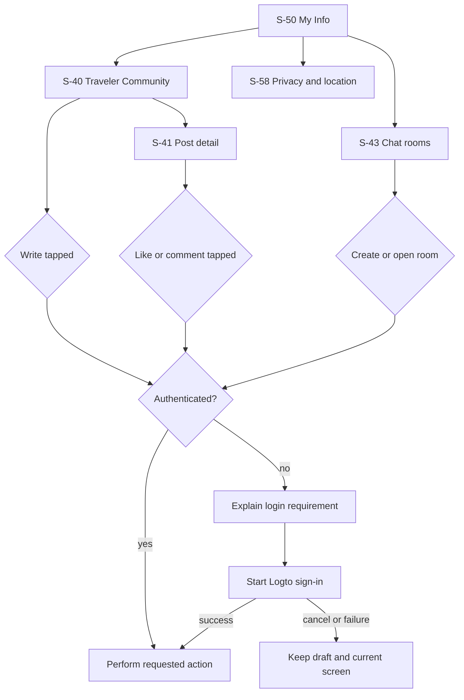
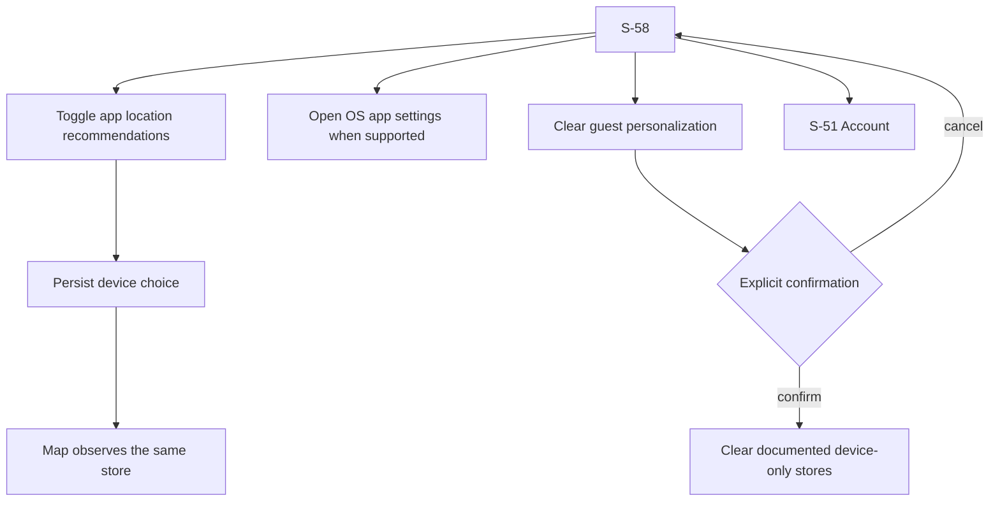

# Canonical Community And Privacy Contract

## Scope

This contract closes the remaining canonical-screen gaps without adding a sixth
bottom-navigation destination. It covers S-40 through S-44 and S-58. Existing
map, Local Signals, Logto, location, and API contracts remain authoritative.

## Information Architecture

Local Signals and Community are deliberately separate:

- **Local Signals** are governed aggregates with source, freshness, and review
  status. They stay in the bottom navigation.
- **Traveler Community** is user-authored conversation. It is entered from My
  Info, where account state and write permissions are understandable.
- **Local guide chats** are a second My Info entry. Reading public community
  content remains possible as a guest; every write and chat action requires a
  real Logto session.

```text
MY INFO (S-50)
+------------------------------------------------+
| Account and sync status                        |
| Travel preferences / Saved / Past trips        |
|------------------------------------------------|
| Service settings                               |
|  Language                               >      |
|  Privacy and location (S-58)            >      |
|------------------------------------------------|
| People and local conversations                 |
|  Traveler community (S-40)              >      |
|    User posts, not a verified Local Signal     |
|  Local guide chats (S-43)               >      |
+------------------------------------------------+
```

```text
PRIVACY AND LOCATION (S-58)
+------------------------------------------------+
| <  Privacy and location                        |
| Location recommendations                 [on]  |
| App choice and OS permission are independent   |
| [Open device settings]                         |
|------------------------------------------------|
| What LALA uses                                 |
| Approx. context / preferences / saved actions  |
| What LALA does not expose                      |
| Precise location / raw reviews / secret data   |
|------------------------------------------------|
| Guest data on this device                      |
| Explain retained categories                    |
| [Clear guest personalization]                  |
|------------------------------------------------|
| Account data                                   |
| Account deletion is managed in Account         |
| [Open account settings]                        |
+------------------------------------------------+
```

## Interaction Flows





## State And Data Bindings

| Surface | Source of truth | Required behavior |
| --- | --- | --- |
| S-40 feed | public community GET API | Honest loading, empty, error, and pagination states |
| S-41 detail | public post/comment GET APIs | Preserve readable content when signed out |
| S-42 create | OAuth community POST API | Preserve title, body, and tags across sign-in cancellation/failure |
| S-43 room list | authenticated chat API | Never infer login from the presence of a token-provider callback |
| S-44 room | authenticated REST and WebSocket | Signed-out state offers sign-in; failed send keeps editable text |
| S-58 location choice | persisted device preference store | One value shared with map settings and restored after restart |
| S-58 OS permission | platform settings capability | Explain mismatch; never claim OS permission from the app toggle |
| S-58 guest clear | device-only stores | Explicit scope and confirmation; no account deletion or sign-out |

## Authentication Recovery Contract

1. `authenticated` comes only from `LalaAuthController.state`.
2. A write action calls a single reusable authentication guard.
3. If Logto is disabled, the UI states that account actions are unavailable and
   keeps public reading usable.
4. If sign-in is cancelled or fails, typed content and navigation position stay
   intact. Raw OAuth or API errors never appear.
5. After successful sign-in and `/api/v1/me` synchronization, the user confirms
   the action again. No post, comment, reaction, room, or message is submitted
   implicitly after authentication.

## Guest Data Clear Scope

The destructive action is limited to on-device personalization and must list its
scope before confirmation: default travel preferences, trip overrides and visit
feedback, saved place IDs, current plan/selection, onboarding choices, and manual
region. It does not delete an account, server history, community content, or
operating-system permissions. When an account is connected, the action is
disabled and the user is directed to S-51 for account-data controls.

## Responsive And Accessibility Rules

- Minimum interactive target is 44 logical pixels.
- Text may wrap; no viewport-width font scaling or negative letter spacing.
- Authentication and sync states use text and icons, never color alone.
- Keyboard focus order follows visual order and all icon-only controls have
  tooltips/semantic labels.
- At 200% text scale, write controls remain reachable and drafts remain visible.
- Wide web layouts constrain readable content width without placing cards inside
  cards.

## Visual Acceptance Matrix

| State | Required visible evidence |
| --- | --- |
| Community entry | My Info distinguishes user conversation from verified Local Signals |
| Guest feed | Public posts/empty state load; Write presents a login path |
| Signed-in write | Draft fields survive navigation and publish only on explicit tap |
| Guest post detail | Post/comments remain readable; like/comment explains login |
| Chat signed out | No false online state; sign-in recovery is visible |
| S-58 enabled | App choice shown as enabled, with separate OS-settings action |
| S-58 disabled | Map stops requesting current-location recommendations and offers manual region |
| Guest clear | Scope, confirmation, completion, and next onboarding path are explicit |
| Account connected | Device clear is not presented as server/account deletion |

## Verification

- Widget tests cover route reachability, Local Signals/community distinction,
  authentication recovery, draft preservation, S-58 persistence, and guest clear.
- Existing full Flutter suite and analyzer must pass.
- Exact-head iPhone 17 Pro evidence uses real taps and the configured API. It does
  not fabricate community data when the production list is empty.
- Web verifies responsive reachability. Production CORS is not widened merely to
  make a localhost runtime check pass.
