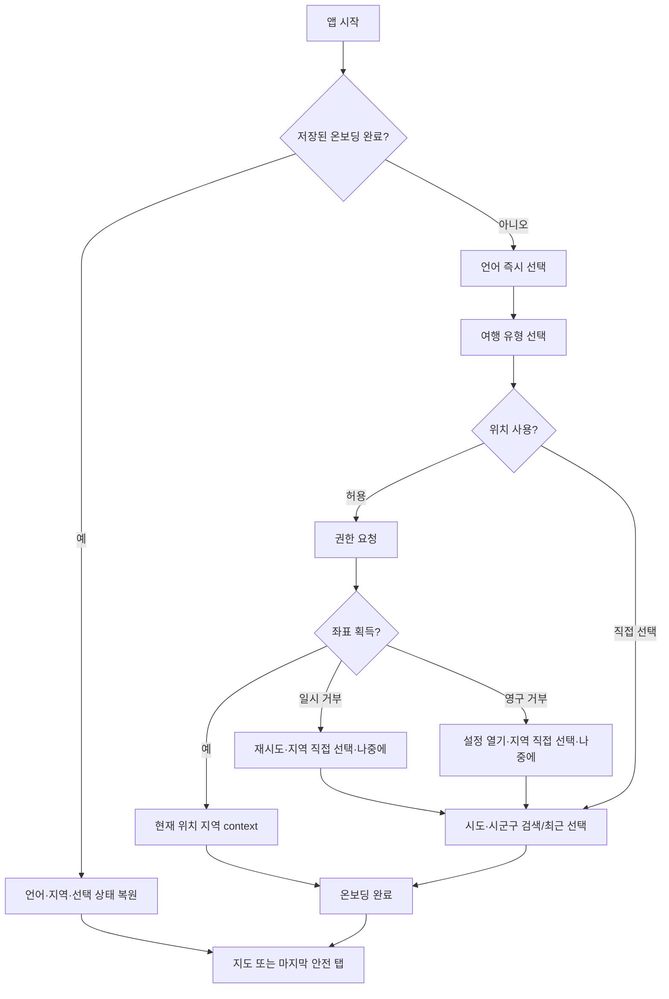
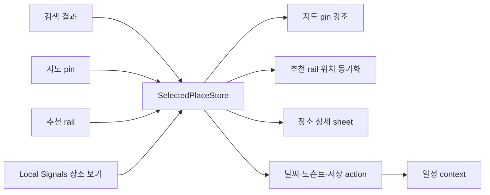
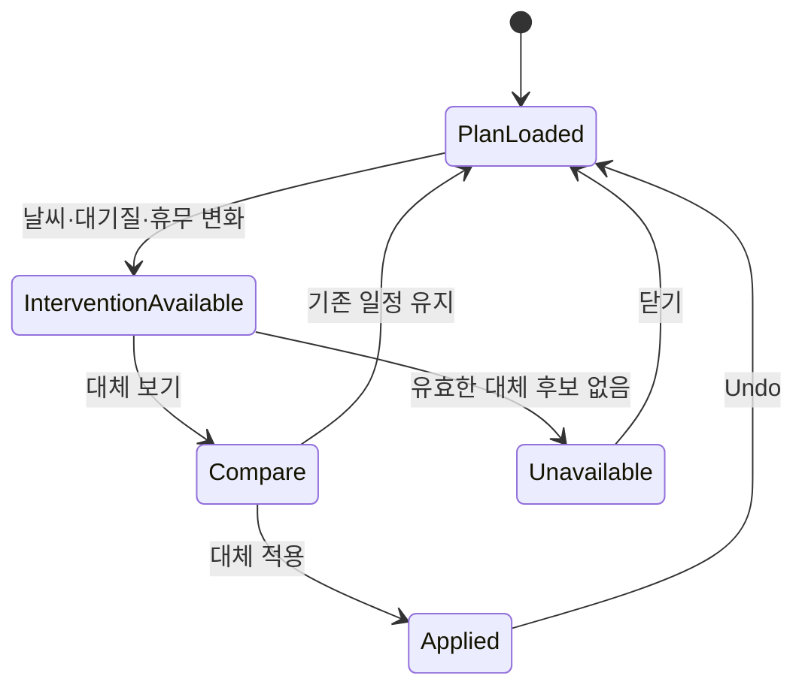
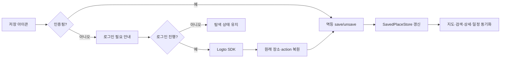

# 01. 정보 구조와 사용자 흐름

## 1. 최종 정보 구조

```text
앱 시작
├─ 언어 선택(항상 접근 가능)
├─ 여행 유형
├─ 위치 사용 또는 전국 지역 직접 선택
└─ 완료 상태·언어·지역 cold-start 복원

메인 하단 탭
├─ 검색
├─ 지도
├─ 일정
└─ 로컬 신호

공통 overlay / secondary surface
├─ 전국 지역 선택 sheet
├─ 장소 상세·도슨트 sheet
├─ 날씨 상세 sheet
├─ 설정·계정 sheet
└─ 로그인 필요 dialog
```

커뮤니티는 현재 라우트와 화면이 있지만 이 4탭 계약에 억지로 끼우지 않는다.
Local Signals의 집계형 정보와 사용자 커뮤니티 게시물을 같은 카드로 섞지 않는다.

## 2. 최초 진입과 회복 흐름



## 3. 장소 탐색과 공통 선택 상태



모든 이동은 `canonical_place_id`로 연결한다. 표시 이름이나 배열 index를 identity로
사용하지 않는다. 탭 이동 뒤에도 선택 장소를 유지하되, 새 region context에 속하지
않으면 사용자에게 보존/해제 이유를 알리고 안전하게 해제한다.

## 4. 일정 개입과 undo



`reason`, `trigger_type`, `trigger_factors`, `original_slot`,
`alternative_slot`이 없으면 비교 UI를 발명하지 않는다. 적용은 명시적 사용자 action
뒤에만 수행하고, 성공 후 undo snackbar를 제공한다.

## 5. 저장·인증 회복



## 6. 공통 상태 소유권

| 상태 | SSOT | 소비 화면 |
| --- | --- | --- |
| 언어 | `OnboardingState.languageListenable` | 전 화면 |
| 지역 | `RegionContextStore` | 검색·지도·일정·Signals |
| 선택 장소 | `SelectedPlaceStore` | 검색·지도·상세·Signals |
| 저장 장소 | `SavedPlaceStore` + `ActionPreferences` | 지도·검색·상세·일정 |
| 일정 context | `PlanContextStore` | 지도·일정 |
| 방문 상태 | `SlotVisitStore` | 일정·전환 측정 |

화면 내부 duplicate state는 애니메이션·입력 초안처럼 일시적인 UI 상태에만 허용한다.
