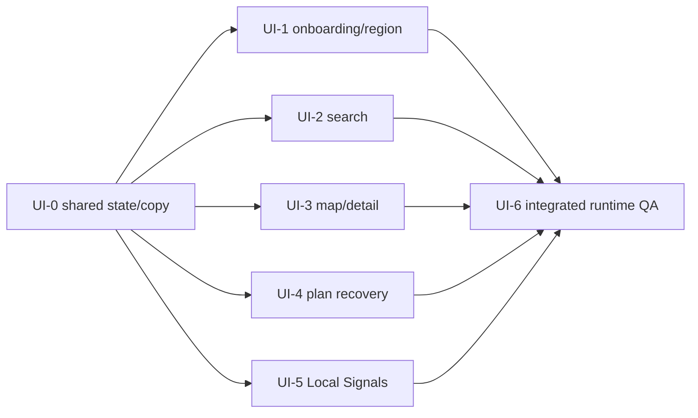

# 05. 구현 슬라이스

## 원칙

- 이 패킷은 구현 순서를 정의하지만 별도 RC PR을 양산하지 않는다.
- 기능 정의서/계약 문서가 먼저 병합된 뒤 코드 phase를 시작하는 것이 기본이다.
- 한 phase branch와 Draft PR에서 독립적인 slice commit을 1~3개씩 push한다.
- 구현자는 현재 code path를 먼저 읽고 기존 store·widget을 재사용한다.
- 테스트를 약화하거나 screenshot OCR로 문구·치수를 추정하지 않는다.
- 정상 경로 mock/demo, live crawl, production DB mutation, paid provider 호출은 별도
  승인 없이 수행하지 않는다.

## 의존성 DAG



## UI-0. 공통 기반

**목표**: 상태·copy·source/freshness·error treatment를 화면마다 다시 만들지 않는다.

**주요 소유 파일**

- `apps/flutter_app/lib/shared/l10n/lala_copy.dart`
- `apps/flutter_app/lib/app/lala_visual_tokens.dart`
- `apps/flutter_app/lib/shared/widgets/`
- 관련 focused tests

**구현**

- `Loading/Empty/Stale/Error/Disabled` 공통 surface
- source/freshness block과 estimated badge
- locale-aware date/relative-time helper
- semantic icon button wrapper와 44dp 보장

**게이트**: 기존 Kakao/Logto/location conditional import와 category token을 변경하지
않는다.

## UI-1. 온보딩·전국 지역 회복

**주요 코드**: `features/onboarding/`, `features/location/`,
`core/location/region_context.dart`, onboarding persistence.

**필수 테스트**

- 선택 전/후 next 상태
- 언어 즉시 반영과 한 화면 한 언어
- 권한 허용·일시 거부·영구 거부·직접 선택
- 전국 검색/최근 선택/empty
- cold relaunch 온보딩 skip·지역 복원

## UI-2. 검색

**주요 코드**: `features/search/presentation/pages/search_page.dart`,
`SelectedPlaceStore`, region context.

**필수 테스트**

- skeleton 3개와 loaded 전환
- empty/error/retry 분리
- 지역 변경 반응성
- 단일 정렬 선택 또는 unsupported 숨김
- 검색 선택 → 지도 동일 canonical ID 강조
- stale response suppression

## UI-3. 지도·상세·도슨트 shell

**주요 코드**: `features/home/`, `features/map/`, `features/place/`,
`features/docent/`, `SavedPlaceStore`.

**필수 테스트**

- Kakao conditional boundary 보존
- pin/rail/dock canonical 동기화
- 선택 pin cluster 밖 유지
- bounds 요청 경쟁 상태
- source/freshness honest absence
- 저장 CTA 단일성·인증 회복
- text docent와 audio availability 분리
- map controls/dock/nav non-overlap

## UI-4. 4슬롯 일정·상황 회복

**주요 코드**: `features/plan/`, `features/planner/`,
`features/intervention/`, `PlanContextStore`.

**필수 테스트**

- 정확히 4 period와 honest partial slot
- travel/opening-hours estimated badge
- 원래·대체 비교
- keep/apply/undo 상태 전이
- 대체 후보 없음
- bottom safe area와 text scaling

## UI-5. governed Local Signals

**주요 코드**: `features/local_signals/`,
`core/navigation/local_signal_action.dart`, backend aggregate read.

**필수 테스트**

- system aggregate와 user post 분리
- raw text/author/url/coordinate 필드 불가
- available false/empty/error/stale
- mention·organic·optional score 부재 처리
- 장소 보기 → 공통 선택 상태
- unresolved canonical ID의 disabled action

## UI-6. 통합 검증

**자동 검증**

```text
flutter analyze
flutter test
uv run pre-commit run --all-files
git diff --check
GitHub exact-head CI
```

**런타임 검증**

- iPhone 17 Pro Simulator에서 clean build/install
- 모바일·데스크톱 웹 local build
- 실제 API read-only 데이터
- 온보딩/지역/지도/날씨/검색/일정/Signals/도슨트 text 흐름
- cold relaunch persistence
- 서로 다른 상태의 서로 다른 screenshot hash

유료 AI/Speech, production write, crawl, deploy는 이 UI 검증의 기본 전제가 아니다.
필요한 경우 별도 운영 승인과 비용 gate를 통과한다.
