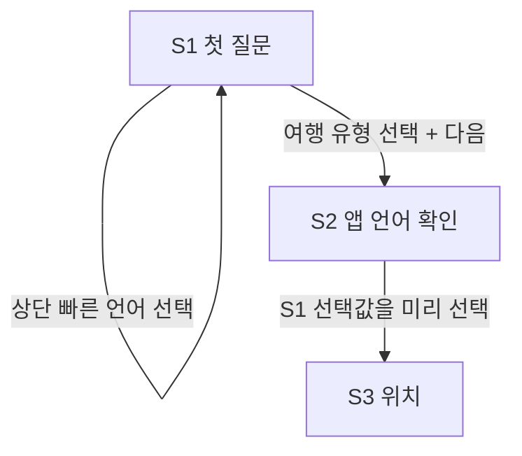
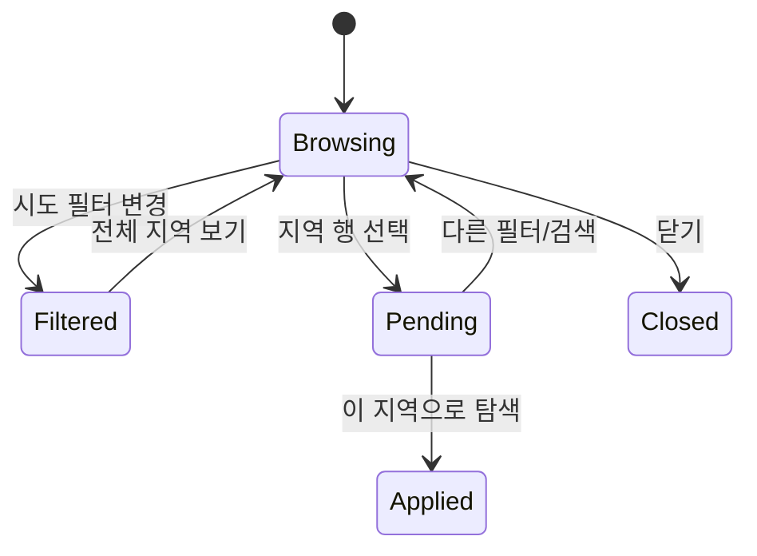

# 01. 흐름과 상태 진실성

## 1. 온보딩 언어 역할

- S1 상단 메뉴는 첫 질문을 이해하기 위한 즉시 번역 장치다.
- S2는 최종 앱 언어를 명시적으로 확인하는 단계다.
- S1에서 고른 값은 S2에 그대로 미리 선택한다. 유형 기본값이 덮지 않는다.
- 한 화면에는 선택 언어 한 가지의 문장만 표시한다. 언어 고유명은 선택지에서만 예외다.

## 2. 지역 선택

- `전체 지역 보기`는 목록 필터이며 현재 지역이 아니다.
- 실제 현재 지역은 시트 상단의 `현재 탐색 지역`과 지역 행의 check로 표현한다.
- 행 탭은 pending 선택만 바꾸며 API 요청이나 화면 전환을 시작하지 않는다.
- 하단 CTA가 pending 값을 반환할 때만 `RegionContextStore`가 갱신된다.
- 현재 위치나 기본 지역은 수동 지역 ID가 없으므로 어떤 행도 거짓 선택 표시하지 않는다.

## 3. 검색

- 검색과 카테고리 변경은 기존 client-side 필터를 유지한다.
- 결과 정렬은 서버 계약이 생기기 전까지 추가하지 않는다.
- 결과 카드는 `장소명 → 지금 갈 이유 → 카테고리·지역·거리 → 출처·신선도` 순이다.
- source/data_as_of가 없으면 메타 영역을 숨긴다.
