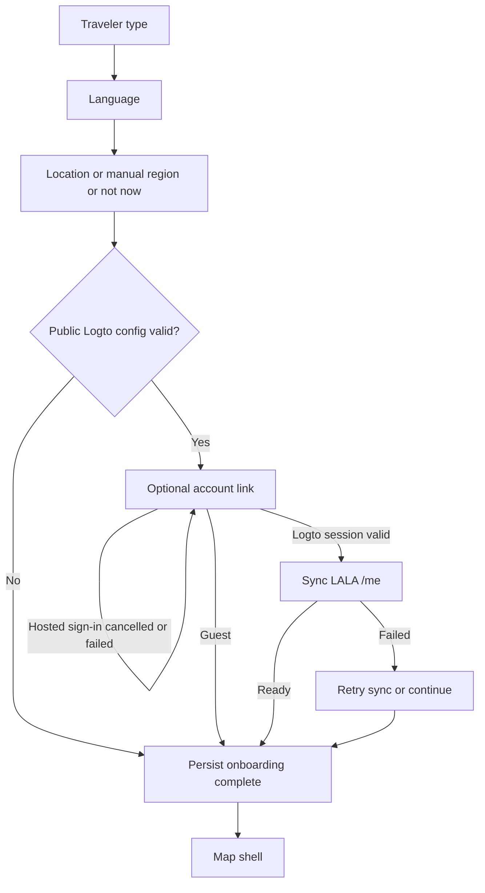

# Logto onboarding account-link contract

## Product decision

- Account linking is optional and is not a fourth required onboarding step.
- The three onboarding decisions remain traveler type, language, and location.
- Maps, search, planning, weather, and read-only Local Signals remain usable as a guest.
- Sign-in unlocks account-protected community and future account persistence paths.
- Cancelling or failing hosted sign-in must not clear language, traveler type, or region.

## Flow



## Mobile wireframe

```text
+-----------------------------------+
| LALA                              |
|                                   |
| [account icon]                    |
|                                   |
| 여행을 계정과                     |
| 연결할까요?                       |
|                                   |
| 로그인하면 커뮤니티와 계정 기능을 |
| 사용할 수 있습니다. 게스트 경로도 |
| 그대로 유지됩니다.               |
|                                   |
| [connected profile or safe error] |
|                                   |
|                                   |
| [       로그인 / 계속        ]    |
| [       게스트로 둘러보기     ]    |
+-----------------------------------+
```

## Runtime bindings

| UI state | Auth state | Primary action | Escape action |
| --- | --- | --- | --- |
| resolving | `busy` | disabled with progress | guest unless hosted sign-in is active |
| guest | `signedOut` | hosted Logto sign-in | complete onboarding as guest |
| provider error | unauthenticated `error` | retry hosted sign-in | complete as guest |
| account syncing | authenticated + `syncing` | disabled with progress | continue after operation settles |
| account sync error | authenticated + `error` | retry `/me` only | continue without discarding session |
| ready | authenticated + `ready` | complete onboarding | continue to app |

The root `LalaAuthController` owns the session. Every API configuration receives
the same token-provider callback; feature pages do not create their own Logto
client. A session is usable only after an API-audience access token can be
obtained. Profile claims are display-only and failure to read them cannot log the
user out.

## Build configuration boundary

Flutter may receive only these public values:

- `LOGTO_ENDPOINT`
- `LOGTO_WEB_APP_ID`
- `LOGTO_NATIVE_APP_ID`
- `LOGTO_API_AUDIENCE`
- `LOGTO_WEB_REDIRECT_URI`
- `LOGTO_NATIVE_REDIRECT_URI`
- `LOGTO_WEB_POST_LOGOUT_REDIRECT_URI`
- `LOGTO_NATIVE_POST_LOGOUT_REDIRECT_URI`
- `LOGTO_REDIRECT_URI`
- `LOGTO_POST_LOGOUT_REDIRECT_URI`

Platform-specific URI names take precedence. The two legacy shared URI names
remain a migration fallback only; a valid URI for the opposite platform is
ignored so a Web-oriented dotenv cannot silently disable a native build.

Management client credentials, API bearer tokens, database DSNs, provider API
keys, and raw environment payloads must never reach a Dart define or public Web
bundle. Public configuration is resolved from approved managed configuration,
then `.env.local`, then `.env`, without printing values.

## Accessibility and responsive rules

- Keep both actions at least 48 dp high and preserve a visible guest escape.
- Do not encode account state by color alone; pair icons with text.
- Long translated copy scrolls while actions remain reachable.
- Profile strings are single-line ellipsized and never expose the internal user ID.
- Screen-reader order is wordmark, title, explanation, status, primary, guest.
- The layout must not overflow at 320 dp width or with 200% text scaling.

## Acceptance matrix

| Case | Expected evidence |
| --- | --- |
| Logto build config absent | Location completes directly to the map; no dead account screen |
| Guest choice | Onboarding and region persist across cold restart |
| Hosted login cancellation | Safe retry state; guest action remains available |
| Restored valid session | Profile/account state appears without a new login prompt |
| `/me` unavailable | Provider session remains valid; retry is limited to account sync |
| Sign-out during late response | Late `/me` result cannot restore the prior session |
| Search/plan/community clients | All use the root token-provider callback |
| Web/native callbacks | Registered redirect and post-logout paths match the selected app type |
