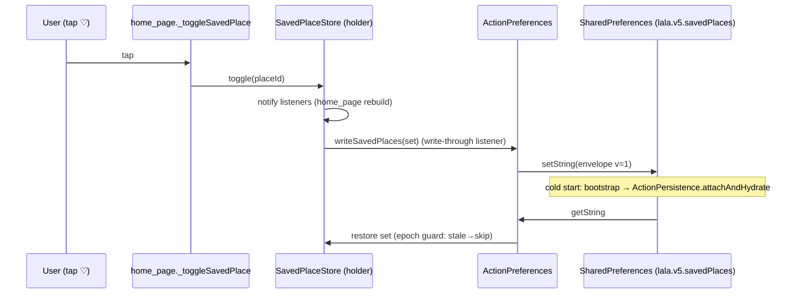
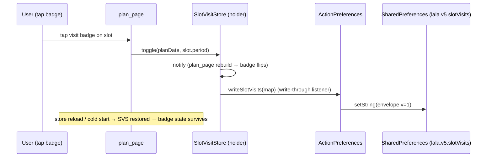

# V5-B — Flutter Action UI (SAVE / VISIT / SPEND) Design Note

> Lane V5-B off the V5-A green head `2e28c1f`. Authoritative contract:
> [`v5-save-move-visit-spend-contract.md`](./v5-save-move-visit-spend-contract.md) §V5-B
> (lines 157–203). This note is the widget-level design; the contract wins on conflict.

## 0. Scope verdict & offline contract

V5-B ships the **offline-first action UI** for SAVE / VISIT / SPEND on top of the V5-A
persistence schemas. The **normal path makes zero network calls** (contract hard invariant
#1 + §B "Offline-only. No live/paid/network call on the normal path"). Persistence is a
**local SharedPreferences store** under `lala.v5.*`, mirroring the proven V1
`cross_tab_preferences.dart` pattern byte-for-byte (versioned envelope, corrupt→null,
version-mismatch→null, app-owned encoder, testable backend seam).

**D4 ("wire via regenerated client; no hand-written HTTP") is satisfied by:**
1. Zero hand-written HTTP in new code — no `http.`/`dio`/`Uri.parse`/`_request`
   (grep proof in §6).
2. New code consumes the V5-A client **DTO types** (`LalaSavedPlace`, `LalaSlotVisit`) as
   the serialization shape where relevant; the **store owns encoding** — no `toJson` is
   added to the generated client (B6).
3. The live backend sync (calling `savePlace`/`checkInSlot`/…) is **V7 BLOCKED_EXTERNAL**
   (contract §3), exactly like live routing/per-place pricing. V5-B does not invoke it.

This is the same relationship `cross_tab_preferences` has to the network: it is pure local
persistence, adds **zero** `LalaBackend` methods, and hydrates static holders in
`bootstrap.dart`. V5-B mirrors that exactly. Adding abstract methods to `LalaBackend` is
avoided because ~11 existing test fakes implement that interface (blast radius), and the
contract requires additive-only mutation.

## 1. Architecture — what is added

```
apps/flutter_app/lib/
  core/
    persistence/
      action_preferences.dart        ← NEW. lala.v5.* store (mirrors cross_tab_preferences)
    state/
      saved_place_store.dart         ← NEW. static in-memory holder (Set<String>) — mirrors SelectedPlaceStore
      slot_visit_store.dart          ← NEW. static in-memory holder (Map<key,status>) — mirrors PlanContextStore
  features/
    planner/
      spend_band_helpers.dart        ← NEW. offline category-band table (concrete domain name)
      widgets/
        plan_slot_tile.dart          ← EXTEND (additive optional params: visitStatus, onToggleVisit, spendBand)
  features/
    home/
      home_page.dart                 ← EXTEND (hydrate saves via SavedPlaceStore; write-through toggle)
    plan/
      presentation/
        pages/
          plan_page.dart             ← EXTEND (own visit map; render VISIT + SPEND per slot)
  app/
    bootstrap.dart                   ← EXTEND (hydrate V5 stores alongside CrossTabPersistence)
```

**Off-limits (not mutated):** `clients/flutter/lib/lala_api_client.dart` (generated),
`apps/api/**` (backend), `dashboard.dart` core wiring, V1–V4 render contracts,
`widget_test.dart` golden (extended only, not broken).

## 2. ASCII wireframe of changed surfaces

### 2.1 SAVE — unchanged shape, now durable (home tab + detail header)

The favorite button in `FeaturedPlaceHeader` is byte-identical. Only the backing store
changes (ephemeral `_savedPlaceIds` → durable `SavedPlaceStore` hydrated at cold start):

```
┌─────────────────────────────────────┐
│ [img]                               │
│ 카테고리배지                          │
│ 장소명                       ♡ Save │ ← unchanged IconButton; now durable across cold start
│ region                              │
└─────────────────────────────────────┘
```

### 2.2 VISIT + SPEND — plan slot tile (additive rows inside existing tile)

```
┌──────────────────────────────────────────┐
│ ⏰ 아침        ☀ 맑음 · 20°   ⌂ 실내       │  ← existing period/weather/indoor row
│ 장소명(title)                              │
│ ┌─operation badge─┐                       │  ← existing closure badge (unchanged)
│ │ ✓ 영업중 (추정) │                       │
│ └────────────────┘                        │
│                                           │
│ ┌─ VISIT badge (NEW) ─┐  ┌─ SPEND band (NEW) ─┐
│ │ ⊙ 방문함 / Visited  │  │ ₩ 식당 · 1만~3만원  │   ← tap toggles planned↔visited
│ └─────────────────────┘  └─────────────────────┘   ← category-band OR honest-unavailable
│                                           │
│ region · detail · meta chips              │
│                                      ›    │
└──────────────────────────────────────────┘
```

VISIT badge states (icon + text + color, never color-alone — mirrors closure/indoor pattern):
- `planned` → `◯ 예정 / Planned` (slate `0xFF64748B`)
- `visited` → `✓ 방문함 / Visited` (teal `0xFF0F766E`)

SPEND band states (same chip tokens as `_PlanSlotMetaChip` — `0xFFF1F5F9` bg / `0xFFE2E8F0`
border / `0xFF475569` text):
- known category → `₩ <category-label> · <range>  (예산 구간)` — always carries the
  `(예산 구간)/(budget band)` marker because it is an estimate, not an authority (mirrors
  the `(추정)/(est.)` rule on `estimatedOpeningHours`, planner_helpers §12.3).
- no estimate (unknown category / no place) → honest-unavailable band:
  `예산 구간 미확정 / Budget band unavailable` (slate, with `help_outline` icon — never a
  fabricated number).

## 3. Mermaid sequences

### 3.1 SAVE persist + cold-start hydrate



### 3.2 VISIT check-in (persist through store, survives reload)



### 3.3 SPEND band (offline, no network)

```mermaid
sequenceDiagram
    participant Tile as PlanSlotTile.build
    participant Helper as spendBandFor(slot, lang)
    participant Table as offline category-band table
    Tile->>Helper: slot.place?.category
    alt known category
        Helper->>Table: lookup(category)
        Table-->>Helper: range
        Helper-->>Tile: SpendBand(label, range) → category-band chip
    else unknown / no place
        Helper-->>Tile: null → honest-unavailable chip
    end
    Note over Tile: zero network; honest-unavailable never fabricates a number
```

## 4. Data bindings (V5-A client methods / DTOs)

| Surface | V5-A binding | Direction |
|---|---|---|
| SAVE set serialization | `LalaSavedPlace.placeId` shape (place-id only, no coords/PII — contract privacy scope) | store owns encode/decode; **no `toJson` on client** |
| VISIT map serialization | `LalaSlotVisit.{slotPeriod, status}` shape (status ∈ `planned`\|`visited`) | store owns encode/decode |
| Visit status enum | `LalaSlotVisit.status` String values | read-side type mirror |
| `planDate` key | UTC date (`YYYY-MM-DD`) per contract A1/D1 "one plan per user per day (UTC date key)" | derived `DateTime.now().toUtc()` |

**Client methods NOT invoked on the normal path** (`listSavedPlaces`, `savePlace`,
`unsavePlace`, `savePersistedPlan`, `loadPersistedPlan`, `checkInSlot`, `listSlotVisits`):
these are the V5-A backend seam. Live sync is V7 BLOCKED_EXTERNAL (§3). V5-B proves D4 by
consuming the DTO shapes + zero hand-written HTTP, identical to how
`cross_tab_preferences` relates to the network.

## 5. Responsive + a11y notes

- **Touch targets:** VISIT badge is a `_MinTouchTarget`-wrapped tappable (≥44dp), mirroring
  the plan-page failure/empty buttons.
- **Never color-alone:** VISIT and SPEND each render icon + text (+ semantics label), like
  the existing closure-state and indoor/outdoor badges (plan_slot_tile §13.5).
- **Semantics:** each tile's existing `Semantics(label:)` is extended with the visit status
  and spend-band text so screen-reader users get the full state. SPEND carries the
  `(예산 구간)/(budget band)` marker in the label so the estimate is never read as fact.
- **Responsive:** bands use `Wrap` (existing meta-chip pattern) so they reflow on narrow
  screens; no fixed widths.
- **No new color tokens** (B8): every new style reuses the documented tile set
  (`0xFFF1F5F9`/`0xFFE2E8F0`/`0xFF475569`/`0xFF64748B`/`0xFF0F766E`/`0xFFC53030`).
- **Cross-platform:** no keyboard shortcuts introduced; no `e.metaKey`. Pure tap targets.

## 6. B1–B9 acceptance matrix → concrete tests

| ID | Requirement | Offline proof (test) |
|---|---|---|
| B1 | Cold-start hydrates saves | `action_preferences_test.dart`: write saves → new `ActionPreferences` (same prefs) → `load()` restores the set; `saved_place_store_test.dart`: `ActionPersistence.attachAndHydrate` restores `SavedPlaceStore.current` |
| B2 | Corrupt envelope → empty, no crash | `action_preferences_test.dart`: inject malformed JSON at `lala.v5.savedPlaces` → `load()` returns empty set, no throw |
| B3 | Epoch-guard discards stale envelope | `action_preferences_test.dart`: envelope with `v != kActionEnvelopeVersion` → `load()` returns empty; `attachAndHydrate` epoch test: a `set()` during load window is not clobbered |
| B4 | VISIT check-in persists | `slot_visit_store_test.dart` + `plan_slot_visit_widget_test.dart`: toggle → reload store → status survives; widget tap flips planned↔visited |
| B5 | SPEND band honest-unavailable | `spend_band_test.dart`: slot with unknown category / no place → `spendBandFor()` returns honest-unavailable text; known category → band with `(예산 구간)` marker |
| B6 | No hand-edit to generated client | grep `toJson` on `clients/flutter/lib/lala_api_client.dart` == 0 (unchanged from V5-A) |
| B7 | KO/EN via `lalaCopy` | grep new V5-B files: no raw user-facing KO/EN literal outside `lalaCopy(ko:,en:)` |
| B8 | No new color tokens | grep new V5-B widget files: every `Color(0xFF…)` is in the documented tile/toast set |
| B9 | `widget_test.dart` golden still passes | existing suite green; VISIT/SPEND are additive optional params (omitted by existing cases) so existing tree is unchanged |

## 7. Carry-in for the integrator

- V5-B does **not** invoke the V5-A backend methods. If the integrator wants a live sync
  path, that is a V7 flag-gated follow-up (contract §3), wired through `LalaBackend` (which
  V5-B intentionally does not mutate to keep the 11 test fakes intact).
- `planDate` is derived client-side as today's UTC date. If V5-C or a later lane changes the
  plan-date authority, `SlotVisitStore`'s key derivation (`$planDate:$slotPeriod`) is the
  single place to update.
