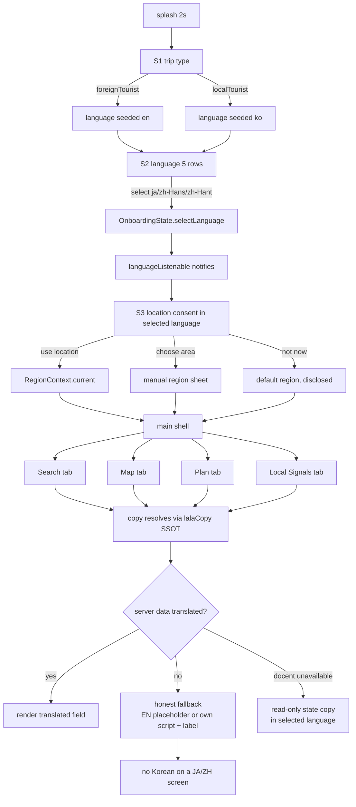

# V6 — Foreign-Visitor UX Design & Locale Contract

Status: implementation contract (tracked). Scope: add English / Japanese /
Simplified Chinese (`zh-Hans`) / Traditional Chinese (`zh-Hant`) as first-class
visitor languages while preserving every existing KO/EN behavior.

Invariants (breaking any of these is a regression):

- **I1 Single-language screen.** A screen renders exactly one language. Never
  Korean + target language mixed in one screen. Static UI copy always resolves
  through the copy SSOT; dynamic server data resolves through the honest
  fallback rules (§6).
- **I2 KO/EN contracts unchanged.** `lalaCopy(lang, ko:…, en:…)` returns the
  same bytes for `ko` and `en` as before. Existing locale/API tests stay green
  without edits.
- **I3 No flag emoji.** Language affordances use text badges (`KO`, `EN`, `JA`,
  `简`, `繁`) exactly like the existing S2 screen — never flag emoji.
- **I4 Conditional imports untouched.** Kakao map, Logto, and hybrid location
  keep their conditional-import seams. No new unconditional platform imports.
- **I5 Honest fallback.** When translated static data is unavailable, we show a
  truthful English placeholder or the data's own script with a disclosed label
  — never machine-translated-looking Korean mixed into a JA/ZH screen.

---

## 1. Flows

Foreign-visitor flows are the existing KO/EN flows with two deltas: the
language step offers five languages, and every downstream surface renders in
the selected language.

```
splash (2s) → S1 trip type → S2 language → S3 location consent → main shell
                                   │
                                   ├─ en / ja / zh-Hans / zh-Hant → visitor flows
                                   └─ ko → existing Korean flow (byte-identical)
```

### S1 Trip type (unchanged mechanics)
Rows stay `Domestic trip` / `Overseas trip` in the *current* language. Row tap
selects only; the primary action remains disabled until a selection exists.
`foreignTourist` still seeds `en`, `localTourist` still seeds `ko`; S2 may
override. Translated row labels let a JA/ZH visitor read the step before any
language is chosen — S1 renders in `OnboardingState.language`, which S1 of a
fresh session seeds as `en` for the foreign path (see §5).

### S2 Language (the V6 surface)
Five rows, one per language. Each row: text badge + endonym label + radio.
Selection immediately writes the SSOT (`OnboardingState.selectLanguage`), so
the step title/subtitle re-render in the just-chosen language (existing
behavior for KO/EN, extended).

| Badge | Endonym | Wire value |
|-------|---------|-----------|
| KO    | 한국어  | `ko`      |
| EN    | English | `en`      |
| JA    | 日本語  | `ja`      |
| 简    | 简体中文 | `zh-Hans` |
| 繁    | 繁體中文 | `zh-Hant` |

The settings sheet exposes the same five values through its language
`SegmentedButton`.

## 2. Wireframes

S2 with five rows (402pt viewport — iPhone 17 Pro logical width):

```
┌────────────────────────────────────────┐
│ LALA                          2 / 3    │  wordmark + progress
│                                        │
│ Language                               │  step title (selected language)
│ Choose the language for the app.       │  step subtitle
│                                        │
│ ┌────────────────────────────────────┐ │
│ │ [KO]  한국어                 (•)   │ │  72h row, text badge
│ └────────────────────────────────────┘ │
│ ┌────────────────────────────────────┐ │
│ │ [EN]  English                ( )   │ │
│ └────────────────────────────────────┘ │
│ ┌────────────────────────────────────┐ │
│ │ [JA]  日本語                 ( )   │ │
│ └────────────────────────────────────┘ │
│ ┌────────────────────────────────────┐ │
│ │ [简]  简体中文               ( )   │ │
│ └────────────────────────────────────┘ │
│ ┌────────────────────────────────────┐ │
│ │ [繁]  繁體中文               ( )   │ │
│ └────────────────────────────────────┘ │
│                                        │
│ ┌────────────────────────────────────┐ │
│ │            Next                    │ │  52h primary action
│ └────────────────────────────────────┘ │
└────────────────────────────────────────┘
```

Five 72pt rows + 12pt gaps = 414pt of rows. 402pt-wide iPhone 17 Pro has
852pt height, so rows fit in one column; the step body keeps `Spacer()` so on
shorter viewports the action pins to the bottom. Endonym strings (`日本語`,
`简体中文`, `繁體中文`) are 3–4 CJK glyphs — no horizontal overflow at 320pt.

Main shell bottom navigation (visitor languages):

```
┌────────────────────────────────────────┐
│                                        │
│              (tab body)                │
│                                        │
├────────────────────────────────────────┤
│   🔍        🗺         📅       📣      │
│ Search     Map       Plan   Local      │
│                                Signals │
└────────────────────────────────────────┘
```

JA/ZH labels are short (§7) and never wrap to two lines — the longest is
`ローカル信号` (6 glyphs) vs the EN `Local Signals` that already fits.

## 3. Journey



## 4. Locale / state / data bindings

| Concern | Binding |
|---|---|
| UI language SSOT | `OnboardingState.language` (+ `languageListenable`) — unchanged |
| Copy SSOT | `lalaCopy(language, ko:…, en:…)` in `shared/l10n/lala_copy.dart` |
| New visitor locales | `ja`, `zh-Hans`, `zh-Hant` normalized in the same layer |
| Persistence | `OnboardingPreferences` — language decode widened to the five values; on-disk key/namespace unchanged (`lala.onboarding.v1.language`) |
| Config threading | `LalaAppConfig.lang` — the existing `_reloadForLanguage` rebuild path on every tab |
| API language param | `normalize_language`-governed endpoints (`/places`, `/plans/daily`, docent, Local Signals); unknown → `ko` |
| Region labels | `RegionContext.label`, `ManualLocationOption.labelKo/labelEn` — JA/ZH resolve via the region-label fallback (§6) |
| Place names | `placeDisplayName` (`nameEn` → `name` → placeholder) — JA/ZH use the same EN-first chain; Korean-script names never leak into a JA/ZH screen |
| Docent script | `usableDocentScript` + `singleLanguageText` single-language extraction, unchanged |
| Bottom nav | `LalaBottomNavBar` labels via `lalaCopy` |
| Static data | `manual_location_options.dart` keeps KO/EN labels only; JA/ZH fall back honestly (§6) |

API contract: the API remains a two-language surface (`ko`/`en`) after
normalization. JA/ZH clients send `language=en` (the visitor data language)
for server-composed strings — reasons, docent text, Local Signals bodies —
while the app chrome renders JA/ZH. This keeps the API minimal and the
single-language invariant intact: the client never displays the raw server
string in Korean on a JA/ZH screen because the request language is `en`.

## 5. Language resolution rules

- Canonical set: `ko`, `en`, `ja`, `zh-Hans`, `zh-Hant`.
- `OnboardingState.selectLanguage` normalizes any input to a canonical value
  (`en` legacy aliases preserved); unknown → `ko` (existing behavior).
- `_decodeLanguage` (persistence) and `applySnapshot` accept all five.
- All `lalaCopy` call sites resolve through one function; adding a locale is a
  data change in the SSOT, never a per-screen conditional.
- Script guards (`singleLanguageText`, `containsKorean`) treat JA/ZH output as
  "non-Korean" for extraction purposes: a JA/ZH screen must never surface a
  Korean fragment, so extraction drops Korean just like `en` does.

## 6. Honest fallback matrix (static data)

Static data with no JA/ZH translation (manual region names, event dates'
Korean forms, category names sourced Korean-only):

| Data | `ko` | `en` | `ja` | `zh-Hans` | `zh-Hant` |
|---|---|---|---|---|---|
| Manual region label | KO label | EN label | EN label | EN label | EN label |
| Place name (no `nameEn`) | `name` | `Local place` | `Local place` translated | 同 | 同 |
| Region fallback | `주변 지역` | `Nearby area` | `近くのエリア` | `附近区域` | `附近區域` |
| Docent unavailable | KO copy | EN copy | JA copy | ZH-Hans copy | ZH-Hant copy |
| Docent script body | KO | EN | EN (server has no JA) + label | 同 | 同 |
| Local Signals body | KO | EN | EN + `Translated view`-style label | 同 | 同 |
| Event date format | `2026년 8월 14일` | `Aug 14, 2026` | `2026年8月14日` | 同 | 同 |
| Distance | `1234m` (all) | `1234m` | `1234m` | `1234m` | `1234m` |
| Temperature | `23°C` (all) | `23°C` | `23°C` | `23°C` | `23°C` |

Rule: JA/ZH static names show the English name (the existing `labelEn` chain)
— an English word on a JA/ZH screen is honest; a Korean word on a JA/ZH screen
violates I1 and is forbidden.

## 7. Campaign-message acceptance matrix

The visitor value proposition ("what LALA does for a foreign visitor") as
rendered per surface and locale. A campaign message is accepted only if every
row holds.

| # | Surface | en | ja | zh-Hans | zh-Hant | Acceptance |
|---|---|---|---|---|---|---|
| C1 | S1 subtitle | Pick a trip type for more relevant recommendations. | より合うおすすめのために、旅のタイプを選んでください。 | 选择旅行类型，获取更合适的推荐。 | 選擇旅行類型，獲取更合適的推薦。 | rendered, no KO on screen |
| C2 | S2 subtitle | Choose the language for the app. | アプリで使う言語を選んでください。 | 选择应用使用的语言。 | 選擇應用使用的語言。 | rendered |
| C3 | S3 consent body | Use your current location for nearby attractions, food, and events. … | 現在地を使って、近くの名所・グルメ・イベントをご案内します。… | 使用当前位置，探索附近的景点、美食和活动。… | 使用當前位置，探索附近的景點、美食和活動。… | rendered |
| C4 | Bottom nav (4 tabs) | Search/Map/Plan/Local Signals | 検索/地図/プラン/ローカル信号 | 搜索/地图/计划/本地信号 | 搜尋/地圖/計畫/在地訊號 | 4 labels, no wrap, no KO |
| C5 | Search empty hint | (existing EN) | JA equivalent | ZH-Hans equivalent | ZH-Hant equivalent | rendered |
| C6 | Map dock title | (existing EN) | JA | ZH-Hans | ZH-Hant | rendered |
| C7 | Plan header date | `2026-08-14 Fri` | `2026-08-14 金` | `2026-08-14 周五` | `2026-08-14 週五` | locale weekday |
| C8 | Local Signals title | Local Signals | ローカル信号 | 本地信号 | 在地訊號 | rendered |
| C9 | Docent unavailable | Loading the docent script. Please check again shortly. | ドセントスクリプトを読み込み中です。しばらくしてからもう一度ご確認ください。 | 正在加载导览解说，请稍后再查看。 | 正在載入導覽解說，請稍後再查看。 | rendered |
| C10 | Default region badge | Default region | 既定の地域 | 默认地区 | 預設地區 | rendered, honest |

The four campaign locales carry the same promise the KO/EN product makes:
*trustworthy local recommendations for your trip* — no locale gets a weaker
or machine-flavored variant.

## 8. Responsive rules

- 402pt (iPhone 17 Pro): all five S2 rows + action fit; rows keep `minHeight:
  72`; no horizontal clipping of endonyms.
- 360/393pt: bottom-nav labels single-line (longest JA/ZH label ≤ 6 glyphs).
- Web widths (≥1024pt): no change to layout; only strings change.
- Overflow gates: the existing narrow-viewport no-overflow harness gains JA
  and ZH variants with the same long-input strategy, at 360, 393, and 402pt.

## 9. Accessibility rules

- Every language row keeps `Semantics(button: true, selected: …, label: …)`
  with the endonym as the label — screen readers announce the language in its
  own name, matching the existing KO/EN rows.
- The bottom nav keeps Material `NavigationDestination` labels (screen-reader
  accessible by construction).
- No information is conveyed by badge color alone; the selected state pairs
  the check icon, border, and fill (existing pattern).
- Contrast: existing token pairs (ink/card, primaryBlue/card) are unchanged;
  JA/ZH glyphs inherit the same sizes/weights, so contrast ratios are
  locale-independent.
- Date/weekday strings are plain text with the weekday included for screen
  readers (no icon-only dates).

## 10. API language contract

`normalize_language` keeps returning `ko`/`en` only — JA/ZH map to `en` at the
client seam (`LalaBackend` converts non-`ko` to `en` when building requests),
so:

- `GET /places?language=…`, `POST /plans/daily`, docent script/audio, Local
  Signals reads: unchanged server behavior, existing tests stay green.
- Contract tests assert the mapping: `ja`, `zh-Hans`, `zh-Hant` → request
  `language=en` from the backend seam, and the API keeps rejecting nothing new
  (unknown values still fall back `ko` server-side).
- No server-side translation pipeline is added in V6 (out of scope, honest
  fallback covers it).
