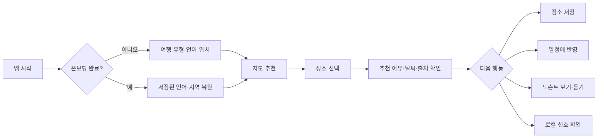
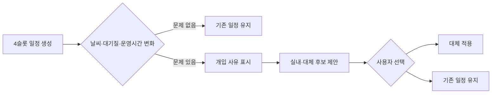

# LALA 서비스 기능 정의서

> 문서 버전: 1.0
> 기준일: 2026-08-26 (Asia/Seoul)
> 코드 기준: `origin/main` `db5ccac097fc5bbc13c7b64646a308e48c3cc352`
> 대상: 기획, 디자인, Flutter, API, 데이터, QA, 운영 담당자

## 1. 문서 목적

이 문서는 LALA가 사용자에게 제공하는 기능, 기능 간 흐름, 데이터 및 운영 조건을
하나의 기준으로 정의한다. 발표자료의 비전, 코드에 구현된 기능, 실제 운영에서
확인된 기능을 구분하여 다음 업무에 사용한다.

- 제품 범위와 우선순위 합의
- 화면 및 API 구현 기준
- 테스트 시나리오와 완료 조건 정의
- 데이터 파이프라인과 사용자 기능의 연결 확인
- 마케팅 문구와 실제 제공 기능의 정합성 검토

이 문서는 화면 디자인 명세나 API 스키마 전체를 대체하지 않는다. 기능 중심의 최신
화면·상태·데이터 바인딩은
`docs/planning/lala-functional-ui-contract-20260827/`, 기존 시각 토큰과 목표
근거는 `docs/planning/lala-mobile-visual-contract-20260728/`, API 필드 정의는
`docs/api/flutter-contract.md`, 데이터 구조는 `docs/data/data-dictionary.md`를
함께 따른다.

## 2. 서비스 정의

### 2.1 한 줄 정의

LALA는 현재 위치와 지역, 날씨·대기질, 공식 관광·문화 데이터, 검증된 로컬
신호를 결합해 사용자가 **지금 갈 곳과 하루 동선**을 결정하도록 돕는 여행
의사결정 서비스다.

### 2.2 핵심 가치

1. **지금성**: 현재 위치와 상황을 반영해 당장 실행할 수 있는 선택지를 준다.
2. **근거성**: 추천 이유, 데이터 출처, 신선도를 숨기지 않는다.
3. **로컬성**: 광고와 프랜차이즈 편향을 줄이고 지역 경험과 소상공인 소비를
   연결한다.
4. **회복성**: 위치 거부, 날씨 악화, 휴무, 데이터 부재에도 다음 행동을 제시한다.
5. **방문객 접근성**: 내국인과 외국인이 선택한 언어 하나로 탐색할 수 있게 한다.

### 2.3 주요 사용자

| 사용자 | 필요 | LALA의 제공 가치 |
| --- | --- | --- |
| 즉흥 여행자 | 지금 근처에서 갈 곳을 빠르게 결정 | 지도 기반 추천, 거리, 현재 추천 이유 |
| 계획형 여행자 | 오전부터 저녁까지 동선 구성 | 4슬롯 일정, 이동시간 추정, 대체 장소 |
| 외국인 방문객 | 언어 장벽 없이 로컬 경험 탐색 | 다국어 UI, 영문·현지어 장소 표현, 도슨트 |
| 찐 로컬 경험을 찾는 내국인 | 광고가 아닌 지역 맥락 확인 | Local Signals 집계, 출처·신선도 표시 |
| 지역 운영자·관리자 | 데이터와 품질을 안전하게 운영 | 공식 ingest, 리뷰 거버넌스, QA, 관측성 |

## 3. 상태 정의와 현재 운영 스냅샷

### 3.1 상태 표기

| 상태 | 정의 |
| --- | --- |
| `RUNTIME_CONFIRMED` | `main`에 병합됐고 현재 운영 API의 비파괴 조회로 확인됨 |
| `IMPLEMENTED` | 앱/API 코드와 자동 테스트가 있으나 이 문서 작성 시 실기기 전체 흐름은 재검증하지 않음 |
| `PARTIAL` | 핵심 계약은 구현됐지만 UI 진입, 데이터량, 기능 플래그 또는 외부 연동이 부족함 |
| `DISABLED` | 구현은 있으나 운영 설정상 비활성화됨 |
| `TARGET` | 승인된 목표이나 아직 사용자 기능으로 제공되지 않음 |

### 3.2 2026-08-26 운영 확인 결과

| 항목 | 확인 결과 |
| --- | --- |
| API 상태 | `/healthz`, `/readyz` 정상 |
| 장소 | DB 기반 실제 장소 응답 확인 |
| 날씨·대기질 | DB와 공공 대기질 데이터가 결합된 응답 확인 |
| 일정 | 오전·점심·오후·저녁 4슬롯 응답 확인 |
| Local Signals | 사용자 피드 0건, 거버넌스 집계 데이터는 사용 가능 |
| 커뮤니티 | 게시글 0건, 채팅방 0건; API와 화면 계약은 구현됨 |
| AI 도슨트 | 운영 설정상 live AI 사용 가능 |
| 음성 | 운영 설정상 비활성화 |
| 정상 데이터 경로 | PostgreSQL/PostGIS 기반, 정적 스냅샷 fallback 비활성화 |

운영 데이터 건수와 기능 플래그는 바뀔 수 있으므로 출시·캠페인 전 다시 확인한다.

## 4. 정보 구조와 대표 사용자 흐름

### 4.1 앱 정보 구조

```text
온보딩
├─ 여행 유형
├─ 언어 선택
└─ 위치 사용 또는 전국 지역 직접 선택

메인 하단 탭
├─ 검색
├─ 지도
├─ 일정
└─ 로컬 신호

보조 화면
├─ 장소 상세·도슨트·날씨
├─ 설정·개인정보·계정
└─ 커뮤니티 피드·게시글·채팅
```

커뮤니티는 라우트와 화면이 구현되어 있으나 현재 하단 탭에 포함되지 않으며,
명확한 상시 진입점은 추가 정의가 필요하다.

### 4.2 핵심 탐색 흐름



### 4.3 일정 회복 흐름



## 5. 기능 목록

| 기능 ID | 기능명 | 우선순위 | 현재 상태 | 주요 화면·경로 |
| --- | --- | --- | --- | --- |
| F-001 | 온보딩과 상태 복원 | P0 | `IMPLEMENTED` | `/onboarding/*` |
| F-002 | 언어 선택 및 현지화 | P0 | `PARTIAL` | 온보딩, 전체 앱 |
| F-003 | 현재 위치·지역 직접 선택 | P0 | `IMPLEMENTED` | 온보딩, 지도, 각 탭 |
| F-010 | 지도 기반 장소 추천 | P0 | `RUNTIME_CONFIRMED` | 지도 탭 |
| F-011 | 카테고리·마커·클러스터 | P0 | `IMPLEMENTED` | 지도 탭 |
| F-012 | 추천 이유·출처·신선도 | P0 | `IMPLEMENTED` | 추천 레일, 장소 상세 |
| F-020 | 장소·지역 검색 | P0 | `IMPLEMENTED` | 검색 탭 |
| F-030 | 장소 상세·저장 | P0 | `PARTIAL` | 지도 독, 상세 시트 |
| F-040 | 날씨·미세먼지 | P0 | `RUNTIME_CONFIRMED` | 지도, 날씨 시트, 일정 |
| F-050 | 4슬롯 하루 일정 | P0 | `RUNTIME_CONFIRMED` | 일정 탭 |
| F-051 | 상황 변화 개입·대체 | P1 | `PARTIAL` | 일정, 지도 토스트 |
| F-060 | RAG 도슨트 스크립트 | P0 | `IMPLEMENTED` | 장소 상세, 도슨트 카드 |
| F-061 | 도슨트 음성 재생 | P1 | `DISABLED` | 도슨트 오디오 바 |
| F-070 | Local Signals 열람·집계 | P0 | `PARTIAL` | 로컬 신호 탭 |
| F-071 | Local Signals 작성·반응 | P1 | `IMPLEMENTED_NOT_RUNTIME_VERIFIED` | 로컬 신호 탭 작성 진입, S-32 상세 |
| F-080 | 커뮤니티 게시글·댓글 | P1 | `PARTIAL` | `/community/*` |
| F-081 | 커뮤니티 실시간 채팅 | P2 | `PARTIAL` | `/community/chat/*` |
| F-090 | 로그인·계정 관리 | P1 | `IMPLEMENTED` | 설정, `/api/v1/me` |
| F-100 | 저장→방문 전환 기록 | P1 | `PARTIAL` | 저장, 일정, 방문 API |
| F-110 | 설정·개인정보·접근성 | P0 | `IMPLEMENTED` | 설정 시트 |
| F-120 | 운영 상태·관측성 | P0 | `RUNTIME_CONFIRMED` | health, readiness, metrics |

## 6. 상세 기능 정의

### F-001. 온보딩과 상태 복원

| 항목 | 정의 |
| --- | --- |
| 목적 | 첫 사용자의 여행 맥락을 받고 재실행 시 같은 설정을 복원한다. |
| 사용자 | 전체 사용자 |
| 선행 조건 | 앱 최초 실행 또는 온보딩 상태 없음 |
| 입력 | 여행 유형, 언어, 위치 사용 방식 |
| 기본 흐름 | 여행 유형 선택 → 언어 선택 → 위치 동의 또는 지역 직접 선택 → 지도 진입 |
| 출력 | 온보딩 완료 여부, 선택 언어, 지역 컨텍스트 |
| 예외 | 저장 데이터가 손상됐으면 안전한 기본 상태에서 다시 선택하게 한다. |
| 완료 조건 | cold relaunch에서 완료 상태와 선택 지역이 유지되고 온보딩이 반복되지 않는다. |

### F-002. 언어 선택 및 현지화

| 항목 | 정의 |
| --- | --- |
| UI 선택 언어 | 한국어, 영어, 일본어, 중국어 간체, 중국어 번체 |
| 기본 흐름 | 온보딩 또는 설정에서 언어 선택 → 하단 탭과 주요 화면 즉시 갱신 |
| 표시 원칙 | 한 화면에서 선택 언어 하나만 사용하며 한국어와 영어를 임의 혼합하지 않는다. |
| 콘텐츠 계약 | 장소·일정·도슨트·Local Signals API는 현재 KO/EN을 기준으로 한다. |
| 확장 언어 처리 | 일본어·중국어 UI는 전용 문구가 있는 영역만 해당 언어를 사용하고, 서버 콘텐츠와 미번역 정적 값은 영어로 정직하게 fallback한다. |
| 데이터 원칙 | 번역 필드가 없으면 번역을 발명하지 않고 fallback 언어임을 제품 계약으로 유지한다. |
| 현재 제약 | 일본어·중국어 전체 콘텐츠 번역과 최신 실기기 검증은 별도 수행이 필요하다. |

### F-003. 현재 위치와 전국 지역 선택

| 항목 | 정의 |
| --- | --- |
| 목적 | 위치 권한 성공 여부와 관계없이 추천 기준 지역을 확보한다. |
| 현재 위치 | 모바일은 Geolocator, 웹은 browser location 조건부 구현을 사용한다. |
| 직접 선택 | 전국 시·도/시·군·구 단위 지역 목록에서 선택한다. |
| 거부 흐름 | 권한 거부 → 재시도, 앱 설정 열기, 지역 직접 선택을 제공한다. |
| 상태 공유 | 선택 지역은 지도·검색·일정·Local Signals에 공통 적용한다. |
| 개인정보 | 정밀 좌표를 Local Signals 질의나 분석 로그에 그대로 전달하지 않는다. |
| 완료 조건 | 권한 허용·일시 거부·영구 거부·지역 직접 선택 모두 다음 화면으로 진행 가능하다. |

### F-010. 지도 기반 장소 추천

| 항목 | 정의 |
| --- | --- |
| 목적 | 현재 지도 범위와 위치에서 실행 가능한 장소를 우선 제시한다. |
| 입력 | 중심 좌표, 지도 bounds, 반경, 카테고리, 언어, 최대 건수 |
| 기본 흐름 | 위치/지역 확정 → 실제 장소 조회 → Kakao Map에 핀 표시 → 추천 레일과 동기화 |
| 출력 | 장소명, 카테고리, 거리, 좌표, 이미지, 추천 이유, 데이터 출처·신선도 |
| 정렬 | 거리, 공식 데이터, 날씨 적합도, 문화 관련도, 로컬 가치 등 검증된 점수를 결합한다. |
| 빈 상태 | 데이터 로딩, 서버 연결 실패, 실제 결과 없음 상태를 서로 다른 문구로 표시한다. |
| 금지 | 정상 경로에서 번들 장소, 임의 좌표, demo marker를 주입하지 않는다. |
| 데이터 | PostgreSQL/PostGIS 장소와 점수 스냅샷, 공식 관광·문화 데이터 |

### F-011. 카테고리·마커·클러스터

| 항목 | 정의 |
| --- | --- |
| 카테고리 | 전체, 명소, 맛집, 행사, 문화. 음식점에 별도 식도락 필터를 강요하지 않는다. |
| 마커 | 카테고리 색상과 선택 상태를 함께 표현한다. 색상만으로 상태를 구분하지 않는다. |
| 클러스터 | 실제 핀이 많고 지도 축척이 넓을 때만 사용하며 선택 장소를 무의미하게 숨기지 않는다. |
| 상호작용 | 추천 카드 선택 ↔ 지도 핀 선택 ↔ 상세 장소가 동일한 장소 ID로 동기화된다. |
| 카메라 이동 | 사용자가 이동한 지도 중심을 보존하고 새 bounds로 결과를 갱신한다. |

### F-012. 추천 이유·출처·신선도

| 항목 | 정의 |
| --- | --- |
| 요약 이유 | 카드에는 사용자가 바로 이해할 수 있는 한 줄 이유를 표시한다. |
| 상세 근거 | 점수·상세 이유는 사용자가 요청할 때만 펼친다. |
| 출처 | 공식 데이터, DB, Local Signals 집계 등 실제 응답 출처를 표시한다. |
| 신선도 | 실제 `data_as_of`가 있을 때만 표시하며 시간을 발명하지 않는다. |
| 비공개 | 내부 점수식, 원문 리뷰, 개인정보, 광고 필터 세부 임계값은 노출하지 않는다. |

### F-020. 장소·지역 검색

| 항목 | 정의 |
| --- | --- |
| 목적 | 장소명이나 지역 맥락으로 목적지를 찾는다. |
| 입력 | 검색어, 현재 지역, 언어 |
| 기본 흐름 | 검색어 입력 → 로딩 스켈레톤 → 실제 결과 목록 → 장소 선택 |
| 연동 | 선택 장소는 공통 선택 상태로 저장되어 지도 탭에서도 같은 장소를 강조한다. |
| 오류 | 통신 오류와 검색 결과 없음 상태를 구분하고 재시도를 제공한다. |
| 제약 | 서버 전체 텍스트 검색 품질과 자동완성은 별도 고도화 대상이다. |

### F-030. 장소 상세와 저장

| 항목 | 정의 |
| --- | --- |
| 상세 정보 | 장소명, 카테고리, 지역, 거리, 이미지, 날씨, 추천 이유, 출처를 표시한다. |
| 저장 | 로그인 사용자는 장소를 저장·저장 해제할 수 있다. API는 멱등성을 보장한다. |
| 비로그인 | 탐색은 가능하며 저장 시 로그인 필요 상태를 안내한다. |
| 상태 공유 | 저장 상태는 지도·검색·일정에서 동일하게 보인다. |
| 현재 제약 | 저장 API와 앱 상태가 구현됐지만 운영 계정 기반 전체 실사용 검증은 필요하다. |

### F-040. 날씨와 미세먼지

| 항목 | 정의 |
| --- | --- |
| 입력 | 현재 또는 선택 장소 좌표 |
| 출력 | 기온, 하늘 상태, 야외 적합도, PM10, PM2.5, 관측 시각, 예보, 출처 |
| 지도 | 빠른 요약 pill과 상세 날씨 시트를 제공한다. |
| 일정 | 날씨·대기질을 일정 추천과 대체 판단에 사용한다. |
| 부재 처리 | placeholder·fallback 값을 실제 관측값처럼 표시하지 않는다. |
| 갱신 | 사용자가 새로고침할 수 있으며 선택 장소와 날씨 기준 위치를 일치시킨다. |

### F-050. 4슬롯 하루 일정

| 항목 | 정의 |
| --- | --- |
| 목적 | 오전·점심·오후·저녁의 실행 가능한 하루 동선을 만든다. |
| 입력 | 중심 좌표, 반경, 언어, 장소 후보, 날씨 |
| 기본 흐름 | 일정 생성 → 4개 슬롯 표시 → 장소·추천 이유·추정 이동시간 확인 |
| 배치 원칙 | 점심·저녁은 음식점을 우선하고 동일 장소를 중복 배정하지 않는다. |
| 이동시간 | 현재는 좌표 기반 도보 추정값이며 실제 길찾기 권위값과 구분한다. |
| 운영시간 | 카테고리 기반 추정 운영시간은 `estimated`로 표시한다. |
| 빈 슬롯 | 후보가 없으면 장소를 발명하지 않고 불가 사유를 표시한다. |
| 저장 | 로그인 사용자는 날짜별 일정을 저장하고 다시 불러올 수 있다. |

### F-051. 상황 변화 개입과 대체

| 항목 | 정의 |
| --- | --- |
| 트리거 | 나쁜 날씨, 대기질, 추정 휴무 등 관측·계산 가능한 변화 |
| 기본 흐름 | 변화 감지 → 개입 이유 → 원래 슬롯과 대체 슬롯 → 사용자 결정 |
| 대체 원칙 | 실제 후보 중 출처가 있는 실내 장소를 우선하며 대체 장소를 발명하지 않는다. |
| 현재 상태 | 날씨 개입과 대체 계약은 구현됨. 휴무·예보 window 등 확장 필드는 운영 플래그에 따라 제한된다. |
| 외부 의존 | 실시간 길찾기와 실제 임시휴무 데이터는 별도 권위 소스가 필요하다. |

### F-060. RAG 도슨트 스크립트

| 항목 | 정의 |
| --- | --- |
| 목적 | 선택 장소를 여행 맥락과 현재 상황에 맞춰 짧고 신뢰할 수 있게 설명한다. |
| 입력 | canonical 장소 ID, 언어, 날씨·대기질, 검증된 점수와 RAG 근거 |
| 기본 흐름 | 캐시 조회 → RAG 근거 검색 → 스크립트 생성 → 품질·언어 검증 → 표시 |
| 품질 원칙 | 장소 혼동, 사실 발명, 내부 점수 노출, Markdown/TTS 부적합 문구를 차단한다. |
| 언어 | 생성 콘텐츠는 현재 KO/EN을 지원한다. 근거가 한국어뿐이어도 영문 요청에 한국어를 섞지 않는다. 일본어·중국어 UI에서는 도슨트 콘텐츠를 영어로 fallback한다. |
| 실패 | live AI를 사용할 수 없으면 캐시 또는 정직한 unavailable 상태를 표시한다. |
| 운영 품질 | 대표 장소 40곳 KO+EN QA 도구와 bounded replay가 구현되어 있다. 최종 수동 QA 기록은 지속 관리한다. |

### F-061. 도슨트 음성

| 항목 | 정의 |
| --- | --- |
| 목적 | 도슨트 스크립트를 이동 중 들을 수 있게 한다. |
| 기본 흐름 | 스크립트 확정 → 음성 요청 → 캐시 키 확인 → 재생·일시정지 |
| 안전 | 생성량 제한과 캐시를 사용하고, 실패 시 스크립트 읽기 기능은 유지한다. |
| 현재 상태 | API와 Flutter 재생 UI는 구현됐으나 운영 Speech 설정은 비활성화돼 있다. |

### F-070. Local Signals 열람과 집계

| 항목 | 정의 |
| --- | --- |
| 목적 | 공식 장소 정보만으로 알기 어려운 최근 로컬 분위기를 집계 형태로 제공한다. |
| 입력 | KO/EN API 언어, coarse region, 장소, 유형, 정렬, cursor. 일본어·중국어 UI 요청은 앱에서 EN으로 정규화한다. |
| 피드 | 승인된 공개 신호 카드와 출처·상업성 고지·신선도를 표시한다. |
| 집계 | 장소별 주간 mention 수, organic mention 수, 감성, 리뷰 품질을 보여 준다. |
| 연동 | 카드에서 장소 보기와 일정 추가로 이동할 수 있다. |
| 개인정보 | 정밀 위치, 작성자 신원, 원문 리뷰, 외부 키·URL을 집계 응답에 넣지 않는다. |
| 현재 상태 | 집계 read model은 운영 데이터가 있으나 공개 사용자 신호 피드는 현재 0건이다. |

### F-071. Local Signals 작성과 반응

| 항목 | 정의 |
| --- | --- |
| 대상 | 로그인 사용자 |
| 기능 | 초안 생성·수정·제출·삭제, 반응, 저장, 댓글, 신고 |
| 정책 | rate limit, 멱등성 키, 소유권, 검수 상태를 적용한다. |
| 공개 조건 | 검수·거버넌스 기준을 통과한 신호만 공개한다. |
| 현재 상태 | S-31 공유 진입·공동 기여 컴포저와 S-32 상세의 작성·반응 흐름이 구현·테스트됐다(`IMPLEMENTED_NOT_RUNTIME_VERIFIED`). 실계정 제출·검수·공개 전환은 실구동·운영 데이터 없이 실행하지 않았다. |

### F-080. 커뮤니티 게시글과 댓글

| 항목 | 정의 |
| --- | --- |
| 열람 | 게시글 목록, 상세, 댓글 목록은 공개 탐색 컨텍스트에서 조회한다. |
| 작성 | 로그인 사용자가 게시글·댓글을 작성하고 좋아요·팔로우를 토글한다. 팔로우는 내부 사용자 식별자로 동작하며 화면 표시는 중립 문구(예: 여행자/Traveler)만 쓴다. |
| 신고 | 로그인 사용자가 게시글을 승인된 신고 사유 코드로 접수한다. 자유 텍스트는 받지 않고, 자기 글 신고와 없는 글 신고는 거부되며 같은 사유의 재신고는 중복으로 처리된다. |
| 목록 | offset 기반 페이지네이션과 새로고침을 제공한다. |
| 현재 상태 | API와 Flutter 화면(작가 팔로우, 게시글 신고 포함)은 구현·테스트됐으나 실구동 검증 전(`IMPLEMENTED_NOT_RUNTIME_VERIFIED`)이며, 하단 탭 진입점이 없고 운영 게시글은 0건이다. |
| 제품 결정 | Local Signals와 일반 커뮤니티의 역할 중복을 해소하고 상시 진입 위치를 확정해야 한다. |

### F-081. 커뮤니티 실시간 채팅

| 항목 | 정의 |
| --- | --- |
| 기능 | 채팅방 목록·생성, 메시지 이력, 방 단위 WebSocket 메시지 수신 |
| 인증 | REST 작성과 WebSocket 연결 모두 유효한 사용자 신원을 요구한다. |
| 현재 제약 | 연결 관리가 프로세스 메모리 기반이므로 다중 인스턴스 확장 시 외부 pub/sub가 필요하다. |
| 운영 상태 | 화면과 API는 구현됐으나 운영 채팅방은 0건이며 최신 실기기 검증이 필요하다. |

### F-090. 로그인과 계정 관리

| 항목 | 정의 |
| --- | --- |
| 인증 | Logto SDK 기반 OAuth를 사용한다. 직접 토큰 구현으로 대체하지 않는다. |
| 비로그인 | 공모전 공개 탐색 정책에 따라 핵심 읽기 기능을 제공한다. |
| 로그인 | 최초 로그인 시 내부 사용자 계정을 provision한다. |
| 삭제 | 사용자 확인 후 외부 인증 계정과 내부 계정 삭제 상태를 순차 처리한다. |
| 실패 | 인증 설정 부재나 토큰 검증 실패를 익명 성공으로 바꾸지 않는다. |

### F-100. 저장·이동·방문 전환 기록

| 항목 | 정의 |
| --- | --- |
| 목적 | 추천이 실제 방문과 지역 소비 행동으로 이어지는지 측정한다. |
| 구현 | 사용자별 저장 장소, 날짜별 일정, 슬롯별 planned/visited 상태를 저장한다. |
| 개인정보 | issuer·subject로 사용자 범위를 격리하고 정밀 이동 경로를 저장하지 않는다. |
| 현재 상태 | 저장·일정·방문 API와 앱 상태 저장은 구현됨. 실제 이동·소비 검증과 KPI 대시보드는 목표 단계다. |
| TARGET | 저장→일정 반영→방문 확인→익명 집계 전환율을 운영 지표로 제공한다. |

### F-110. 설정·개인정보·접근성

| 항목 | 정의 |
| --- | --- |
| 설정 | 언어, 위치, 음성, 자동 도슨트, 근거 표시를 관리한다. |
| 개인정보 | 위치 기반 추천과 사용 데이터 범위를 사용자에게 설명한다. |
| 접근성 | 44dp 이상 터치 영역, 색상 외 상태 표시, 시맨틱 라벨, 텍스트 확대 대응을 지킨다. |
| 반응형 | 모바일 우선이며 넓은 웹 화면에서도 지도·패널이 겹치지 않아야 한다. |

### F-120. 운영 상태와 관측성

| 항목 | 정의 |
| --- | --- |
| health | 프로세스 생존 여부를 반환한다. |
| readiness | DB, PostGIS, 인증, 데이터, AI, Speech, RAG, worker 상태를 값 노출 없이 반환한다. |
| metrics | 요청 수, 상태 코드, 지연시간, Local Signals 이벤트를 집계한다. |
| 로그 | request ID 기반 구조화 로그를 남기되 secret, 원문 리뷰, 정밀 좌표를 기록하지 않는다. |
| 오류 규격 | 모든 JSON API는 성공·오류 envelope와 request ID를 일관되게 사용한다. |

## 7. 데이터·AI 파이프라인 기능

| 파이프라인 ID | 기능 | 입력 | 출력 | 운영 원칙 | 상태 |
| --- | --- | --- | --- | --- | --- |
| P-001 | 공식 장소 ingest | TourAPI 등 허용된 공식 API | canonical 장소·좌표·카테고리 | provenance와 source receipt 필수 | 구현 |
| P-002 | 문화·행사 ingest | KOPIS·공식 문화 데이터 | 행사·문화 장소 | 기간·장소 연결 검증 | 구현 |
| P-003 | 날씨·대기질 refresh | 공식 기상·대기질 데이터 | 관측·예보·PM10·PM2.5 | 관측 시각과 위치 일치 | 운영 |
| P-004 | 카드 소비 ingest | 허용된 공공 집계 파일 | 지역·업종별 소비 집계 | 원천 파일 hash와 기간 보존 | 구현 |
| P-005 | 프랜차이즈 식별 | 공정위 공식 참조 | 체인 규모·지역성 보조 신호 | 프랜차이즈를 무조건 제외하지 않음 | 구현 |
| P-006 | 리뷰·mention ingest | 약관·라이선스가 확인된 소스 | provenance가 있는 후보 | 무단 크롤링 금지 | 구현·제한 운영 |
| P-007 | 광고·중복 전처리 | 리뷰·mention 후보 | accepted/recheck/rejected | 광고·협찬·중복은 점수/RAG 제외 | 구현 |
| P-008 | 속성·감성 점수화 | accepted 후보 | 감성·속성·품질 점수 | bulk와 저신뢰 재검토 분리 | 구현 |
| P-009 | Local Signals 집계 | 승인된 주간 mention | 원문 없는 장소별 집계 | 작성자·URL·원문 비공개 | 운영 데이터 있음 |
| P-010 | RAG 인덱스 재생성 | 검증된 장소·리뷰 근거 | pgvector chunk·embedding | 출처와 세대 추적 | 구현 |
| P-011 | 도슨트 생성·QA | RAG 근거·상황·언어 | 스크립트·QA 결과·캐시 | 대표 장소 수동 QA | 구현·지속 QA |
| P-012 | Naver 로컬 신호 | 공식 Search API 결과 | 거버넌스 후보·집계 | 광고·협찬·중복 필터, bounded run | 제한 운영 |

다음은 정상 파이프라인에 포함하지 않는다.

- 당근 스크래핑
- HTML 무단 크롤링
- 라이선스·약관·출처가 없는 리뷰
- mock/demo 데이터를 운영 추천에 주입하는 처리
- 원문 리뷰를 공개 API나 RAG 응답에 그대로 노출하는 처리

## 8. 공통 비즈니스 규칙

### 8.1 추천 규칙

1. 추천 대상은 canonical 장소 ID가 있어야 한다.
2. 거리·날씨·공식 문화 관련도·로컬 가치 등 실제로 확보된 신호만 사용한다.
3. 점수가 없으면 점수를 발명하지 않고 범주·거리 기반의 정직한 이유를 사용한다.
4. 음식점은 일반 추천 카테고리로 포함하며 별도 식도락 필터를 필수로 하지 않는다.
5. 프랜차이즈는 무조건 제외하지 않고 체인 규모와 지역성을 보정 신호로 사용한다.

### 8.2 데이터 진실성 규칙

1. DB/API 응답 전에는 장소·핀·날씨 값을 임의로 채우지 않는다.
2. fallback 데이터는 장애 시 읽기 전용 보험이며 정상 운영 소스로 표시하지 않는다.
3. 값이 없으면 `null`, 빈 목록, unavailable 상태 중 계약에 맞는 형태로 반환한다.
4. 출처와 관측 시각을 확인할 수 없는 이미지·날씨·리뷰는 노출하지 않는다.

### 8.3 인증·권한 규칙

| 기능 | 비로그인/공개 | 로그인 필요 |
| --- | --- | --- |
| 장소·날씨·일정 생성 | 가능 | 아니오 |
| Local Signals 읽기 | 가능 | 아니오 |
| 커뮤니티 읽기 | 가능 | 아니오 |
| 장소 저장·일정 저장·방문 기록 | 불가 | 예 |
| Local Signals 작성·반응·신고 | 불가 | 예 |
| 커뮤니티 글·댓글·좋아요·팔로우·채팅 | 불가 | 예 |
| 계정 조회·삭제 | 불가 | 예 |

### 8.4 오류·회복 규칙

- `loading`, `empty`, `disabled`, `unavailable`, `error`를 같은 화면으로 처리하지 않는다.
- 재시도 가능한 오류에는 재시도 동작을 제공한다.
- 위치 실패에는 지역 직접 선택을 항상 제공한다.
- AI·Speech 실패가 장소·날씨·일정 읽기까지 막지 않게 한다.
- 요청이 교체되면 이전 응답이 최신 선택 상태를 덮어쓰지 않게 한다.

## 9. 비기능 요구사항

| 구분 | 요구사항 |
| --- | --- |
| 성능 | 지도·검색은 사용자 조작 중 레이아웃을 흔들지 않고 로딩 상태를 즉시 표시한다. |
| 보안 | 운영 secret은 관리형 저장소에서 fail-closed로 주입하고 앱 artifact에 포함하지 않는다. |
| 개인정보 | 원문 리뷰, 작성자 식별정보, 정밀 위치를 공개 응답·로그·분석 산출물에 남기지 않는다. |
| 접근성 | 터치 영역, 시맨틱 라벨, 명도 대비, 동적 텍스트를 지원한다. |
| 호환성 | iOS, Android, Flutter web에서 조건부 위치·지도 구현을 유지한다. |
| 관측성 | request ID, health/readiness, 메트릭, 안전한 구조화 로그를 제공한다. |
| 품질 | API·Flutter 테스트, lint/format, pre-commit, CI를 병합 조건으로 사용한다. |
| 비용 | 유료 AI·Speech는 rate limit, 캐시, canary, bounded batch를 적용한다. |

## 10. 출시 전 핵심 수용 기준

### 10.1 탐색

- [ ] 신규 사용자가 온보딩을 완료하고 재실행 시 상태가 유지된다.
- [ ] 위치 허용·거부·영구 거부·지역 직접 선택 흐름이 모두 동작한다.
- [ ] Kakao Map에 실제 API 장소 핀과 카테고리 필터가 표시된다.
- [ ] 검색에서 선택한 장소가 지도와 상세에 동일하게 반영된다.
- [ ] 날씨, PM10, PM2.5, 관측 시각, 출처가 실제 응답과 일치한다.

### 10.2 일정·도슨트

- [ ] 일정이 정확히 오전·점심·오후·저녁 4슬롯으로 표시된다.
- [ ] 후보 부족, 날씨 악화, 휴무 정보 부재를 발명 없이 처리한다.
- [ ] 도슨트가 canonical 장소와 선택 언어를 유지한다.
- [ ] 대표 장소 30~50개의 KO/EN 스크립트가 수동 QA를 통과한다.
- [ ] Speech 비활성 상태에서도 스크립트 읽기 흐름이 유지된다.

### 10.3 로컬·커뮤니티

- [ ] Local Signals 집계가 원문·작성자·URL 없이 출처와 신선도를 표시한다.
- [ ] 사용자 피드가 비어 있으면 집계와 사용자 글을 혼동하지 않는다.
- [ ] Local Signals 장소 보기·일정 추가가 canonical 장소로 이동한다.
- [ ] 커뮤니티 진입점과 Local Signals와의 역할 차이가 제품 내에서 명확하다.
- [ ] 쓰기 기능은 로그인·rate limit·소유권·멱등성·신고 정책을 통과한다.

### 10.4 운영

- [ ] exact `main` SHA로 iPhone 17 Pro, Android, 모바일·데스크톱 웹을 검증한다.
- [ ] 실제 운영 데이터로 지도·검색·날씨·일정·Local Signals를 확인한다.
- [ ] health/readiness/CI/deploy SHA가 일치한다.
- [ ] secret, raw review, 좌표, 내부 cloud 식별자가 산출물에 없다.

## 11. 미완료 및 의사결정 필요 항목

| 우선순위 | 항목 | 필요한 결정·작업 |
| --- | --- | --- |
| P0 | 최신 통합 실기기 검증 | exact main으로 iPhone 17 Pro·Android·웹 사용자 흐름 재검증 |
| P0 | Local Signals 데이터량 | 사용자 피드 활성화 기준과 지역별 최소 데이터 커버리지 정의 |
| P0 | 도슨트 품질 | 대표 장소 30~50개 수동 QA와 재생성 기준 운영화 |
| P1 | Speech 활성화 | 비용·쿼터·fallback·음성 품질 승인 후 운영 설정 활성화 |
| P1 | 일정 상황 대응 | 실제 휴무·길찾기 권위 데이터 공급자와 비용 결정 |
| P1 | 커뮤니티 IA | 하단 탭 추가 여부 또는 Local Signals 안으로 통합 여부 결정 |
| P1 | Local Signals 쓰기 실구동 검증 | 작성·수정·신고·반응 Flutter 흐름은 구현됐고, 실계정 제출·검수·공개 전환 실구동 검증이 남음 |
| P1 | 전환 KPI | 저장→일정→방문→소비의 익명 집계와 대시보드 구현 |
| P1 | 외국인 UX 검증 | EN/JA/zh-Hans/zh-Hant 실제 사용자·기기 QA |
| P2 | 채팅 확장 | 다중 인스턴스 pub/sub, moderation, 알림 정책 정의 |

## 12. API 기능 맵

| 영역 | 대표 API | 설명 |
| --- | --- | --- |
| 운영 | `GET /healthz`, `GET /readyz`, `GET /metrics` | 상태·준비도·메트릭 |
| 계정 | `GET /api/v1/me`, `DELETE /api/v1/me` | 계정 provision·삭제 |
| 장소 | `GET /api/v1/places` | 위치·bounds·카테고리 기반 추천 |
| 날씨 | `GET /api/v1/weather` | 날씨·예보·대기질 |
| 도슨트 | `POST /api/v1/docents/script`, `POST /api/v1/docents/audio` | 스크립트·음성 |
| 일정 | `POST /api/v1/plans/daily`, `GET /api/v1/plans/intervention` | 4슬롯 일정·개입 |
| 사용자 계획 | `/api/v1/me/saved-places`, `/api/v1/me/plans/*` | 저장·일정·방문 |
| Local Signals | `/api/v1/community/signals*` | 공개 신호·집계·작성·반응·신고 |
| 커뮤니티 | `/api/v1/community/posts*`, `/follows` | 게시글·댓글·좋아요·팔로우·게시글 신고 |
| 채팅 | `/api/v1/community/chat/rooms*` | 채팅방·메시지·WebSocket |

## 13. 변경 관리

기능 상태를 변경할 때 다음을 함께 갱신한다.

1. 이 문서의 기능 목록과 상세 정의
2. 관련 API·데이터 계약 문서
3. feature flag와 운영 전환 조건
4. focused test와 회귀 테스트
5. 실제 런타임 증거가 있으면 기준 SHA와 검증 환경

`IMPLEMENTED`를 `RUNTIME_CONFIRMED`로 올릴 때는 코드 존재나 CI 통과만으로
판정하지 않는다. 실제 데이터, 정확한 빌드 SHA, 사용자 조작 결과가 필요하다.
