# LALA Stitch vs LALA-next 화면 비교 보고서 v2.2 · 이미지·누락·차이판

작성일: 2026-09-03
성격: 기능·UI 대응 및 검증 상태 업데이트
비교 기준: Stitch 통합 프로토타입과 LALA-next canonical 36화면
LALA-next 앱 코드 기준: `651b5f245a2eea88acea479f02ff05dd6097fb93`
기존 통합 검증 빌드 기준: `71c22daa7f1afcc2d5a6d396258a5c6a69fc491c`
기능 gap 보완 기준: `0d64c666d2ef413602b45e4f3a9fe0dfd07dcb1e`
기능 gap 실구동 빌드 기준: `43f3defc09b8637d59a88dc39b776a5d54571a97`

## 1. 요약 판정

이전 비교 보고서에서 미완료였던 36개 canonical 화면의 진입점, 상태, 실제
서비스 바인딩은 현재 비운영 integration 브랜치에 모두 구현됐다. Stitch 통합본은
여전히 시각·상호작용 아이디어를 비교하는 프로토타입이고, LALA-next가 실제 제품
구현의 기준이다.

- 논리 화면 구현: **36/36**
- LALA-next에서 누락된 canonical ID: **0개**
- Stitch 정본 시각 자산에서 누락된 ID: **0개**. 다만 Stitch의 “31개 완료”
  메시지는 S-30, S-53, S-55, S-56, S-57을 목록에서 빠뜨렸다.
- 최종 제품 tree 개별 캡처가 없는 화면: **23개**. 이는 구현 누락이 아니라
  화면별 최종 재생 증거의 공백이다.
- 최종 통합 PR: `#171`, `#172`, `#173`, `#174` 모두 MERGED
- 전체 자동 검증: Flutter 836 tests, Dart client 39 tests, API tests, Ruff,
  formatting, pre-commit 및 detect-secrets 통과
- Stitch에서 가져온 제품화 개선: 음식점 상세의 1탭 소통 도움, 한국어 요청 카드
  큰 글씨 mode, 일정 슬롯 연결선, 채팅의 저장된 식이 요청·여행 취향 첨부와
  실패 메시지 재전송 UI
- exact-head iPhone 17 Pro 실검증: S-02, S-03, S-04, S-05, S-06, S-10,
  S-12, S-13, S-20, S-40, S-42의 비로그인 gate, S-50, S-58
- exact-head 웹 검증: 온보딩, NAVER 지도 surface, 전역 내비게이션, 내 정보의
  모바일·데스크톱 반응형
- 흐름별 시각 비교: Stitch 개념안과 LALA-next 실구동을 맞붙인 비교판 11장
- 운영 승인이 필요한 상태: 실제 Logto 계정 쓰기, 채팅, production DB 적용,
  유료 AI·음성, integration에서 main으로의 승격

`71c22da`와 squash merge 결과 `651b5f2`의 Git tree는
`f986680d6d54bdad2339721151c9c40f15dbed36`으로 동일하다. 따라서 앱 실구동
증거는 현재 integration에 병합된 제품 tree와 일치한다. 이 문서 추가는 제품 코드가
아닌 문서 변경이다.

## 2. 비교 대상과 판정 규칙

### Stitch 기준

- 기능 입력: 로컬 전용 `output/local/lala-stitch-functional-screen-brief-20260903.md`
- 통합 프로토타입: 로컬 전용 `output/local/lala-stitch-integrated-app-20260903/`
- 이전 보고서: 로컬 전용
  `output/local/lala-stitch-ai-studio-integration-review-20260903.md`
- Stitch의 장소, 날씨, 출처, 계정, Local Signals, 채팅 데이터는 예시다.
  실제 서비스 증거로 사용하지 않는다.

### LALA-next 기준

- 기능 기준: `docs/product/lala-service-functional-spec.md`
- 구현 대조표: `docs/product/lala-canonical-screen-reconciliation.md`
- 라우팅: `apps/flutter_app/lib/core/routing/lala_route_paths.dart` 및
  `apps/flutter_app/lib/core/routing/lala_router.dart`
- 실행 기준: 비운영 `integration/canonical-screen-completion-20260903`
- `main`은 `e13216cdabd467b9c7b5ec0a0e475a8005d1a152`로 유지됐으며, 이 비교는
  production 배포 완료를 뜻하지 않는다.

### 이미지 판독 원칙

- `STITCH · CONCEPT`: 기능 정의를 바탕으로 만든 시각·상호작용 제안이다. 화면의
  장소, 계정, 날씨, 수치와 대화는 운영 사실이 아니다.
- `LALA · EXACT 71c22da`: 현재 integration 제품 tree와 동일한 exact-head를 새로
  빌드·설치해 실제 탭으로 확인한 화면이다.
- `LALA · PHASE EVIDENCE`: 해당 기능 구현 당시의 실구동 캡처다. 이후 전체 회귀
  검증은 통과했지만 최종 exact-head에서 같은 하위 화면을 다시 캡처한 것은 아니다.
- 비교판은 정보 구조와 기능 대응을 보기 위한 것이다. 서로 다른 기기 frame이나
  축척을 픽셀 완성도 점수로 해석하지 않는다.

### 표의 기호

| 기호 | 의미 |
| --- | --- |
| `FULL` | Stitch가 의도한 핵심 기능이 실제 상태·데이터 계약과 함께 구현됨 |
| `ADAPTED` | 기능은 구현됐으나 별도 route 대신 sheet/nested page 등 LALA 구조로 표현됨 |
| `GATED` | 화면과 계약은 구현됐지만 인증·유료 호출·운영 데이터 등 명시 gate 뒤의 상태가 남음 |
| `E` | 병합된 앱 tree와 동일한 exact-head에서 iPhone 또는 웹으로 확인 |
| `P` | 해당 phase 또는 이전 빌드 증거가 있고 전체 자동 검증을 통과했으나 최종 head 개별 재생은 안 함 |
| `A` | 코드와 자동 검증만 확인; 해당 실상태를 기기에서 만들지 않음 |

이 기호는 시각적 픽셀 복제율이 아니라 기능·상태·근거성의 대응 정도다.

## 3. 누락·차이 총괄

### 3.1 이전 보고서 대비 변화

| 항목 | 이전 판정 | v2 판정 |
| --- | --- | --- |
| 36개 canonical 화면 | route parity 미완료 | 36개 모두 도달 가능; route, focused sheet, nested page로 의도에 맞게 구현 |
| 지도 | 점선 캔버스와 고정 예시 핀 | 실제 NAVER Dynamic Map, API 장소, 핀·클러스터·선택 동기화 |
| 검색·상세 | 예시 데이터와 로컬 상태 | canonical place ID와 API 검색·상세 흐름 연결 |
| 일정 | 모달 안의 4슬롯 예시 | 서버 호환 4슬롯, 상황 변화 비교, 여행별 override, 방문 확인 연결 |
| Local Signals | 고정 mention 수치 | governed aggregate 및 source-safe 상세; 데이터 부족은 정직한 상태로 표시 |
| 계정 | 가짜 프로필과 로컬 동기화 | Logto SDK와 `/api/v1/me` 계약; 성공·동기화·오류 상태 분리 |
| 개인화 | React 메모리 상태 | device-first 저장, 계정 동기화, 여행별 override 및 충돌 해결 |
| 커뮤니티·채팅 | 가짜 실시간 대화 | 공개 읽기와 Logto-gated 쓰기/채팅; 로그아웃 시 private state 폐기 |
| 실구동 | 모바일 브라우저 prototype만 | iPhone 17 Pro exact-tree 설치·실제 탭 및 모바일·데스크톱 웹 검증 |
| 사실성 | 예시를 실시간처럼 보일 위험 | unavailable, empty, stale, auth-required를 실제 데이터와 분리 |

### 3.2 어떤 화면이 없는가

| 비교 대상 | 누락 또는 미독립화 화면 | 정확한 판정 |
| --- | --- | --- |
| 현재 LALA-next integration | **없음** | S-01~S-59의 canonical 36개가 route, focused sheet 또는 nested page로 모두 도달 가능하다. sheet로 표현된 S-13~S-15도 의도적 정보 구조이며 화면 누락이 아니다. |
| Stitch 정본 시각 자산 | **없음** | 내보내기 명세가 36개 자산을 S-01~S-59에 일대일 배정한다. S-05와 S-52~S-57은 `_14`, `_8`, `_5`, `_17`, `_11`, `_10`, `_18`처럼 일반 폴더명으로 생성됐지만 자산은 존재한다. |
| Stitch “31개 완료” 메시지 | S-30, S-53, S-55, S-56, S-57이 목록에서 누락 | 메시지의 열거 오류다. 다섯 화면 모두 실제 생성 자산과 36화면 내보내기 명세에 있으므로 디자인 자체가 없다는 뜻은 아니다. |
| 초기 3-ZIP Stitch 통합 미리보기 | S-03 독립 화면 부재. S-20~S-25와 S-40~S-44 일부, S-59가 독립 URL route가 아닌 모달·조건부 상태 | 다섯 전역 hash route만 있고 대부분의 하위 화면은 React local state로 전환됐다. 보이는 UI 상태는 있어도 canonical route parity와 상태 복원 계약은 없었다. 이후 선택한 36개 정본 자산과 구분해야 한다. |
| LALA-next 최종 제품 tree 개별 캡처 | S-01, S-11, S-14~S-15, S-21~S-25, S-30~S-32, S-41, S-43~S-44, S-51~S-57, S-59 | 총 23개다. 코드·focused test·전체 회귀 검증 또는 이전 phase 캡처는 있지만, 현재 제품 tree에서 각 화면을 다시 열어 저장한 개별 이미지는 없다. **증거 누락이지 화면 누락이 아니다.** |

따라서 “현재 앱에 아예 없는 화면”은 canonical 범위에서는 **0개**다. 남은 것은
독립 실계정·운영 상태를 만들지 못한 기능 검증과 23개 화면의 최종 제품 tree 개별 캡처다.

### 3.3 이번 기능 gap 보완에서 새로 닫은 항목

| 화면 | 이전 차이 | 이번 제품 구현 | 사실성·안전 경계 |
| --- | --- | --- | --- |
| S-13 | 음식점 상세 아래 설명 카드에서 소통 sheet로 들어가 큰 글씨 도달성이 낮았음 | 음식점 상세 첫 행동 묶음에 `소통 도움`을 추가하고, 한국어 요청 카드에서 26pt 전체 화면 큰 글씨 mode와 복사를 제공 | 저장된 식이·알레르기 조건만 사용하며 위험도를 추정하거나 안전을 보장하지 않음 |
| S-20 | 실제 슬롯 카드는 있었지만 하루 동선의 시각적 연결이 약했음 | 서버가 돌려준 실제 슬롯 순서에 rail·dot·위치 semantics를 더해 하나의 일정 흐름으로 표현 | 이동 시간이나 수단은 새로 만들지 않고 기존 응답만 표시 |
| S-44 | 실제 REST/WebSocket 채팅은 있었지만 Stitch의 스마트 첨부와 명시적 실패 bubble이 없었음 | 저장된 식이 요청 카드 또는 여행 취향 요약을 메시지 **초안**에 넣고, WebSocket 전송 실패를 본문·재전송 action으로 보존 | 자동 전송하지 않으며, 위치·계정 식별자·알레르기 심각도를 첨부하지 않음 |

이 세 항목은 독립 화면을 늘린 것이 아니라 이미 존재하는 canonical flow 안에 실제
상태와 연결된 행동을 보강한 것이다. 반대로 가짜 채팅 상대, 예시 식이 조건, 임의의
이동 시간은 추가하지 않았다.

### 3.4 어떤 기능이 없거나 아직 끝까지 검증되지 않았는가

| 기능군 | Stitch 프로토타입에 없는 것 | LALA-next 현재 상태 | 남은 공백의 성격 |
| --- | --- | --- | --- |
| 지도·장소 | 실제 지도 SDK, API 장소, canonical ID, 위치 오류 회복 | NAVER Dynamic Map, API 장소·날씨, 핀·클러스터·선택 동기화 구현 및 exact-head 확인 | 핵심 기능 공백 없음. 웹 localhost 실데이터는 production CORS 정책상 제한 |
| 계정 동기화 | 실제 OAuth, 토큰 수명주기, `/api/v1/me`, 실패·logout 상태 | Logto SDK와 계정 동기화 상태 기계 구현 | 실제 Google 로그인 성공 뒤 `/me` 동기화는 실계정 검증이 아직 없음 |
| 일정·방문 | 서버 저장, 실제 날씨 개입 재계산, 방문 기록 쓰기 | 4슬롯, 전후 대안, 여행별 override, 방문 확인 계약 구현 | production migration과 실제 write를 실행하지 않았음 |
| Local Signals | 수집 adapter, 광고·중복 필터, accepted-only 저장, 안전한 집계 | governed aggregate/detail과 empty·stale·source-safe 상태 구현 | 운영 데이터량과 source 활성화 결과에 따라 honest empty가 남을 수 있음 |
| 커뮤니티·채팅 | 실제 계정 권한, 서버 게시·댓글·반응, WebSocket, logout privacy | 공개 읽기와 Logto-gated 쓰기·채팅 및 late-response 폐기 구현 | 실계정 post/comment/reaction/chat은 운영 데이터를 만들지 않아 미실행 |
| 개인화 | 기기 영속화, 서버 동기화, 기본 취향과 여행 override 우선순위 | device-first 저장, account sync, 날짜별 override, 충돌 해결 구현 | 계정 간·기기 간 동기화의 실제 runtime 검증이 남음 |
| 도슨트 | 실제 RAG 응답, 비용 gate, 음성 생성 실패 상태 | text-first RAG와 음성 enablement 분리 구현 | 유료 음성 호출, 대표 장소 전체 품질·발음 수동 QA가 남음 |
| 언어·접근성 | 선택 UI 외 실제 전 화면 번역과 보조기술 동작 | 5개 locale 선택, 위치 회복, 이동·접근성 설정 구현 | KO/EN/JA/zh-Hans/zh-Hant 전 화면 번역 완전성, 동적 글자, VoiceOver·키보드 QA가 남음 |
| 플랫폼 증거 | 실제 native build·install 개념 없음 | iPhone 17 Pro와 웹 대표 흐름 검증 | 23개 화면 exact-head 재캡처와 최신 Android integration 실구동이 남음 |

여기서 “남음”은 모두 같은 뜻이 아니다. 지도처럼 구현과 실구동이 끝난 기능도 있고,
계정·채팅처럼 코드는 있으나 실제 계정 상태를 만들지 않은 기능도 있으며, production
DB write나 유료 음성처럼 의도적으로 승인 경계 뒤에 둔 기능도 있다.

### 3.5 같은 기능인데 어떻게 다른가

| 화면·기능 | Stitch 방식 | LALA-next 방식 | 차이와 선택 이유 |
| --- | --- | --- | --- |
| S-01~S-06 시작·온보딩 | 한 앱 안의 화면 상태와 자동 전환 중심. 계정 행동의 시각 집중도가 높음 | 여행 맥락, 언어, 위치, 지역, 계정을 복원 가능한 단계로 분리 | LALA는 단계가 더 많지만 권한 거부·로그인 실패 후에도 게스트나 직접 지역으로 회복 가능 |
| S-10 지도 | 점선 캔버스, 고정 핀·거리·대기 정보 | 실제 NAVER 지도, API 장소, category pin, cluster, 위치·오류 상태 | Stitch는 시각 구성이 선명하고 LALA는 데이터와 지도 동작이 실제임 |
| S-11 검색 | 예시 장소를 local state로 필터·정렬 | 선택 지역과 API 검색, canonical place ID로 지도·상세 연결 | 겉보기 기능은 같지만 LALA 결과는 다른 화면과 동일 장소 정체성을 유지 |
| S-12 장소 상세 | 큰 대표 이미지와 세 CTA, 풍부한 예시 날씨·혼잡·출처 | API 상세·추천 근거와 실제 후속 route, unavailable·stale 구분 | Stitch는 첫 화면 탐색성이 우수하고 LALA는 근거성과 상태 진실성이 우수 |
| S-13 식당 소통 | 독립 카드에 미리 채운 알레르기·요청과 다국어 표현 | 음식점 상세 첫 행동 묶음에서 focused sheet와 큰 글씨·복사로 바로 연결 | LALA는 사용자가 입력하지 않은 위험도를 만들지 않고, 방문자 확인문과 직원용 한국어를 분리함 |
| S-14 날씨·대기질 | 즉시 풍부한 예시 수치와 활동 적합도 | API 관측시각, unavailable·error·stale 및 일정 개입 진입 | Stitch는 정보 밀도가 높고 LALA는 값이 없을 때 거짓 수치를 만들지 않음 |
| S-15·S-20·S-21 동선과 일정 회복 | 카드 재배열과 local state 기반 대체, 이동선이 시각적으로 명확 | 선택한 실제 장소, 서버 호환 4슬롯, 슬롯 rail, 원안·대안 비교와 명시 적용 | LALA는 실제 상태 계약과 시각적 하루 흐름을 함께 유지하고, 근거 없는 이동값을 만들지 않음 |
| S-30 도슨트 | 완성된 오디오 player처럼 재생되는 시뮬레이션 | RAG text를 기본으로 제공하고 음성은 비용·준비 상태에 따라 disabled/available 분리 | LALA는 가짜 재생을 피하고, Stitch의 player 계층은 음성이 실제 활성화될 때 참고 가능 |
| S-31~S-32 Local Signals | 큰 mention 수와 최신성을 예시로 채워 풍부하게 표현 | 광고·중복·출처 정책을 통과한 집계만 표시하고 raw 원문·작성자·URL은 비공개 | Stitch는 밀도가 높지만 LALA가 신뢰 등급과 개인정보 경계를 보존 |
| S-40~S-44 커뮤니티·채팅 | 예시 사용자·게시글·대화가 즉시 보이는 local state | public read와 authenticated write/chat 분리, 취향·식이 카드 초안 첨부, 실패 재전송, logout 시 private state와 늦은 응답 폐기 | LALA는 빈 화면이 생겨도 실제 권한·개인정보와 사용자 전송 결정을 우선 |
| S-50~S-51 계정 허브 | 연결된 가짜 계정과 동기화 완료를 기본 표시 | guest/account/loading/error/logout과 `/me` 상태를 구분 | 같은 프로필 UI라도 LALA는 인증 결과 전 성공 상태를 보여 주지 않음 |
| S-52~S-59 개인화 | 다채로운 chip·요약과 React 메모리 저장 | device-first 기본값, account sync, 여행별 override, hard safety constraint, 충돌 해결 | Stitch는 설정 탐색성이 좋고 LALA는 저장 수명주기와 우선순위가 실제 계약에 연결됨 |
| 전역 내비게이션 | 5개 hash route와 모듈 내부 modal/local state | typed route, shell tab, focused sheet, nested page를 목적에 따라 구분 | LALA는 deep link·복원·ID 전달이 가능하며, 모든 상태를 억지로 top-level route로 만들지 않음 |

## 4. Flow 1: 시작과 진입

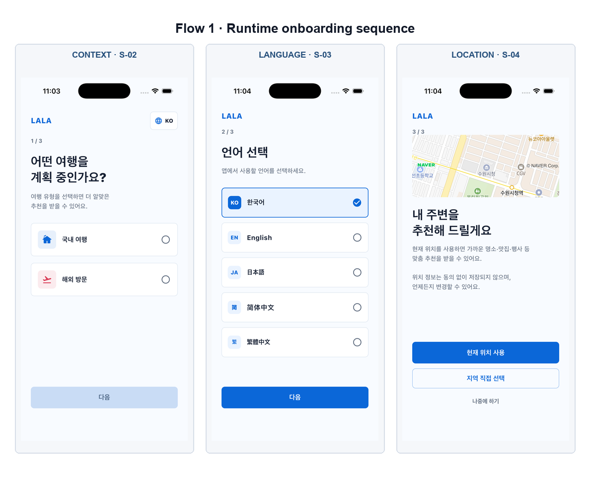

*그림 1. exact-head iPhone 17 Pro에서 확인한 S-02~S-04. 로그인이나 위치 권한이
완료되지 않아도 사용자가 직접 회복 경로를 선택할 수 있다.*

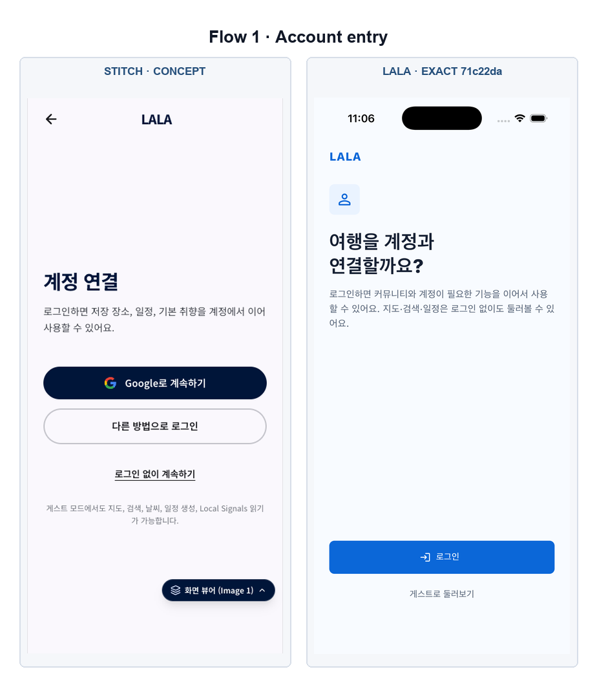

*그림 2. Stitch는 계정 행동의 시각적 집중도가 높고, LALA-next는 Logto 로그인과
게스트 진입을 실제 인증 경계에 맞춰 분리한다.*

| ID | Stitch 의도 | LALA-next 현재 대응 | 판정 | 검증·남은 차이 |
| --- | --- | --- | --- | --- |
| S-01 앱 시작·복원 | 스플래시, 설정 복원, 실패 복구 | `OnboardingSplashPage`가 저장 상태를 복원하고 안전한 다음 route를 결정 | `FULL/A` | 자동 테스트 대상. 최종 캡처는 복원 후 S-02부터 시작해 splash frame은 별도 보존하지 않음 |
| S-02 여행 맥락 | 국내 여행·해외 방문·생활권 탐색 선택 | 1/3 단계에서 맥락을 저장하고 이후 추천 기본값에 전달 | `FULL/E` | iPhone 17 Pro에서 실제 선택·다음 이동 확인 |
| S-03 언어 | KO/EN/JA/zh-Hans/zh-Hant 선택 | 2/3 독립 화면과 5개 locale 선택, 선택 언어 상태 유지 | `FULL/E` | 다섯 선택지와 선택 상태를 exact-head에서 확인; 모든 하위 콘텐츠의 번역 완전성은 별도 locale QA |
| S-04 위치 설정 | 현재 위치, 직접 선택, 나중에 하기 | 권한 요청·거부 회복·직접 지역·나중에 진행을 모두 제공 | `FULL/E` | NAVER map preview와 세 행동을 실제 화면에서 확인 |
| S-05 지역 직접 선택 | 검색, 시·도/시군구, 최근 지역 | 229개 전국 지역 selector, 검색·빠른 선택·공통 region context | `FULL/E` | 실제 sheet 열기와 지역 목록 확인 |
| S-06 계정 연결 | Google/다른 로그인 또는 guest | Logto 시작과 guest 진행을 분리하고 탐색은 비로그인 허용 | `GATED/E` | guest 진입은 확인. 실제 Google 로그인과 `/me` 동기화 완료 상태는 실계정 gate |

### Flow 판정

Stitch가 한 화면에 많이 묶었던 언어·위치·계정을 LALA-next는 3단계로 분리했다.
화면 수는 늘지만 한 단계의 판단 부담이 낮고, 위치나 로그인 실패가 탐색 진입을 막지
않는다는 점에서 방문객 접근성과 회복성이 더 높다.

## 5. Flow 2: 발견과 방문 준비

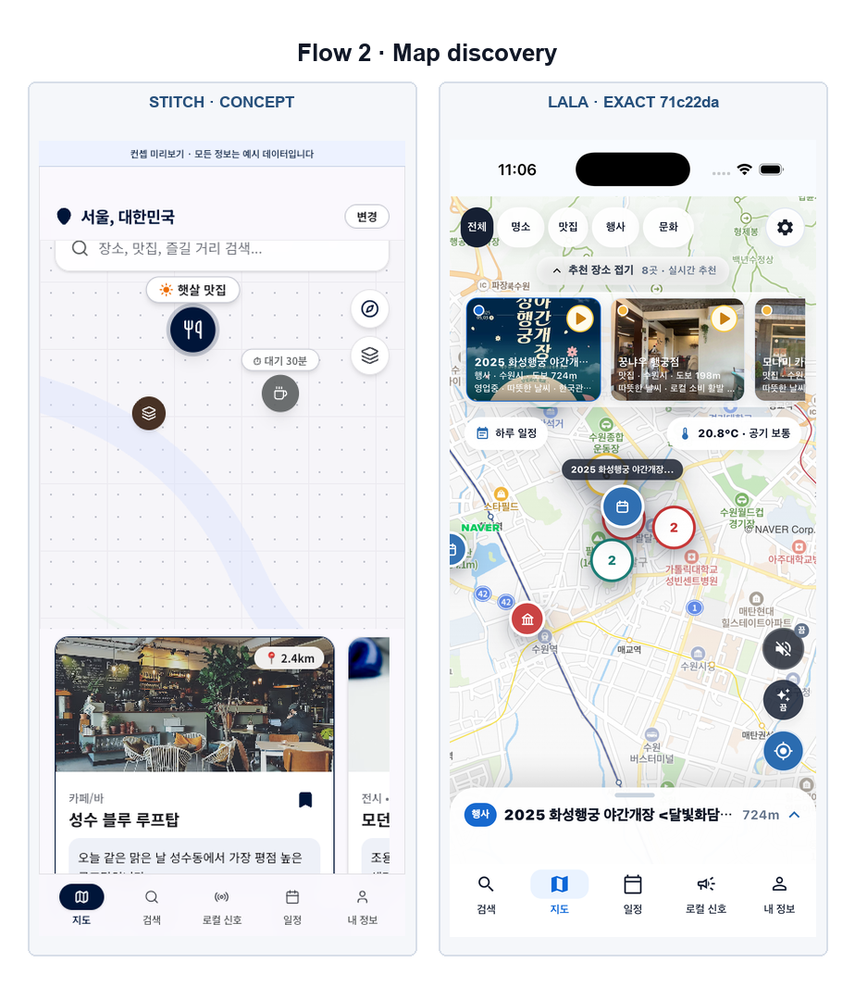

*그림 3. 왼쪽은 예시 핀·카드로 구성된 개념안이고, 오른쪽은 실제 NAVER 지도와
API 장소·날씨·핀·클러스터가 결합된 exact-head 화면이다.*

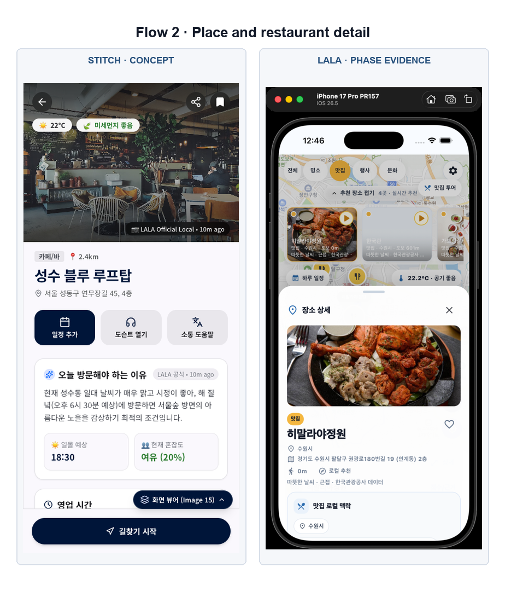

*그림 4. Stitch는 대표 이미지와 핵심 CTA의 첫 화면 집중도가 높다. LALA-next는
canonical 장소와 실제 행동을 연결하며, 음식점에서는 첫 행동 묶음의 소통 도움으로
저장된 요청 카드에 한 번의 탭으로 진입한다.*

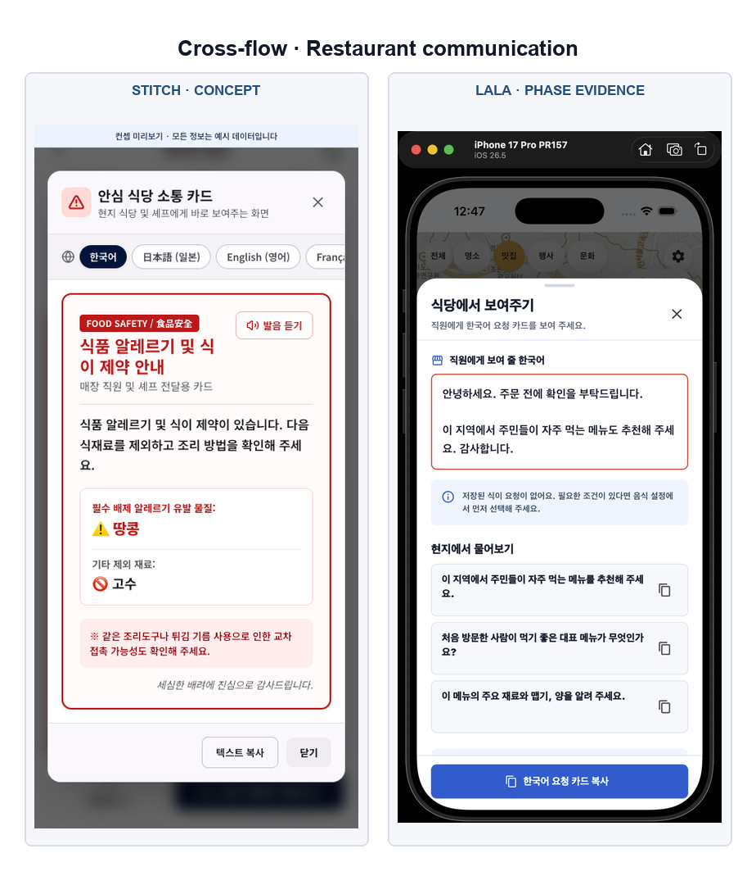

*그림 5. 두 안 모두 직원에게 바로 보여 주는 목적을 갖는다. LALA-next는 저장된
식이 제약이 없을 때 이를 정직하게 알리고, 큰 글씨·복사·현지 표현을 제공한다.*

| ID | Stitch 의도 | LALA-next 현재 대응 | 판정 | 검증·남은 차이 |
| --- | --- | --- | --- | --- |
| S-10 지도 탐색 | 지도 핀, 카테고리, 추천 rail | 실제 NAVER map, API 장소, category pin, cluster, 선택·rail 동기화, 오류 회복 | `FULL/E` | iPhone에서 실데이터 장소·날씨·핀 확인. 웹 localhost API는 production CORS를 유지해 데이터 호출이 차단됨 |
| S-11 검색 | 지역 문맥, 정렬·필터, 장소 선택 | API 검색, 선택 지역, 필터, canonical ID로 지도·상세 연결 | `FULL/P` | phase 증거와 테스트 통과; 최종 head에서 검색 전체 flow는 개별 재캡처하지 않음 |
| S-12 장소 상세 | 이미지, 근거, 저장, 일정·도슨트·소통 CTA | `PlaceDetailPage`가 canonical API 장소와 추천 근거 및 각 후속 route를 연결 | `FULL/E` | iPhone 17 Pro에서 실제 음식점·주소·거리·날씨·대기질과 소통 도움 진입을 확인 |
| S-13 음식점 방문 도움 | 알레르기·주문 요청을 큰 글씨로 제시 | 음식점 상세 1탭 action, 저장된 식이 제약 sheet, 26pt 전체 화면 큰 글씨·복사·안전 고지 | `ADAPTED/E` | focused sheet와 큰 글씨 전체 화면을 실제 탭으로 확인. 저장 요청이 없을 때 이를 명시하며, 실매장 번역·사용성은 후속 현장 QA |
| S-14 날씨·대기질 | 현재 날씨, PM, 일정 영향과 대안 | 실제 weather/AQ 응답, observed time, 오류·stale, 일정 개입 진입 | `ADAPTED/P` | map/detail의 focused sheet. 유효 데이터가 없을 때 예시값을 만들지 않음 |
| S-15 동선·투어 | 후보 순서, 이동시간, 일정 초안 | 선택된 실제 장소 기반 `TourSheetContent`, 순서·상태·plan 연결 | `ADAPTED/P` | sheet 표현. 정밀 경로가 아닌 추정 정보의 의미를 구분 |

### Flow 판정

Stitch의 가장 큰 시각 장점은 장소 상세 안에서 행동을 빠르게 발견하는 구조다.
LALA-next는 그 구조를 유지하면서 지도와 장소를 예시가 아닌 동일 canonical ID로
연결했다. S-13 진입과 큰 글씨 mode는 이번 보완에서 닫혔다. S-12의 추천 이유·출처·
신선도는 이미 실제값만 표시하며, 이후에는 기능 추가보다 first viewport 밀도 조정이 남는다.

## 6. Flow 3: 일정과 회복

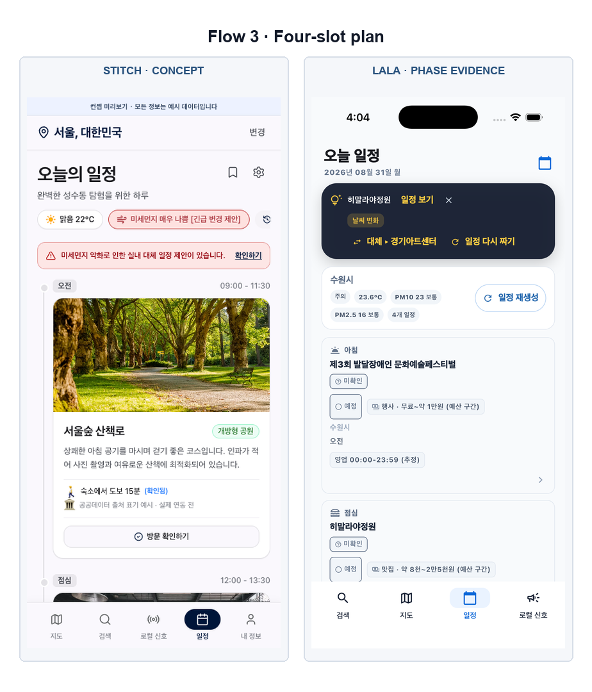

*그림 6. Stitch의 카드·이동선은 빠른 스캔에 유리하다. LALA-next는 실제 4슬롯과
상황 정보를 우선하며, 다음 시각 보정 대상은 슬롯 간 이동과 대안 비교의 연결감이다.*

| ID | Stitch 의도 | LALA-next 현재 대응 | 판정 | 검증·남은 차이 |
| --- | --- | --- | --- | --- |
| S-20 하루 일정 | 오전·점심·오후·저녁과 이동 연결 | server-compatible 4슬롯, 실제 순서 rail, 장소·도슨트·방문 행동 | `FULL/E` | iPhone 17 Pro에서 실제 4슬롯과 시작·중간·종료 rail, 기존 장소·상태·예산·도슨트 행동을 확인 |
| S-21 상황 변화 비교 | 기존 장소와 날씨·대기질 대안을 비교·적용 | 실제 intervention 전후안을 독립 route에서 비교하고 선택 | `FULL/P` | 적용 전 비교 상태가 구현됨; production mutation 없이 검증 |
| S-22 이번 여행 설정 | 동행·속도·이동·안전 조건의 임시 override | 날짜별 `TripPreferenceOverride`와 server contract, 기본 취향과 우선순위 분리 | `FULL/P` | 코드·API·migration 계약과 phase 검증 완료; production migration apply는 별도 승인 |
| S-23 저장한 장소 | 저장 목록, 상태 변화, 오늘 일정 추가 | device-first 저장 ID와 계정 동기화 경로, 상세·일정 연결 | `FULL/P` | guest local 흐름과 자동 테스트; account cross-device 상태는 인증 gate |
| S-24 지난 일정 | 과거 여행 조회·재사용 | 계정 plan history와 현재 조건을 구분한 `PastTripsPage` | `GATED/P` | 화면·계약 구현. 실제 계정 history는 실계정 데이터가 있어야 검증 가능 |
| S-25 방문 확인 | 실제 방문 여부와 제한된 feedback | 일정 slot의 bounded visit confirmation route와 저장 계약 | `GATED/A` | 테스트로 계약 확인. 실제 계정 쓰기와 전환 측정은 production write gate |

### Flow 판정

Stitch의 이동 연결선과 대체 제안을 LALA-next의 실제 전후안, 여행별 override,
저장·방문 계약에 결합했다. 슬롯 rail은 실제 응답 순서를 바꾸지 않는다. 남은 차이는
기능 부재가 아니라 최종 head에서 S-20~S-25를 한 번에 재생한 영상·캡처 증거다.

## 7. Flow 4: 도슨트와 로컬 정보

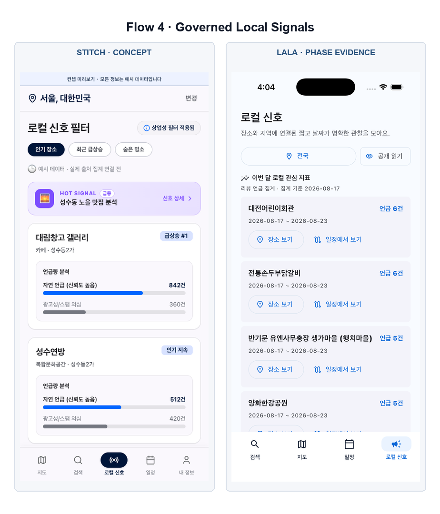

*그림 7. Stitch의 풍부한 수치는 예시다. LALA-next는 실제 집계·출처·기준일을
표시하고, 데이터가 없거나 부족한 경우 준비 상태를 그대로 보여 준다.*

| ID | Stitch 의도 | LALA-next 현재 대응 | 판정 | 검증·남은 차이 |
| --- | --- | --- | --- | --- |
| S-30 장소 도슨트 | 음성 player, script, 이동 제어 | RAG text를 기본 제공하고 음성은 enablement·유료 gate에 따라 분리 | `GATED/P` | text/read-only는 구현. 유료 음성 호출과 전 장소 품질 QA는 별도 운영 gate |
| S-31 Local Signals | 자연 언급과 광고 의심을 구분한 집계 탐색 | governed public aggregates, 표본·신선도·데이터 부족 상태 | `FULL/P` | mock count를 정상 경로에서 쓰지 않음; 운영 데이터량에 따라 honest empty 가능 |
| S-32 Signal 상세·참여 | 표본·관측 메타데이터, 장소·일정 연결 | source-safe detail, canonical place 연결, moderation-aware action | `FULL/P` | phase 구현·테스트 완료. 원문·작성자·raw URL은 의도적으로 공개하지 않음 |

### Flow 판정

Stitch는 수치가 풍부해 보이지만 예시값이었다. LALA-next는 정보량이 적더라도 실제
집계가 없으면 준비 중·없음으로 표시한다. 이는 시각적 밀도보다 근거성을 우선한
의도적 차이다.

## 8. Flow 5: 커뮤니티와 채팅

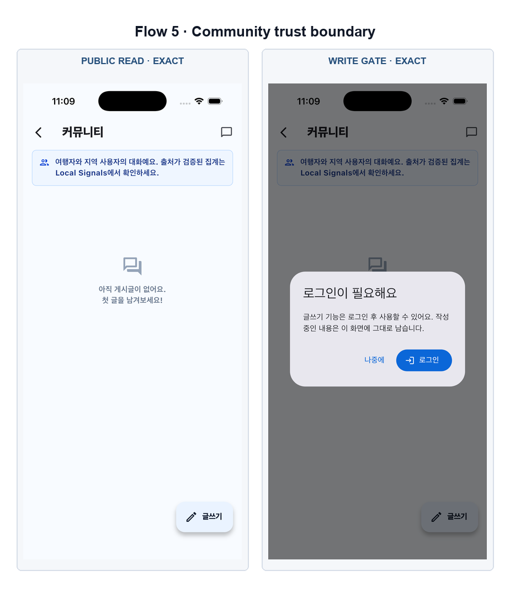

*그림 8. exact-head에서 공개 읽기는 허용하되, 글쓰기는 Logto 계정 연결 뒤로
제한된다. 예시 게시글로 빈 운영 데이터를 채우지 않은 상태도 함께 검증했다.*

| ID | Stitch 의도 | LALA-next 현재 대응 | 판정 | 검증·남은 차이 |
| --- | --- | --- | --- | --- |
| S-40 커뮤니티 피드 | 팁·질문 중심 사용자 대화 | Local Signals와 명확히 분리된 public feed, empty/error/retry, 글쓰기 gate | `FULL/E` | iPhone에서 실제 public empty와 신뢰 고지 확인 |
| S-41 게시글 상세 | 본문, 댓글, 반응, 신고 | public read와 authenticated reaction/comment 경계를 구현 | `GATED/A` | 운영 글을 만들지 않았으므로 실제 detail data는 미재생 |
| S-42 글 작성 | category, place context, publish | Logto account가 있어야 publish하며 로그인 중단 후 draft 보존 | `GATED/E` | 비로그인 write gate와 draft-preservation 문구 exact-head 확인; 실제 publish는 미실행 |
| S-43 채팅방 목록 | unread, 상대·가이드별 thread | authenticated membership 기반 room list, loading/empty/error | `GATED/A` | 실제 회원 room 데이터 미사용. 로그아웃 시 private list 즉시 폐기 테스트 통과 |
| S-44 채팅방 | REST/WebSocket 메시지, 전송·재시도와 스마트 첨부 | authenticated REST/WebSocket, late-response suppression, 저장된 식이·취향 초안 첨부, 실패 bubble·재전송 | `GATED/A` | attachment widget 및 전체 회귀 검증 완료. 실제 private chat은 운영 데이터를 만들지 않아 미실행 |

### Flow 판정

Stitch의 채팅은 풍부하지만 가짜 사용자와 로컬 메모리였다. LALA-next는 비어 있어도
실제 public 상태를 보여 주고, private UI는 로그인 직후만 허용한다. 저장된 취향과
식이 요청은 초안으로만 가져와 사용자가 검토·전송하며, 실패한 메시지는 재시도할 수 있다.

## 9. Flow 6: 계정과 개인화

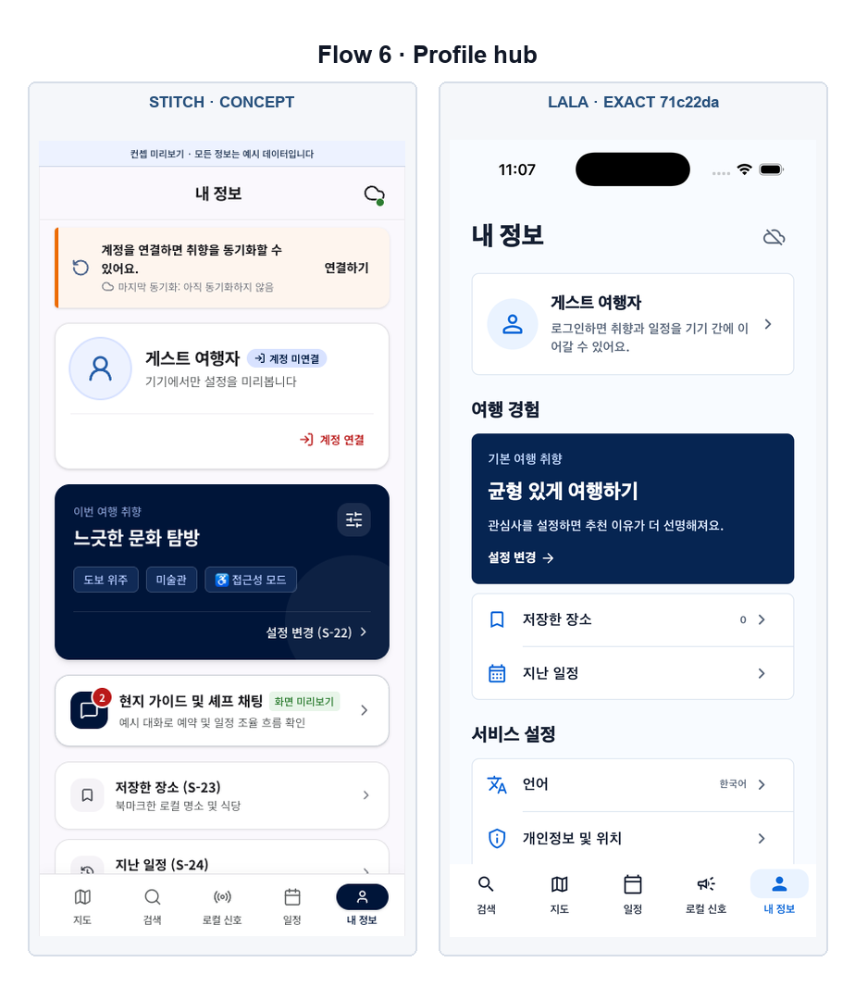

*그림 9. Stitch의 프로필은 시각적으로 풍부하지만 가이드·계정 예시를 포함한다.
LALA-next는 실제 guest/account 상태와 저장·지난 일정·동의·커뮤니티 진입을 묶는다.*

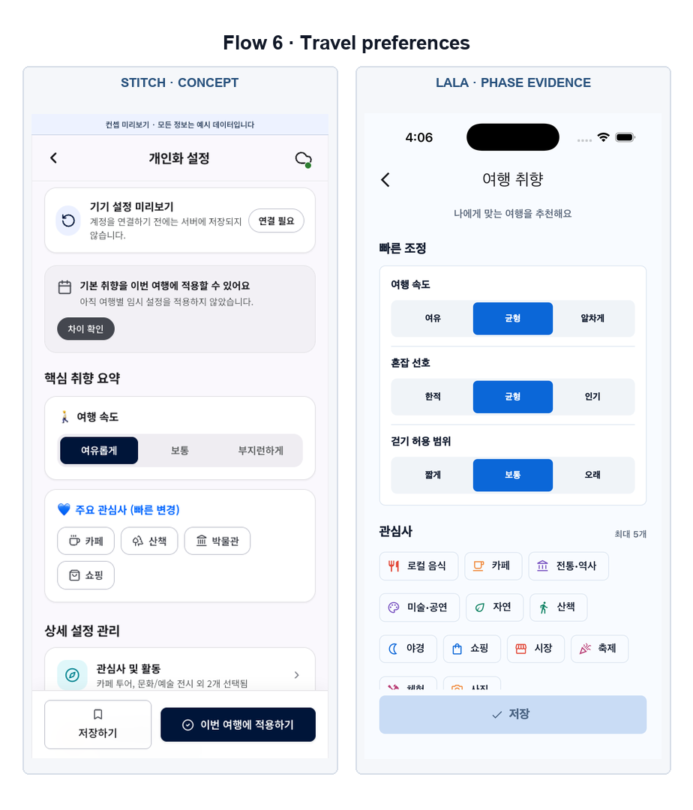

*그림 10. Stitch는 요약 카드와 고정 이중 CTA가 강점이다. LALA-next는 취향과
안전 조건의 저장 우선순위를 실제 상태에 연결하고 더 조용한 밀도로 표현한다.*

| ID | Stitch 의도 | LALA-next 현재 대응 | 판정 | 검증·남은 차이 |
| --- | --- | --- | --- | --- |
| S-50 설정 허브 | 계정, 취향, 저장, 지난 일정, 언어·위치, 커뮤니티 | 다섯 번째 `내 정보` tab과 모든 하위 기능의 실제 entry | `FULL/E` | iPhone 및 웹 mobile/desktop에서 진입·스크롤 확인 |
| S-51 계정 관리 | 프로필, sync 상태, 재시도, logout | Logto와 `/api/v1/me` 상태, guest/account/error/logout 분리 | `GATED/A` | wiring·tests 완료. 실제 Google 로그인 후 account sync는 실계정 검증 gate |
| S-52 취향 요약 | 기본값과 여행 override 차이, 빠른 조정 | device-first/account-synced defaults와 여행별 적용 진입 | `FULL/P` | phase 검증 완료; profile에서 entry 확인 |
| S-53 관심사·스타일 | 최대 관심사, 여행 스타일, 동행·속도 | `StylePreferencesPage`에서 interests, pace, style과 저장 | `FULL/P` | nested page로 구현; Stitch의 컬러 chip을 절제해 사용 |
| S-54 음식·식이 제약 | 요리·맵기·예산과 알레르기·식단 | preference와 hard safety constraint를 분리하고 S-13 카드에 연결 | `FULL/P` | 자동·phase 검증. 번역과 실제 매장 전달은 현장 QA 권장 |
| S-55 이동·접근성 | 도보, 교통, 환승, 휠체어·유아차 | `MobilityPreferencesPage`와 추천 filtering 계약 | `FULL/P` | 미검증 접근성 정보를 사실처럼 표시하지 않음 |
| S-56 예산·혼잡·운영 조건 | 일일·식사 예산, 대기, 활동 시간, 휴무 규칙 | `BudgetPreferencesPage`에서 예산·혼잡·대기·운영 조건 저장 | `FULL/P` | 기능 대응. 추천 결과에 반영되는 production 데이터 QA는 후속 |
| S-57 도슨트·콘텐츠 언어 | locale, 설명 깊이, 자동재생, 속도 | `DocentPreferencesPage`에서 언어·깊이·playback 설정 | `GATED/P` | 설정은 구현. 실제 유료 음성 preview는 호출하지 않음 |
| S-58 개인정보·위치 | 앱 동의, OS 권한, 동기화·삭제 안내 | persisted app-level consent, OS 설정 분리, manual region, guest data clear | `FULL/E` | exact-head 화면·재실행 persistence·OCR 확인 |
| S-59 취향 동기화 충돌 | 기기값·계정값 비교와 명시 선택 | `PreferenceSyncConflictPage`에서 양쪽 요약과 선택적 해결 | `ADAPTED/A` | 강제로 가짜 conflict를 만들지 않음; reducer/store tests로 검증 |

### Flow 판정

Stitch가 제안한 개인화 분류는 대부분 유지됐고, LALA-next는 이를 실제 저장 우선순위와
계정 경계에 연결했다. 시각적으로는 S-53~S-57이 Stitch보다 조용하고 실무적인
형태다. 컬러 chip을 늘릴 때도 안전 조건과 일반 취향의 우선순위가 색상만으로
구분되지 않게 해야 한다.

## 10. 시각·UX 비교

### LALA-next가 앞선 부분

1. 실제 지도와 데이터 상태: NAVER map, API 장소, 오류·위치 회복이 한 화면에서
   실제로 동작한다.
2. 일관된 앱 구조: 검색·지도·일정·로컬 신호·내 정보의 5개 목적지가 모든 주요
   화면에서 같은 의미를 가진다.
3. 사실성: 가짜 계정, 가짜 실시간 수치, 가짜 채팅을 정상 상태로 사용하지 않는다.
4. 인증 안전성: 로그인 전 공개 읽기와 로그인 후 쓰기를 구분하고, 로그아웃 시
   private state 및 늦게 도착한 응답을 폐기한다.
5. 위치 회복: OS 권한과 앱 선택을 분리하고 전국 직접 선택을 항상 제공한다.

### Stitch에서 계속 참고할 부분

1. S-12: 대표 이미지 아래 핵심 행동과 추천 근거를 더 빠르게 스캔하는 계층.
2. S-20/S-21: 슬롯 rail은 반영됨. 원안·대안의 비교 계층은 현재 실제값을 유지하며 후속 시각 QA 대상.
3. S-30: script와 playback 상태를 한눈에 이해하는 player 구성.
4. S-53~S-57: 긴 설정을 압축하는 색상 chip과 즉시 보이는 선택 요약.
5. S-13: 음식점 상세 1탭 진입과 큰 글씨 mode를 반영함. 실제 매장 번역·가독성 QA가 남음.

### 가져오면 안 되는 부분

- 고정된 mention 수, 혼잡도, 신선도, 평점, 날씨를 실제값처럼 표시
- 사용자 입력이 아닌 심각도나 생명 위험 표현을 알레르기 카드에 추가
- 가짜 이메일·프로필·동기화 완료·채팅 메시지
- 장소와 일치하지 않거나 권리가 검증되지 않은 원격 이미지
- Local Signals와 사용자 커뮤니티를 같은 신뢰 등급으로 표현
- mock/demo를 실제 데이터가 없는 정상 경로의 대체물로 사용

## 11. 실구동 및 증거

### iPhone 17 Pro

- 기기: iPhone 17 Pro PR157, iOS 26.5 Simulator
- build: 기존 build 삭제 후 approved build wrapper로 새 simulator debug build
- install: 기존 bundle uninstall 후 새 `Runner.app` install
- 입력: 실제 simulator tap; fixture, VM state injection, demo data 미사용
- 관찰: 온보딩, 229개 지역 selector, 실제 NAVER map 및 API 장소·날씨,
  내 정보, community empty, write auth gate, 개인정보·위치
- exact `71c22da` 캡처: 11개, SHA-256 모두 상이
- 로컬 증거 경로:
  `/tmp/lala-canonical-screen-audit-20260903/output/local/runtime-evidence/pr174-iphone17pro/exact-71c22da/`
- 기능 gap 보완 tree `43f3def` 추가 캡처: 일정 타임라인, 실제 음식점 상세,
  소통 도움 sheet, 26pt 큰 글씨 화면. 네 캡처의 SHA-256은 모두 상이하다.
- OCR 확인: `오늘 일정`, 실제 4개 일정, `식당에서 보여주기`, 저장된 식이 요청
  없음 안내, `큰 글씨로 보여주기`, `직원에게 보여 주세요`와 한국어 문구를 확인했다.
- 추가 로컬 증거 경로: `/tmp/lala-gap-expansion-evidence/`

### 웹

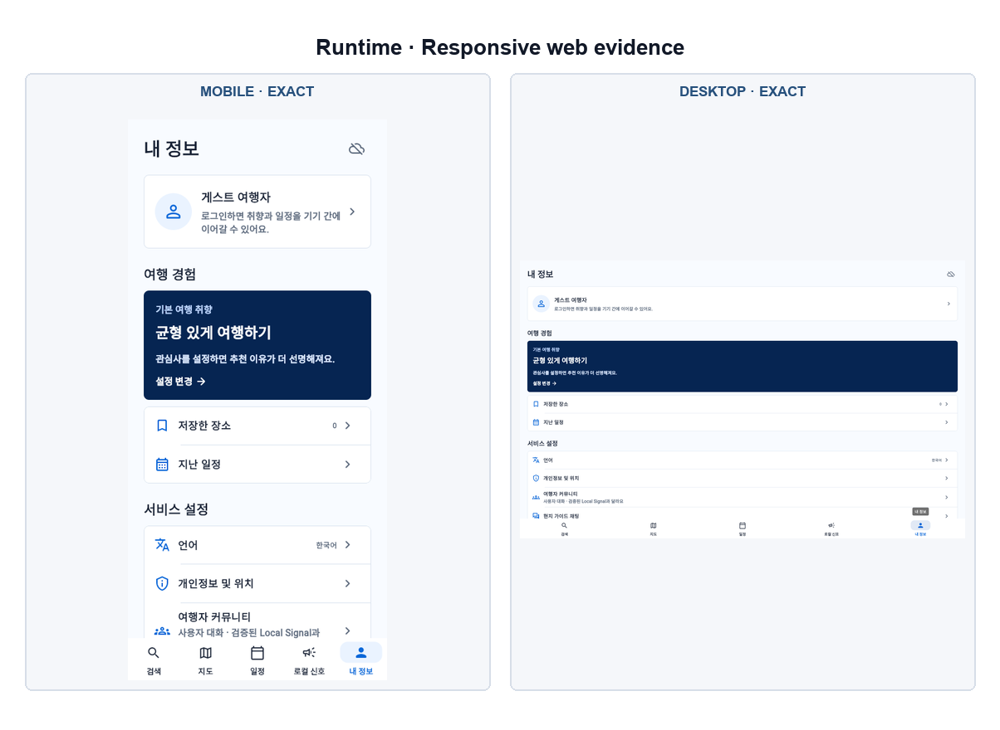

*그림 11. 동일 exact-head 웹 빌드의 393×852 및 1440×900 화면. 데스크톱은
기능 손실 없이 폭을 사용하지만 정보 밀도와 최대 콘텐츠 폭은 후속 시각 개선 대상이다.*

- build: iOS 확인 뒤 기존 build를 다시 삭제하고 exact head로 web build
- viewport: 393 x 852 및 1440 x 900
- 관찰: 온보딩 클릭, NAVER iframe, 5-tab navigation, My Info 반응형
- localhost에서 production API 호출은 기존 CORS 정책 때문에 실패한다. 보안을
  약화하지 않았으며, 실데이터 acceptance는 iPhone 결과를 사용했다.
- 로컬 증거 경로:
  `/tmp/lala-canonical-screen-audit-20260903/output/local/runtime-evidence/pr174-web/exact-71c22da/`

### 자동 검증

| 검증 | 결과 |
| --- | --- |
| Flutter analyze | PASS |
| Flutter tests | PASS, 836 tests |
| community auth/logout focused tests | PASS, 3 tests |
| Dart client tests | PASS, 39 tests |
| API tests and safety contracts | PASS |
| Ruff check/format | PASS |
| pre-commit all files and detect-secrets | PASS |
| GitHub CI 3 jobs | PASS |
| `git diff --check` | PASS |

## 12. 정직한 완료 경계

### 완료

- 36개 canonical 화면의 route/sheet/nested-page 표현
- 화면 간 canonical ID, region, selected place, plan, preference state 전달
- 실제 NAVER 지도와 read API 정상 경로
- 게스트 탐색, location denial recovery, manual nationwide region
- 기본 취향, 여행별 override, 저장 장소, 지난 일정, sync conflict UI
- governed Local Signals와 사용자 커뮤니티의 신뢰 경계
- Logto-gated community writes/chat 및 logout privacy regression
- 채팅 식이 요청·여행 취향 초안 첨부와 실패 메시지 재전송
- 음식점 상세 1탭 소통 도움과 26pt 큰 글씨 직원용 카드
- 실제 일정 슬롯 순서를 유지하는 하루 timeline rail
- exact merged-tree 자동 검증과 대표 iPhone/web 실구동

### 구현됐지만 외부 상태 때문에 아직 끝까지 누르지 않은 것

- 실제 Google/Logto 로그인 후 `/api/v1/me` 동기화
- authenticated post/comment/reaction/chat 및 account history
- production DB migration/apply와 실제 visit write
- 유료 도슨트·음성 호출과 전체 장소 수동 품질 QA
- 36개 화면 각각의 final exact-head screenshot replay
- Android 최신 integration 실구동

이 목록은 누락 화면 목록이 아니다. 코드가 존재해도 실제 계정, 운영 데이터,
비용 또는 production mutation이 필요한 상태는 별도의 승인·검증 단계로 남긴 것이다.

## 13. 다음 시각 개선 우선순위

1. S-12 장소 상세: 현재 실제 추천 이유·출처·신선도를 유지하며 first viewport 밀도를 실기기에서 조정.
2. S-21 일정 개입: 적용·유지·되돌리기의 시각 일관성을 실제 개입 응답으로 재검증.
3. S-30 도슨트: text-first 기본 상태와 음성 disabled/available 상태의 player 완성도.
4. S-53~S-57 개인화: 안전 조건을 훼손하지 않는 범위에서 chip·요약·저장 feedback 강화.
5. S-13 음식점 도움: 실제 매장에서 다섯 언어 표현과 큰 글씨 가독성을 현장 검수.
6. S-40~S-44: 실제 계정·운영 데이터가 준비되면 empty, loaded, error, retry, logout을 동일
   exact head에서 다시 캡처.

시각 개선은 화면 존재 여부를 다시 늘리는 작업이 아니라, 이미 구현된 흐름의 정보
우선순위와 표현 완성도를 높이는 다음 단계다.
